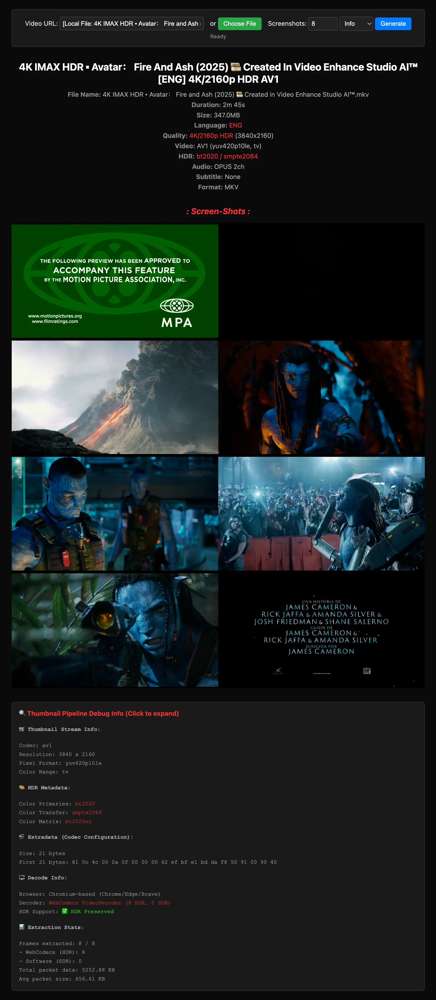

<div align="center">

# AnyVid Player & Browser Media Engine

### Play any video format directly in the browser.
##### No server transcoding. Standardized manifests. Paced buffer streaming. <br /> `<anyvid-player src="video.mkv" controls stats></anyvid-player>`

[](LICENSE)
[](package.json)
[](decisions/)

<sub>MKV · HEVC · AV1 · 4K HDR · Multi-Audio · ASS/SSA Subtitles · Token Encrypted Streaming</sub>

</div>

---

## Quick Start

### Installation

```bash
npm install anyvid-player
```

Or from a CDN, with no build step. The **module build** is the one to reach for — it is what `import` and modern bundlers want:

```html
<script type="module" src="https://cdn.jsdelivr.net/npm/anyvid-player/dist/element.js"></script>
```

…and the `.global` build is the same element for a page that cannot use a module: a classic script that registers `<anyvid-player>` on load and puts a `Movi` global on `window`. It is what jsDelivr and unpkg point at by default:

```html
<script src="https://cdn.jsdelivr.net/npm/anyvid-player/dist/element.global.js"></script>
```

> **Slim Build**: `dist/element.slim.global.js` is built on the slim bundle — one third of the size (~4.9 MB), fetching `movi.wasm` asynchronously from beside itself.

---

### Basic Usage

```html
<!DOCTYPE html>
<html>
  <head>
    <script type="module">
      import "anyvid-player";
    </script>
  </head>
  <body>
    <!-- Works with both <anyvid-player> and <movi-player> -->
    <anyvid-player 
      src="https://example.com/video.mkv" 
      controls 
      autoplay 
      muted 
      stats
      style="width: 100%; height: 500px;">
    </anyvid-player>
  </body>
</html>
```

That's it! The custom element works just like a native `<video>` tag, with full `HTMLMediaElement` property and event compatibility.

---

## API Reference

### Element Registration

The custom element is automatically registered on import:

```javascript
import "anyvid-player"; 
// Automatically registers both <anyvid-player> and <movi-player>
```

* **Element Name**: `anyvid-player` (or legacy alias `movi-player`). Hyphen is required per the W3C Web Components specification.

### Media Source

#### `src` (Attribute & Property)
Specifies the video source URL or local `File`/`Blob` object.

```html
<!-- Remote HTTP / HTTPS Stream (MKV, MP4, WebM, TS, HLS) -->
<anyvid-player src="https://example.com/video.mkv" controls></anyvid-player>

<!-- Local File via JavaScript drag-and-drop or file input -->
<anyvid-player id="player" controls></anyvid-player>
<script>
  const player = document.getElementById("player");
  const fileInput = document.getElementById("file");
  fileInput.addEventListener("change", (e) => {
    player.src = e.target.files[0];
  });
</script>
```

**Supported Formats:**
- **Containers**: Matroska (`.mkv`), MP4 (`.mp4`, `.m4v`), WebM (`.webm`), QuickTime (`.mov`), MPEG-TS (`.ts`), AVI (`.avi`), FLV.
- **Video Codecs**: HEVC / H.265, AV1, VP9, H.264 / AVC (Hardware WebCodecs with WASM dav1d/de265 fallback).
- **HDR Standards**: BT.2020, PQ (ST 2084), HLG via WebGL2 `display-p3` color space.
- **Audio Codecs**: AAC, AC-3, E-AC-3 (Dolby Digital Plus), Opus, FLAC, MP3, Vorbis.
- **Adaptive Streams**: HLS (`.m3u8`), MPEG-DASH (`.mpd`), Smooth Streaming (`.ism`).

---

#### `sourceAdapter` (JavaScript-Only Property)
Bypasses `src` entirely and feeds raw binary bytes through a custom `SourceAdapter` stream interface. Use this when your media doesn't live behind an HTTP URL or local `File` (e.g. WebSocket, WebRTC data channel, IndexedDB cache, custom token encryption):

```html
<anyvid-player id="player" controls></anyvid-player>

<script type="module">
  import { MyWebSocketSource } from "./my-source.js";

  const player = document.getElementById("player");
  player.sourceAdapter = new MyWebSocketSource("wss://media.example.com", 12_345_678);
</script>
```

**Mutual exclusion with `src`:**

| You set | Result |
|---|---|
| `src` | Clears `sourceAdapter`, loads via URL/File |
| `sourceAdapter` | Clears `src` + `src` attribute, loads via adapter |
| Both | Last assignment wins |
| `null` | Clears that source; both `null` → empty state |

Setting either re-runs the source-switch lifecycle: safely disposes of the previous decoder context, fires `loadstart`, and re-initializes.

```javascript
// Swap protocols on a live element
player.sourceAdapter = new MyWebRTCSource(channel);

// Later, switch back to a plain URL (sourceAdapter auto-clears)
player.src = "https://example.com/video.mp4";

// Clear everything
player.src = null;
```

> **Note**: There is no `sourceadapter` HTML attribute — stream adapter instances are not serializable strings. Always assign via JavaScript or `player.setSourceAdapter()`.

---

### Manifest-First Inspection (`anyvid-player/demuxer` & `anyvid-player/player`)

Inspect metadata, streams, HDR primaries, chapters, and font attachments **without rendering video**:

```typescript
import { MoviPlayer, CapabilityEngine } from "anyvid-player/player";

// Rapid non-visual manifest extraction (<300ms)
const manifest = await MoviPlayer.inspect("https://example.com/movie.mkv");

console.log("Format:", manifest.container.formatName);
console.log("Duration:", manifest.container.duration, "seconds");
console.log("Video Streams:", manifest.video);
console.log("Audio Tracks:", manifest.audio);
console.log("Subtitles:", manifest.subtitles);
console.log("Chapters:", manifest.chapters);

// Capability Diagnostics: Explain hardware vs software decode
const assessment = await CapabilityEngine.assessTrack(manifest.video[0]);
console.log("Strategy:", assessment.decoderType); // "webcodecs-hardware" | "wasm-software"
console.log("Explanation:", assessment.explanation);
```

---

### Diagnostics HUD & Telemetry (`stats` / `diagnostics`)

Enable real-time telemetry overlay displaying FPS, dropped frames, decode latency, buffer lead, and memory:

```html
<anyvid-player src="video.mkv" controls stats></anyvid-player>
```

Or toggle dynamically via keyboard shortcut (`I` for Stats for Nerds) or JavaScript:

```javascript
player.toggleNerdStats();
```

---

## Contents

- [Why Movi Player?](#why-movi-player)
- [What's New in 0.4.1](#whats-new-in-041)
- [Getting Started](#getting-started)
- [Common Use Cases](#common-use-cases)
- [Advanced](#advanced)
- [Reference](#reference)
- [Server Requirements](#server-requirements)
- [Browser Support](#browser-support)
- [Development](#development)
- [AI Assistants](#ai-assistants)

## Why Movi Player?

**The browser can't play MKV, HEVC, or HDR videos.** You either transcode everything server-side or tell users "format not supported." Movi Player fixes this.

- **Play anything** -- MKV, HEVC, AV1, 4K HDR, multi-audio, subtitles. Formats that `<video>` can't touch.
- **Zero server cost** -- No FFmpeg on your server. No transcoding pipeline. Everything runs in the browser via WebAssembly.
- **Drop-in replacement** -- `<movi-player src="video.mp4" controls>` works like `<video>` but plays everything — the full `HTMLMediaElement` API surface answers, so code written against a native `<video>` works unchanged.
- **Content protection** -- Built-in encrypted playback with AES-256-GCM, token auth, HMAC signing. No DRM license server needed.
- **HDR rendering** -- Detects and renders BT.2020/PQ/HLG content on supported displays. Other players can't.
- **Canvas-based** -- No `<video>` element exposed. Right-click save disabled.
- **Picture-in-Picture** -- Document PiP with controls (play/pause, seek, mute, progress). Chromium 116+.
- **Ambient mode** -- Dynamic letterbox glow that samples video colors in real-time. Press `G` or use context menu.
- **Split sources** -- Separate video and audio files via child `<source kind="audio">` elements, external subtitles via `<track>` — standard `<video>`-style markup.
- **Adaptive streaming** -- HLS (`.m3u8`), MPEG-DASH (`.mpd`), and Smooth Streaming (`.ism`) unified through Shaka Player, with a live-edge UI and DVR seeking.
- **Custom request headers** -- Send auth tokens / signed headers across manifests, segments, progressive HTTP, and the encrypted source via the `headers` attribute.
- **DRM ready** -- Optional Widevine/PlayReady/FairPlay support via `drm` + `licenseurl` attributes for adaptive streams.

<details>
<summary><b>Full feature overview</b> — everything in the box</summary>

<br />

**Playback** -- MP4, MKV, WebM, MOV, TS, AVI. H.264, HEVC, VP9, AV1. Hardware decode with software fallback. Pitch-preserving time-stretch via Signalsmith Stretch.

**Adaptive Streaming** -- HLS (`.m3u8`), MPEG-DASH (`.mpd`), and Smooth Streaming (`.ism`) unified through Shaka Player (hls.js / dash.js fallbacks). Live-edge badge, DVR-window seeking, Auto-mode quality badge. Streams whose codec the browser can't decode escalate through the other MSE engine and finally the built-in FFmpeg-WASM demuxer, keeping quality switching and track menus working. Optional MPEG-5 LCEVC enhancement-layer decoding via `lcevc` + `lcevcurl`.

**Adaptive Quality** -- An "Auto" mode measures the link's real throughput (past CDN pacing bursts), opens on the rung it can sustain, and switches renditions seamlessly in place — no reload, no dropped playhead. Works for HLS/DASH and plain multi-file quality ladders alike.

**Custom Headers** -- Send auth tokens / signed headers across the whole media flow (manifest, segments, progressive HTTP, thumbnails, encrypted source) via the `headers` attribute (JSON) or property (object).

**Audio** -- AAC, MP3, Opus, FLAC, AC-3, E-AC-3. Multi-track switching. **Output-device routing** (`audiooutput` attribute / `setAudioOutput()` / right-click "Audio Output" menu, via `AudioContext.setSinkId`). Stable volume (loudness normalization). First-class audio-only mode with cover art extraction and a dedicated strip UI. Data-saver `audioonly` mode skips the video decode (and fetches an audio-only stream rendition). Perceptual (log) volume curve. Muted-autoplay fallback with tap-to-unmute — for the `autoplay` attribute and for a page that starts playback from script.

**Non-Range Servers** -- Servers that ignore `Range` (respond `200`, not `206`) still play via a forward-only sliding-window "linear mode" with in-window seeking; the `linearmode` event lets your UI adapt.

**Subtitles** -- SRT, ASS, WebVTT, PGS (image-based), DVB. Multi-track with on-the-fly switching. Per-source delay/offset (`Z` / `X` to nudge ±100ms), full transcript browser with search + click-to-seek, customizable size/color/background/edge (persisted), karaoke-aligned VTT. Captions can be dragged anywhere in the picture and stay put — across seeks, sources and sessions — with a double-click to reset (`controlslist="nosubtitledrag"` to switch that off). Pluggable `SubtitleRenderer` hook for full ASS/SSA styling via an external renderer (e.g. jassub).

**HDR** -- BT.2020/PQ/HLG detection + Display-P3 rendering on supported browsers.

**Immersive / VR** -- 360° equirectangular, 180° (VR180), fisheye, side-by-side stereo (3D), and stereographic "little planet" video via a WebGL2 raycast with a spring-animated look-around camera. Auto-enters from the source's spherical metadata (no toggle UI) or force a projection with the `vr` attribute (`vr="180 fisheye sbs"`, `vr="littleplanet"`); opt-in on-screen joystick via `vrpad`.

**UI** -- Controls, context menu, keyboard shortcuts (`?` to view all), themes (dark/light), gestures, ambient mode. Settings live behind a single gear panel; the bar groups controls into capsules and cuts real chapter gaps through the progress track.

**Custom Controls** -- `addControl()` adds host-defined buttons and context-menu rows that sit with the built-ins (toggles, hotkeys, nested submenus, per-surface anchors); `showOverlay()` puts host panels (end screens, up-next cards) over the picture, including in fullscreen.

**Native `<video>` Parity** -- All `HTMLMediaElement` / `HTMLVideoElement` members answer — `buffered`/`seekable`/`played`, `textTracks`/`audioTracks`/`videoTracks`, `srcObject`, `canPlayType`, `captureStream`, `getVideoPlaybackQuality`, `requestVideoFrameCallback`, `setSinkId`, `fastSeek` — plus the standard event set (`seeking`/`seeked`, `durationchange`, `abort`, `suspend`, `cuechange`, …). Every documented attribute reflects as a JS property (`el.rotate = 90`).

**Persistent Preferences** -- Volume, mute, playback rate, stable volume, ambient mode, and HDR toggles persist across reloads via OPFS. User choices override HTML attribute defaults. The `persist` attribute takes over that decision explicitly — an opt-in list of exactly which settings (including audio/subtitle language) are remembered, namespaced by `persistkey`.

**Picture-in-Picture** -- Document PiP with play/pause, seek, mute, progress bar. Press `P`.

**Aspect Ratio** -- Press `A` to cycle contain/cover/fill/zoom. Context menu sub-menu with icons.

**Crop Bars** -- `cropbars` strips letterbox/pillarbox padding baked into the source pixels before applying `cover`/`fill`/`zoom`, detected automatically with a conservative check so dark scenes are never mistaken for bars.

**Nerd Stats** -- Press `I` for codec, resolution, FPS, decoder type, buffer health, network graph. HLS-aware stats. 8K/16K resolutions labeled correctly.

**Timeline** -- Press `T` for thumbnail strip. Chapter-aware. Keyboard navigation (arrows + enter).

**Chapters** -- Auto-detected from video metadata; or supplied from outside the file via the `chapters` attribute/property. Markers on progress bar, titles in seek tooltip.

**Rotation** -- Press `R` to rotate 90, or set the `rotate` attribute (`0`/`90`/`180`/`270`). Metadata rotation auto-applied. Thumbnails sync.

**Resume** -- `<movi-player resume>` saves position to localStorage, shows resume dialog on reload. Keyboard navigable.

**Poster from Timestamp** -- `postertime="10%"` (or `"5"`, `"1:30"`, `"0:01:30"`) generates a native-resolution poster frame from any timestamp. Runs on an isolated thumbnail pipeline, respects rotation metadata, and never paints stale frames after a `src` change.

**Encrypted** -- AES-256-GCM chunked encryption with HMAC-signed token auth. See encrypted-server/.

**Custom SourceAdapter** -- Plug any byte protocol (WebSocket, WebRTC, IndexedDB, custom encryption) directly into the element or player. Same `SourceAdapter` contract works across `<movi-player>`, `MoviPlayer`, and `Demuxer`; `registerSourceAdapter()` teaches the element custom `src` schemes (`s3://`, `ipfs://`, …) with no per-element wiring.

**DRM** -- Optional Widevine/FairPlay for HLS streams via `drm` + `licenseurl` attributes. Uses native `<video>` + EME API.

**Premuxed Quality Menu** -- Multiple `<source data-height="...">` children give you a YouTube-style quality picker for plain MP4/MKV files, no HLS manifest needed.

**File Revoked Recovery** -- Mobile browsers silently revoke `File` handles after long backgrounding; the `filerevoked` event fires so playlist UIs can prompt for re-pick instead of hanging forever.

**Host Fullscreen Handoff** -- Cancelable `movi-fullscreen-request` event + `setHostFullscreen()` so embedders (VS Code webview, custom apps) can take over fullscreen and keep the player's UI in sync. `exitFullscreen()` covers every fullscreen route.

**Host Error Screen** -- Restyle the built-in error overlay via `::part()`, replace it outright with `slot="error"`, and read the exact on-screen wording from the `errordisplay` event.

**Host Chrome** -- Every button, the progress bar, the time, the centre play button, the title strip and the spinner carry a `part=` for `::part()` restyling. `setIcon()` swaps any of the player's 72 icons for your own. `slot="spinner"` swaps the loading ring for your own; `controlslist="nospinner"` takes it away entirely.

</details>

### vs. Other Players

|  | Movi Player | video.js | hls.js | dash.js | Shaka Player | Plyr |
|---|---|---|---|---|---|---|
| Raw MKV / HEVC / AV1 file | Yes | No | No | No | No | No |
| HDR (BT.2020 / PQ / HLG) | Yes | No | No | No | Native | No |
| Adaptive HLS / DASH | Yes | Plugin | HLS only | DASH only | Yes | No |
| Canvas render (no `<video>`) | Yes | No | No | No | No | No |
| Encrypted playback (built-in AES) | Yes | No | No | No | EME/DRM | No |
| Multi-audio track switching | Yes | Plugin | Yes | Yes | Yes | No |
| Built-in subtitle rendering | Yes | Plugin | No | No | Yes | No |
| Chapters on progress bar | Yes | Plugin | No | No | No | No |
| Document Picture-in-Picture | Yes | Basic | No | No | No | Basic |
| Drop-in web component | Yes | No | No | No | No | No |
| Bundle size (JS) | 50-410KB | 500KB+ | 60KB | 200KB+ | 400KB+ | 25KB |

### Alternatives

Evaluating Movi Player against the ecosystem:

- **[video.js](https://videojs.com/), [Plyr](https://plyr.io/), [Vidstack](https://vidstack.io/) and [Media Chrome](https://www.media-chrome.org/)** are UI players for browser-**native** formats (MP4/WebM) and HLS/DASH — they can't open a raw MKV, HEVC or AV1 file.
- **[hls.js](https://github.com/video-dev/hls.js) and [dash.js](https://github.com/Dash-Industry-Forum/dash.js)** are streaming *engines* (no arbitrary-file playback); **[Shaka Player](https://github.com/shaka-project/shaka-player)** is the DASH/HLS heavyweight. All three need content pre-packaged into adaptive streams server-side.
- For playing an **arbitrary file** (MKV / AV1 / HEVC / 4K HDR) with **zero server work**, the closest peers are **[ffmpeg.wasm](https://github.com/ffmpegwasm/ffmpeg.wasm)** — a transcode/processing *library*, not a player, that CPU-decodes (heavy, no GPU) — and **[libmedia](https://github.com/zhaohappy/libmedia)**, a WASM + WebCodecs media SDK.

Movi Player's niche is that same WebCodecs + FFmpeg-WASM playback, delivered as a **drop-in `<movi-player>` web component** with a batteries-included UI — HDR, chapters, multi-audio, built-in subtitles, ambient mode, Document PiP and encrypted playback — so it's a practical **alternative to video.js / hls.js / Shaka Player** when your files aren't browser-native, and a friendlier, GPU-accelerated **alternative to ffmpeg.wasm / libmedia** when you want a player, not a toolkit.

## What's New in 0.4.1

The headline changes — see the [full changelog](CHANGELOG.md) for everything:

- **[Playlists and queues](#playlists)** — `playlist` hands the element a list and an index: Next/Previous in the bar, `Shift+N`/`Shift+P`, and the skip pair on the lock screen and headset button, which a page could never draw for itself. `autoadvance` plays through, `shuffle` plays in a random order.
- **[Take over the `<video>` a page already has](#existing-video-tags)** — `upgradeVideoElements()`, or a `data-upgrade` script tag, drops a `<movi-player>` in place of an existing element (including one driven by video.js) and keeps the original as a live proxy, so the page's own `video.play()` and listeners go on meaning what they meant. The browser extensions do it on any page — frames included — for a file at a URL, at the flick of a switch.
- **Auto English captions, made in the browser** — `decodeAudio()` hands back the soundtrack as 16 kHz mono PCM without playing it, `addSubtitleTrack()` takes cues as they are heard, and the web app puts the two together.
- **`smoothwarning` and `canPlaySmoothly()`** — tell a viewer that what is loaded will not play smoothly at this speed on this machine *before* it starts stuttering, or ask the question yourself and decide what to do about it. While it plays, the same notice speaks up from measurement: stutter the device cannot keep up with — named for what it is when the software decoder has taken over — or a link that cannot deliver the file fast enough ("This media needs about N Mbps to play").
- **`thumb="precise"` and standard thumbnail tracks** — previews decode forward to the frame under the pointer instead of showing the keyframe before it, and a storyboard is read the way video.js and JW Player already write one (`<track kind="metadata" label="thumbnails">`).
- **More places to put a control** — `placement: "top"` for the corner, `placement: "center"` for the middle of the bar, and `screen: "fullscreen" | "windowed"` for a control that belongs to only one of them.
- **Subtitles the viewer owns** — an "Add subtitle file…" picker for a file sitting next to the video (`subtitlepicker`), and captions that can be dragged anywhere in the picture and stay there, with a double-click to reset.
- **A build a plain `<script>` tag can load** — `dist/element.global.js` registers `<movi-player>` with no module anywhere in sight.
- **A loop with no seam** — `loop` turns a file over without stopping first, and says so with a `looped` event.
- **DRM-protected content says so** — "Protected Video" with a plain explanation instead of a generic loading error, and a packager's clear lead plays rather than stalling.
- **`posterdelay` and a spinner that waits** — hold the opening poster back by a moment, and report a stall only once it is really a stall (`spinnerdelay`).
- **Steadier streaming on a slow or busy link** — the next range is fetched while the current one arrives, Auto quality no longer sticks after a switch on 4K/8K, and a video-only file keeps its clock on the picture instead of running the bar over a frozen frame.
- **`data-movi-ignore`** — a `<video>` (or a whole section) that should stay native says so, and the upgrade and the extensions leave it alone.

## Getting Started

### Install

```bash
npm i movi-player
```

Or skip the install entirely and load from a CDN as in the [Quickstart](#quickstart). Browser and editor integrations live in [`chrome-extension/`](chrome-extension/), [`firefox-extension/`](firefox-extension/), and [`vscode-extension/`](vscode-extension/).

### HTML Element (simplest)

```html
<script type="module" src="https://cdn.jsdelivr.net/npm/movi-player/dist/element.js"></script>

<movi-player src="video.mp4" controls autoplay muted></movi-player>
```

Or with npm:

```html
<script type="module">
  import "movi-player";
</script>

<movi-player src="video.mp4" controls autoplay muted></movi-player>
```

### Existing `<video>` Tags

A page already built around `<video>` (or video.js, which is a `<video>` with a
script on it) does not have to be rewritten — take the elements over:

From a CDN, with no JavaScript of your own — `data-upgrade` on the script tag:

```html
<script type="module" src="https://cdn.jsdelivr.net/npm/movi-player/dist/element.js"
        data-upgrade></script>

<video src="movie.mkv" controls></video>
```

`data-upgrade="video.hero"` narrows it to a selector, `data-upgrade-watch` keeps
upgrading elements added later, and `data-upgrade-attrs='{"thumb":""}'` puts
attributes on every player it makes.

Or call it yourself:

```js
import { upgradeVideoElements } from "movi-player";

upgradeVideoElements();                 // every <video> on the page
upgradeVideoElements("video.hero");     // only these
upgradeVideoElements({ watch: true });  // …and any added later (SPA routes)
```

Each one is replaced by a `<movi-player>` carrying its attributes and children
(sources, caption tracks, thumbnail tracks, poster, `data-setup`), and its `id`,
so `getElementById` keeps finding the player. The original element stays hidden
with its API pointed at the new one, so `video.play()`, `video.currentTime = 60`
and `video.addEventListener(…)` in existing code keep working.

It goes on answering like the `<video>` it was. Listeners the page attached
*before* the upgrade — which is when a player skin attaches all of its own —
still hear `playing`, `timeupdate`, `seeked` and the rest, and `timeupdate`
comes at a `<video>`'s pace rather than every frame. Its size and position,
`networkState`, `played`, `getVideoPlaybackQuality()`, `setAttribute("src")`,
fullscreen (the `webkit*` pair included) and picture-in-picture all answer from
the player, and a page's own click handler that toggles playback no longer
undoes the player's toggle on the same click.

Where the page drew a skin around its `<video>` — video.js, JW Player, Plyr —
that skin stops drawing: its control bar, big play button, poster and spinner
would otherwise sit on top of the player's own. Nothing is removed and no
player is disposed, so the page's scripts keep working; they are simply no
longer the thing on screen. The skin's quality ladder becomes the player's
quality menu, so a skin switching rung behind the player's back — a new `src`,
a `load()`, a seek back — no longer starts the film over.

Other layers a page left over its `<video>` — its own big play button, a
transparent click-catcher, a dimming overlay — are found once the player is in
place and hidden, so clicks reach the player. `{ keepOverlays: true }` leaves
them where they are.

Only a `<video>` that is playing a **file at a URL** is taken over. A site that
feeds its element from JavaScript — Media Source Extensions, a MediaStream, a
DRM stream, or an element with no source yet — is left alone: there is no file
behind those to open, so replacing the element would break a video that works.
Pass `{ sources: "any" }` to upgrade them anyway, on a page you know.

That answers what *can* be opened. On a page you do not control, what *should*
be is a second question — a search page of stock footage is a grid of `<video>`
thumbnails, a marketing page has one looping behind its headline — and
`{ filter: (video) => … }` is where a caller answers it.

The page gets a say too: `data-movi-ignore` on a `<video>` — or on anything
around it — keeps it native. The upgrade and the browser extensions' takeover
both leave it alone.

```html
<video data-movi-ignore src="clip.mp4" controls></video>
```

### Local File

```html
<movi-player id="player" controls></movi-player>
<input type="file" onchange="document.getElementById('player').src = this.files[0]" />
```

### React / Vue / Svelte

Typed wrappers ship in the package — same attributes as the element, as props:

```tsx
import { MoviPlayer } from "movi-player/react";

<MoviPlayer src="video.mkv" controls />
```

- **Vue**: `import { MoviPlayer } from "movi-player/vue"`
- **Svelte**: `import MoviPlayer from "movi-player/svelte"`
- Typed `<source>` / `<track>` children via `MoviSource` / `MoviTrack` — named exports of `movi-player/react` and `movi-player/vue`; Svelte imports them per file, from `movi-player/svelte/MoviSource` and `movi-player/svelte/MoviTrack`.
- Each wrapper has a [slim](#slim-build) twin: `movi-player/react/slim`, `movi-player/vue/slim`, `movi-player/svelte/slim`.

### Modules

| Module | Size | Gzip | Brotli | What you get |
|---|---|---|---|---|
| `movi-player` / `movi-player/element` | ~410KB | 3.13 MB | 2.37 MB | Full player with UI, controls, gestures |
| `movi-player/element/slim` | ~410KB | 1.00 MB + WASM | 750 KB + WASM | Same player, WASM shipped as a separate `movi.wasm` |
| `movi-player/player` | ~180KB | 3.15 MB | 2.38 MB | Programmatic playback, no UI |
| `movi-player/demuxer` | ~50KB | 2.37 MB | 1.79 MB | Metadata extraction, decoding only |

> **Note:** Module sizes (first column) exclude the embedded WASM binary. Gzip/Brotli columns show the total transfer size including WASM. Enable Brotli compression on your server for optimal delivery.

## Common Use Cases

### Adaptive Streaming (HLS / DASH / Smooth)

```html
<!-- HLS -->
<movi-player src="https://example.com/master.m3u8" controls autoplay muted></movi-player>

<!-- MPEG-DASH -->
<movi-player src="https://example.com/manifest.mpd" controls autoplay muted></movi-player>

<!-- Smooth Streaming -->
<movi-player src="https://example.com/manifest.ism/manifest" controls autoplay muted></movi-player>
```

`.m3u8`, `.mpd`, and `.ism` are unified through Shaka Player (with hls.js / dash.js as automatic fallbacks) and drawn to the same canvas pipeline, so the quality menu, stats, and track switching work identically across all three. Live streams get a `LIVE` badge, jump-to-edge, DVR-window seeking, and an Auto-mode quality badge. Streams whose codec the browser can't decode escalate to the built-in FFmpeg-WASM demuxer automatically, keeping quality and track switching intact.

### External Subtitles (`<track>`)

Standard `<video>`-style markup, no JS wiring needed. Treats `kind="subtitles"`, `kind="captions"`, or no `kind` as caption tracks. `data-format="srt"` to load SRT instead of the default VTT.

```html
<movi-player controls>
  <source src="video.mp4" type="video/mp4">
  <track src="subs-en.vtt" srclang="en" label="English" kind="subtitles" default>
  <track src="subs-hi.vtt" srclang="hi" label="Hindi" kind="subtitles">
  <track src="subs-jp.srt" srclang="ja" label="Japanese" kind="subtitles" data-format="srt">
</movi-player>
```

### Storyboard Previews (`<track>`)

Scrub previews normally cost a seek and a decode. A storyboard is the other
way round: the frames were made once, ahead of time, and stitched into a
mosaic — so hovering the bar costs a crop out of an image the browser already
has. Declare one the way every other player does, as a thumbnail track:

```html
<movi-player controls>
  <source src="video.mp4" type="video/mp4">
  <track kind="metadata" label="thumbnails" src="thumbs.vtt">
</movi-player>
```

`kind="metadata"` with a `thumbnails` label is video.js's spelling and the one
read here — `kind` is a fixed HTML enum with no value of its own for this. The
VTT's cues carry an image URL and the rectangle to take from it
(`sprite.jpg#xywh=160,0,160,90`); one cue per whole image works as well. There
is no attribute for this — a thumbnail track is a track.

For a board worked out at runtime, set the `storyboard` PROPERTY to a tile
spec instead — `{columns, rows, width, height, fragments}`, the shape YouTube
publishes and yt-dlp reports, or the `videojs-sprite-thumbnails`
`{url, width, height, columns, rows, interval}` form:

```js
player.storyboard = {
  columns: 5, rows: 5, width: 160, height: 90,
  fragments: [{ url: "sb0.jpg", duration: 120 }, { url: "sb1.jpg", duration: 120 }],
};
```

Either way the decode pipeline is never started: no seek, no decode, and the
second WASM module stays unopened.

### Split Video + Audio Sources

Separate video and audio files via child `<source>` elements with `kind="audio"`:

```html
<movi-player controls>
  <source src="video-only.mp4" type="video/mp4">
  <source src="audio-only.m4a" type="audio/mp4" kind="audio">
</movi-player>
```

### Multi-Language Audio

Declare two or more `<source kind="audio">` tags with `srclang` (or `label`) and the player surfaces an audio-language menu. Default pick: explicit `default` / `data-default`, else the first match for the page locale, else the first one.

```html
<movi-player controls>
  <source src="video.mp4" type="video/mp4">
  <source src="audio-en.m4a" type="audio/mp4" kind="audio" srclang="en" label="English" default>
  <source src="audio-hi.m4a" type="audio/mp4" kind="audio" srclang="hi" label="Hindi">
  <source src="audio-ja.m4a" type="audio/mp4" kind="audio" srclang="ja" label="Japanese">
</movi-player>
```

### Quality Menu from Plain Files

Declare multiple video sources with `data-height` to get a YouTube-style quality picker without an HLS manifest — with seamless in-place switching and an Auto (adaptive) mode when bitrates are declared:

```html
<movi-player controls>
  <source src="video-1080p.mp4" type="video/mp4" data-height="1080" data-label="1080p">
  <source src="video-720p.mp4"  type="video/mp4" data-height="720"  data-label="720p">
  <source src="video-480p.mp4"  type="video/mp4" data-height="480"  data-label="480p">
</movi-player>
```

### Chapters

Chapters embedded in MKV/MP4 containers are picked up automatically — markers on the progress bar, titles in the seek tooltip. For sources that keep chapters elsewhere (a CMS, a watch page), pass them in:

```html
<movi-player src="video.mp4" controls
  chapters='[{"title":"Intro","start":0},{"title":"The Build","start":95},{"title":"Results","start":310}]'>
</movi-player>
```

Or as a property: `player.chapters = [{ title, start, end? }]` (times in seconds). Supplied chapters win over the container's.

Add `image` to a chapter and the timeline strip shows that artwork instead of decoding a frame at `start` — the picture you chose, and one less seek per chapter:

```js
player.chapters = [
  { title: "Intro", start: 0, image: "/art/intro.jpg" },
  { title: "The Build", start: 95 },   // no image → a frame from the video
];
```

A URL that fails to load falls back to the same title-only tile a missing frame gets.

### Playlists

A list of things to play, and the bar grows the two buttons that walk it. `Shift+N` / `Shift+P` do the same, and so do the skip controls on the lock screen.

```html
<movi-player controls autoadvance
  playlist='[
    {"src":"ep1.mkv","title":"Pilot","poster":"1.jpg"},
    {"src":"ep2.mkv","title":"The Return","startAt":92}
  ]'>
</movi-player>
```

Bare strings work where you have nothing but URLs — `playlist='["ep1.mkv","ep2.mkv"]'` — and anything that isn't a JSON array is read as a URL the array is fetched from (`playlist="/season-1.json"`, a bare array or `{ "items": [...] }`).

Or as a property, which is where the rest of the API lives:

```js
player.playlist = [{ src: "ep1.mkv", title: "Pilot" }, { src: "ep2.mkv" }];

player.next();            // false if there is nothing next
player.previous();
player.playItem(3);
player.playlistIndex;     // where the queue is; writing it syncs, playItem() moves
player.playlistItem;      // { src, title?, poster?, startAt? }
player.hasNext;           // what the buttons grey out on

player.addEventListener("itemchange", (e) => {
  highlight(e.detail.index);            // also .previousIndex, .item
});
player.addEventListener("playlistend", () => showRecommendations());
```

An item owns four things — `src`, `title`, `poster`, `startAt` — and owns them strictly: an item without a title clears the title the last one set. Anything you set for the whole player is left alone.

**Queues the host loads.** `src` is optional. Leave it off and the element never loads anything — it just owns the queue as a control surface (the two buttons, the keys, the lock-screen pair, which end is dead) and announces every move as a **cancelable** `itemchange`:

```js
player.playlist = videos.map(v => ({ id: v.id, title: v.title, poster: v.thumbnail }));

player.addEventListener("itemchange", (e) => {
  e.preventDefault();                        // the element writes nothing
  router.push(`/watch/${e.detail.item.id}`);
});
```

Use this whenever a source is more than a URL. A `<source>` quality ladder, per-language audio and `<track>` subtitles can't be said in one `src` — and an item that *has* a `src` would hide those children outright, since they're only read when the element has none. Swapping the children yourself from the handler keeps the ladder, and keeps fullscreen and the unlocked `AudioContext` with it. Opening such a queue is silent: the first item is adopted, not announced, because you're already showing it.

`autoadvance` is off by default. Bare, the next item starts the moment one ends; `autoadvance="5"` waits five seconds; `autoadvance="loop"` joins the ends of the list, for the buttons as much as for the advance; `autoadvance="5 loop"` does both. The element's own `loop` is a different thing and wins over all of it — it repeats the item, so nothing ever ends.

Setting a list opens its first item, *unless* the element is already playing one of them:

```html
<!-- opens on episode 2, and knows it is the second of three -->
<movi-player src="ep2.mkv" playlist='["ep1.mkv","ep2.mkv","ep3.mkv"]' controls></movi-player>
```

Previous, play and next sit in one pill — they are one decision about what is on screen, not three. Trim an end with `controlslist="noprev"` / `"nonext"`: that takes the *button* and nothing else, so the key and the lock-screen pair carry on. `controlslist="noplaylist"` is the one that switches the whole feature off, keys and lock screen included.

### Remembering Viewer Settings

By default the player remembers volume, mute, speed, and its toggles on its own. The `persist` attribute takes over that decision explicitly — an opt-in list of exactly what is remembered:

```html
<movi-player src="video.mp4" controls
             persist="volume speed audiolang subtitlelang"
             persistkey="my-app"></movi-player>
```

Settings: `loop`, `muted`, `volume`, `speed`, `ambient`, `stablevolume`, `hdr`, `aspect`, `cropbars`, `audiolang`, `subtitlelang`. Languages are remembered as a *language*, not a track number, and matched against each new file's tracks. `persistkey` namespaces the store so two players on a page don't share preferences. See [`persist`](https://moviplayer.com/docs/api/element#persist) in the docs.

### Resume and Posters

```html
<movi-player src="video.mp4" controls resume postertime="10%"></movi-player>
```

`resume` saves the position to localStorage and shows a resume dialog on reload. `postertime` accepts `"5"`, `"1:30"`, `"0:01:30"`, or `"10%"` and renders a native-resolution frame — no pre-rendered thumbnail needed.

## Advanced

### Custom Controls and Overlays

`addControl()` puts a control of your own in the player's chrome — the bottom bar (either end, or the middle), the top-right corner, the right-click menu, or any combination — so it sits with the built-ins instead of beside them. Described once; the player builds the button and the menu row, keeps them in sync, and removes them together.

```js
player.addControl({
  id: "autoplay-next",
  label: "Autoplay",
  icon: '<svg viewBox="0 0 24 24">…</svg>',
  before: "cc",            // sits just left of the subtitles button
  placement: "both",       // bar AND context menu, one shared state
  toggle: true,
  hotkey: "shift+a",       // appears in the shortcuts panel, flashes the OSD
  onSelect: (on) => setAutoplay(on),
});
```

`placement: "top"` puts the control in the top-right corner instead, beside the three-dots that opens the context menu on touch — the corner for what is about the session rather than about playback (cast, share, close), and shown on every device. A list takes several surfaces at once: `placement: ["top", "menu"]`. The corner is ordered with `before` / `after` like the bar is, and the three-dots is one member of it named `"dots"` — so `after: "dots"` is how a control sits further right than it, and the arrangement is the same on touch and on desktop.

`placement: "center"` is the middle of the bar — the free width between the left run and the settings run, which the player itself never fills. Paired with `screen: "fullscreen"`, that is the "Suggestions" / "Up next" affordance a full-screen player has the room for and a small embed does not:

```js
player.addControl({
  id: "suggestions",
  label: "Suggestions",
  icon: '<svg viewBox="0 0 24 24">…</svg>',
  placement: "center",     // the middle of the bar
  screen: "fullscreen",    // …and only once there is a screen to fill
  toggle: true,
  onSelect: (on) =>
    on
      ? player.showOverlay({ id: "suggestions", content: panel, placement: "center", dismissOn: ["play", "escape"] })
      : player.hideOverlay("suggestions"),
});
```

The middle is the first thing to go when the bar runs out of room — the clusters grow towards each other as the player narrows and it steps aside rather than being drawn across the clock.

Controls can open nested submenus (`items` / `onPick`, any depth), persist their toggle state (`persist: true`), group into a bar capsule of their own (`group`), anchor differently per surface (`anchors: { bar, center, menu, top }` — an anchor can be a list for a neighbour that only sometimes exists), and declare `media: "video" | "audio" | "both"` or `screen: "fullscreen" | "windowed" | "both"` to hide themselves where they don't apply — a scoped-out control leaves every surface *and* its hotkey stops firing. `updateControl(id, patch)` and `removeControl(id)` manage them afterwards.

Host overlays put your own panel over the picture — including in fullscreen:

```js
player.showOverlay({
  id: "up-next",
  content: upNextCard,           // markup or an Element
  placement: "bottom-end",       // "fill" | "center" | "bottom-end"
  dismissOn: ["play", "escape"],
});
// later: player.updateOverlay("up-next", { content }) / player.hideOverlay("up-next")
```

While a `"fill"` overlay (an end screen) is up, the centre play button and the captions stand down so they do not show through behind your suggestions; `controlslist="nocenterplay"` takes the button away for good.

Full spec: [Custom Controls](https://moviplayer.com/docs/api/element#custom-controls) in the docs.

### Engine Selection and Native Fallback

Movi has multiple ways to play a source and a sensible built-in order: its own WASM demuxer + WebCodecs pipeline first, Shaka (then dash.js / hls.js) for adaptive manifests, the browser's `<video>` last. The `engine` attribute re-orders that — the first name leads, any others replace the built-in escalation:

```html
<!-- Play through the browser; fall back to Movi's pipeline only if it can't -->
<movi-player src="video.mp4" engine="native wasm" controls></movi-player>

<!-- Prefer dash.js over Shaka for manifests -->
<movi-player src="manifest.mpd" engine="dashjs shaka" controls></movi-player>
```

Values: `wasm`, `shaka`, `dashjs`, `hlsjs`, `native`.

`fallback="native"` handles the other direction — a source Movi itself can't read (a no-CORS cross-origin file, a transient network failure) is handed to the browser's own `<video>` wrapped in the player's controls instead of a dead end. The degraded surface keeps a `<source>` quality ladder switching in place, parses `<track>` subtitles into Movi's own overlay, and syncs a companion `<audio>` for split video+audio sources. The `nativefallback` event tells you it happened.

```html
<movi-player src="video.mkv" fallback="native" controls></movi-player>
```

### Slim Build

`movi-player/element/slim` is the same `<movi-player>` element with the same API — only the WASM ships differently. The default build embeds the FFmpeg WASM inside the JS (11.4 MB of JS); the slim build keeps it as a separate `movi.wasm` (4.2 MB JS + 5.6 MB WASM), so the engine streams and compiles as a cacheable asset and the JS parses far faster. If the WASM can't be fetched, playback falls back to the browser's native `<video>` automatically — no `fallback="native"` needed.

```typescript
import "movi-player/element/slim";
```

You host `movi.wasm` yourself — it ships in the package at `movi-player/dist/movi.wasm`. Vite / webpack 5 / Parcel 2 emit it automatically; otherwise copy it next to your bundle or point at it with `wasmurl`:

```html
<movi-player
  src="video.mkv"
  wasmurl="https://cdn.example.com/movi-player/movi.wasm"
  controls
></movi-player>
```

The framework wrappers have slim twins too — `movi-player/react/slim`, `movi-player/vue/slim`, `movi-player/svelte/slim` — same components, same props. At runtime, `MoviElement.build` / `el.build` reports `"slim"` or `"full"`, and `MoviElement.version` / `el.version` the package version. See [Modules](https://moviplayer.com/docs/guide/modules) for details.

### Custom Request Headers

```html
<!-- JSON attribute -->
<movi-player
  src="https://example.com/master.m3u8"
  headers='{"Authorization":"Bearer <token>"}'
  controls autoplay muted
></movi-player>
```

```js
// Or the property (preferred for non-trivial maps)
player.headers = { Authorization: `Bearer ${token}` };
```

Headers ride along on every media request -- manifest + segments, progressive HTTP, thumbnails, and the encrypted source.

### Encrypted Playback

```html
<movi-player
  encrypted
  tokenurl="/api/token"
  videourl="/api/video"
  videoid="movie.mp4"
  controls autoplay muted
></movi-player>
```

AES-256-GCM encrypted, HMAC signed, 2s token expiry, IP + fingerprint binding.
See [encrypted-server/](encrypted-server/) for the server example.

### DRM (Widevine / PlayReady / FairPlay)

```html
<movi-player
  src="https://example.com/encrypted.m3u8"
  drm
  licenseurl="https://license.pallycon.com/ri/licenseManager.do"
  controls autoplay
></movi-player>
```

Requires a DRM license server (PallyCon, EZDRM, BuyDRM, etc.). Key systems are tried Widevine → PlayReady → FairPlay. Extra headers for the license request only (auth token, customer ID) go in `licenseheaders` (a JSON object string). In DRM mode, the native `<video>` element is used (canvas features like rotation are disabled).

### Programmatic Playback (no UI)

```typescript
import { MoviPlayer } from "movi-player/player";

const player = new MoviPlayer({
  source: { type: "url", url: "video.mp4" },
  canvas: document.getElementById("canvas"),
});

await player.load();
await player.play();
```

Ask before playing whether it will be smooth on this device, at this speed:

```typescript
const a = await MoviPlayer.assessPlayback("film.mkv", { rate: 2 });
if (!a.smooth) console.log(a.reasons);   // e.g. no hardware decoder, over the software budget
```

The same is `MoviElement.canPlaySmoothly()` and `element.canPlaySmoothly()` on the element.

Read the soundtrack as samples without playing it, and write a subtitle track as you go — the two halves of in-browser auto captions:

```typescript
for await (const chunk of player.decodeAudio({ from: player.currentTime })) {
  const cues = await whisper(chunk);   // 16 kHz mono Float32Array → [{ start, end, text }]
  player.appendSubtitleCues(cues, { lang: "en-auto", label: "English (auto)", select: true });
}
```

See the [Programmatic API guide](https://moviplayer.com/docs/guide/programmatic-api).

### Demuxer Only (50KB)



[Source](https://github.com/MrUjjwalG/movi-player-examples/blob/main/demuxer.html)

Extract metadata, tracks, HDR info, and thumbnails without playing the video.

```typescript
import { Demuxer, HttpSource } from "movi-player/demuxer";

const demuxer = new Demuxer(new HttpSource("video.mp4"));
const info = await demuxer.open();

console.log(`Duration: ${info.duration}s, Format: ${info.formatName}`);
console.log(`Chapters: ${info.chapters.length}`);

const video = demuxer.getVideoTracks()[0];
console.log(`${video.width}x${video.height} ${video.codec} ${video.frameRate}fps`);
console.log(`HDR: ${video.isHDR}, Color: ${video.colorPrimaries}/${video.colorTransfer}`);

const audio = demuxer.getAudioTracks();
console.log(`Audio: ${audio.map(a => `${a.codec} ${a.language}`).join(", ")}`);

const subs = demuxer.getSubtitleTracks();
console.log(`Subtitles: ${subs.map(s => `${s.codec} ${s.language}`).join(", ")}`);

demuxer.close();
```

Use cases: video validators, asset management, HDR detection pipelines, search indexing, format analysis before transcoding.

### Custom Source Adapters

Plug any byte protocol (WebSocket, WebRTC, IndexedDB, custom encryption) into the element, player, or demuxer via the `SourceAdapter` contract. `registerSourceAdapter()` teaches the player custom `src` schemes globally — no per-element wiring:

```typescript
import { registerSourceAdapter } from "movi-player";

registerSourceAdapter("s3", (config) => new MyS3Source(config.url));
```

```html
<movi-player src="s3://bucket/video.mkv" controls></movi-player>
```

See [Sources](https://moviplayer.com/docs/api/sources) in the docs.

### Embedding Hooks

- **Host fullscreen handoff** — a cancelable `movi-fullscreen-request` event plus `setHostFullscreen()` let embedders (VS Code webview, custom apps) take over fullscreen and keep the player's UI in sync; `exitFullscreen()` covers all fullscreen routes.
- **Host error screen** — every piece of the built-in error overlay carries a `part=` for `::part()` restyling; `slot="error"` replaces it outright; the `errordisplay` event (and `errorTitle` / `errorMessage` properties) carries the exact wording on screen, including format/codec failures that never raise a runtime `error`. See [Customizing the Error Screen](https://moviplayer.com/docs/api/element#customizing-the-error-screen).
- **`noerrorscreen`** — suppress the built-in error overlays entirely and render your own.
- **Host chrome** — forty-five pieces of the shadow tree carry a `part=`: every bar button (`::part(button)` reaches all of them at once), the progress track and its buffered/played/handle, the time, the centre play button, the title strip, the poster, the OSD, caption lines and the spinner's box. See [Restyle the chrome](https://moviplayer.com/docs/api/element#restyle-the-chrome-part).
- **Host icons** — `player.setIcon(name, svg)` replaces any of the player's 72 marks, `null` restores it; one swap changes the bar, the centre button, the menu row and the OSD together, and `::part(icon)` sizes and colours them all. See [Replace an icon](https://moviplayer.com/docs/api/element#replace-an-icon-seticon).
- **Host spinner** — `slot="spinner"` replaces the built-in loading ribbon while the player keeps deciding when it is on screen and where it sits; `controlslist="nospinner"` removes it entirely and leaves the `is-buffering` / `is-spinner-pending` host classes for a page drawing its own.

## Reference

Full reference with every property, method, and event: **[API docs](https://moviplayer.com/docs/api/element)**.

### Element Attributes

Every attribute can also be read and set as a JS property (`el.rotate = 90`). Grouped by concern:

<details>
<summary><b>Source & network</b> — <code>src</code>, <code>preload</code>, <code>headers</code>, <code>buffersize</code>, …</summary>

<br />

| Attribute | Example | Description |
|---|---|---|
| `src` | `src="video.mkv"` | Video source URL — or assign a `File` from JS: `player.src = file` |
| `preload` | `preload="metadata"` | `none` \| `metadata` \| `auto` — how much data to buffer initially |
| `headers` | `headers='{"k":"v"}'` | Custom HTTP headers (JSON) applied to every media request — manifests, segments, progressive HTTP, thumbnails, encrypted source |
| `crossorigin` | `crossorigin="anonymous"` | CORS mode: `anonymous` \| `use-credentials` |
| `buffersize` | `buffersize="200"` | Target prefetch window in **MB** (HTTP + encrypted) |
| `probesize` | `probesize="2mb"` | How far the demuxer may read before naming the streams — bytes, or `"512kb"` / `"2mb"` |
| `probeduration` | `probeduration="5000"` | How much media it may analyse first, in milliseconds |
| `backgroundplay` | `backgroundplay` | Let `autoplay` start while the tab is hidden (off by default) |
| `bindav` | `bindav="false"` | Stall sound and picture together on a slow link. **On by default** — `"false"` opts out |

</details>

<details>
<summary><b>Playback</b> — <code>controls</code>, <code>autoplay</code>, <code>loop</code>, <code>volume</code>, <code>resume</code>, …</summary>

<br />

| Attribute | Example | Description |
|---|---|---|
| `controls` | `controls` | Show the built-in UI controls |
| `autoplay` | `autoplay` | Start playback automatically when loaded |
| `muted` | `muted` | Start muted |
| `loop` | `loop`, `loop="all"`, `loop="all 5"` | Repeat. Bare (or `one`) repeats the **item**, seamlessly — no black frame at the join; `all` repeats the **queue**, wrapping the last item back to the first, and turns `autoadvance` on with it. A number is the gap in seconds between items, which implies `all` |
| `volume` | `volume="0.8"` | Initial volume 0..1 (a persisted user choice overrides it) |
| `playbackrate` | `playbackrate="1.25"` | Initial playback speed |
| `startat` | `startat="30"` | Start playback at this time, in seconds |
| `playsinline` | `playsinline` | Play inline (no auto-fullscreen on iOS); on touch devices, suppresses swipe/volume gestures while inline so they don't fight page scroll |
| `resume` | `resume` | Save position to localStorage; show a resume dialog on reload |
| `resumekey` | `resumeKey` | What that position is filed under (default: the title) |

</details>

<details>
<summary><b>Appearance & layout</b> — <code>theme</code>, <code>objectfit</code>, <code>rotate</code>, <code>hdr</code>, <code>cropbars</code>, <code>title</code>, …</summary>

<br />

| Attribute | Example | Description |
|---|---|---|
| `poster` | `poster="thumb.jpg"` | Poster image before playback starts |
| `posterfit` | `posterfit="cover"` | How the poster is fitted, when it should differ from the video's fit |
| `postertime` | `postertime="10%"` | Generate a native-resolution poster frame from a timestamp (`"5"`, `"1:30"`, `"10%"`) |
| `width` / `height` | `width="640"` | Element dimensions (CSS preferred) |
| `theme` | `theme="dark"` | UI theme: `dark` \| `light` |
| `themecolor` | `themecolor="#7c75ff #4f86ff"` | Accent — one or two, space-separated (secondary drives the centre play/pause flash). The primary may be a **gradient**: it then paints the scrubber's fill, switches and the resume button, while text and borders use its first colour |
| `objectfit` | `objectfit="contain"` | `contain` \| `cover` \| `fill` \| `zoom` \| `control` |
| `rotate` | `rotate="90"` | Rotate the video: `0` \| `90` \| `180` \| `270` degrees |
| `cropbars` | `cropbars` | Crop letterbox/pillarbox bars baked into the picture, so `cover`/`fill`/`zoom` size the image, not its padding |
| `hdr` | `hdr` | Enable HDR rendering (Chromium + canvas renderer + HDR source) |
| `renderer` | `renderer="canvas"` | Rendering backend (`canvas`; HLS/DASH/DRM auto-pick their own pipeline) |
| `ambientmode` | `ambientmode` | Ambient background glow |
| `ambientwrapper` | `ambientwrapper="#wrap"` | CSS selector for an external element to receive the ambient glow |
| `title` | `title="My Video"` | Video title (in-player overlay only — no native tooltip) |
| `showtitle` | `showtitle` | Show the title bar overlay at the top |
| `subtitlepicker` | `subtitlepicker` | Add an "Add subtitle file…" row to the subtitle menu — picks a local SRT/VTT/TTML and shows it straight away. The file is read in the page (a `blob:` URL), never uploaded. Also exposed as `player.addSubtitleFile(file)` for a host with its own button |
| `titlemode` | `titlemode="fullscreen back"` | Where the title bar may show: `both` (default) \| `fullscreen` \| `windowed`; add `back` (or `back-mobile`, `back-fullscreen`, `back-windowed`, `back-mobile-fullscreen`) for a back arrow that fires a cancelable `back` event. The placement tokens gate the whole bar; the `back-*` scopes gate only the arrow, so `back-windowed` keeps the title in fullscreen and drops just the arrow |
| `spinnerdelay` | `spinnerdelay="0.4"`, `spinnerdelay="0.25 1"` | Seconds an interruption must last before the loading spinner appears. Defaults to `"1 2"` — a mid-play stall after a second, an opening after two — so anything the player sorts out inside that passes in silence. A second number is the wait the *opening* gets, which is usually worth more patience than a mid-play stall; `0` shows the spinner at once |
| `posterdelay` | `posterdelay="600"` | Milliseconds to wait before putting the OPENING poster up. Defaults to `0` — paint it at once. For a host that prefetches: a load that finishes inside the wait shows no poster at all, so the picture is simply there instead of being preceded by a cover that appears and is replaced before it has been read. Only the opening poster waits; one replacing a picture already on screen is unaffected |
| `smoothwarning` | `smoothwarning` | Show a notice when the loaded video or audio is not expected to play smoothly on this device at the current speed, in plain language (e.g. "It plays fine at normal speed — switch back to 1×"). Rechecked on every speed change; a cancelable `smoothwarning` event fires first |
| `nolinkwarning` | `nolinkwarning` | Keep `smoothwarning` on but never raise the link-speed notice ("This media needs about N Mbps"). For hosts that serve local files over HTTP (a desktop shell, a LAN server on `127.0.0.1`), where the player would probe loopback and blame a connection that doesn't exist. Decode notices stay |

</details>

<details>
<summary><b>Controls & input</b> — <code>fastseek</code>, <code>doubletap</code>, <code>nohotkeys</code>, <code>controlslist</code>, …</summary>

<br />

| Attribute | Example | Description |
|---|---|---|
| `fastseek` | `fastseek="keys gestures"` | ±10s skip affordances. Bare = all; or narrow to `buttons`, `keys`, `gestures` (aliases: `touch`, `nontouch`, `keyonly`, `controls`, `none`) |
| `doubletap` | `doubletap="true"` | Double-tap to seek ±10s |
| `thumb` | `thumb` | Generate on-demand thumbnails for seek-bar previews. `thumb="precise"` decodes forward from the keyframe to the frame under the pointer — exact, at the cost of a run of frames per preview |
| `nohotkeys` | `nohotkeys` | Disable all keyboard shortcuts |
| `controlslist` | `controlslist="nofullscreen nopip nospeed"` | Switch built-in controls off, as `no<name>` tokens (`noplay`, `nocc`, `noquality`, `nosettings`, … or the `id` of an `addControl()` control) |
| `noerrorscreen` | `noerrorscreen` | Suppress the built-in error overlays (host renders its own) |
| `autopictureinpicture` | `autopictureinpicture` | Enter Picture-in-Picture by itself when the tab is hidden, like `<video autopictureinpicture>` (native-element playback only) |
| `disablepictureinpicture` | `disablepictureinpicture` | Refuse Picture-in-Picture, like `<video disablepictureinpicture>` |
| `disableremoteplayback` | `disableremoteplayback` | Turn off remote playback targets (AirPlay, Cast) |
| `gesturefs` | — | **Deprecated** — use `playsinline` |

</details>

<details>
<summary><b>Subtitles</b> — <code>subtitledelay</code>, <code>subtitlesize</code>, <code>subtitlecolor</code>, …</summary>

<br />

| Attribute | Example | Description |
|---|---|---|
| `subtitledelay` | `subtitledelay="0.2"` | Subtitle offset in seconds (positive = later; VLC/mpv sign) |
| `subtitlesize` | `subtitlesize="1.2"` | Size multiplier (also persisted via UI) |
| `subtitlecolor` | `subtitlecolor="#FFFF00"` | Text colour |
| `subtitlebg` | `subtitlebg="0.5"` | Background opacity 0..1 |
| `subtitleedge` | `subtitleedge="outline"` | `none` \| `shadow` \| `outline` \| `raised` |

</details>

<details>
<summary><b>Audio</b> — <code>audioonly</code>, <code>audiooutput</code>, <code>stablevolume</code></summary>

<br />

| Attribute | Example | Description |
|---|---|---|
| `audioonly` | `audioonly` | Data-saver: play audio only, skip the video decode (toggleable live) |
| `audiooutput` | `audiooutput="Headphones"` | Route audio to a device — a `deviceId` or a case-insensitive label substring; `""` = system default |
| `stablevolume` | `stablevolume` | Loudness normalization (DynamicsCompressorNode) |

</details>

<details>
<summary><b>Chapters, playlists & persistence</b> — <code>chapters</code>, <code>playlist</code>, <code>autoadvance</code>, <code>persist</code>, <code>persistkey</code></summary>

<br />

| Attribute | Example | Description |
|---|---|---|
| `chapters` | `chapters='[{"title":"Intro","start":0}]'` | Chapters from outside the media file — JSON array of `{title, start, end?, image?}` (seconds); `image` is artwork for the timeline tile, in place of a decoded frame. The property takes the array directly |
| `playlist` | `playlist='[{"src":"ep1.mkv","title":"Pilot"}]'` | A queue — JSON array of `{src, title?, poster?, startAt?}`, of bare source strings, or a URL to fetch that array from. Adds Previous/Next to the bar, `Shift+P`/`Shift+N`, and the lock screen's skip pair. See [Playlists](#playlists) |
| `playlistindex` | `playlistindex="2"` | Which item to open on. Default 0 |
| `autoadvance` | `autoadvance="5 loop"` | Let the end of one item start the next. Off by default; a number is the gap in seconds, `loop` joins the ends of the queue. `loop="all"` asks for the same thing and turns this on by itself; bare `loop` wins over it — it repeats the item, so nothing ends |
| `shuffle` | `shuffle` | Play the queue in a random order. Off by default. Each pass draws its own order, with the item playing kept where it is; `reshuffle()` draws a new one |
| `persist` | `persist="volume speed audiolang"` | Which settings to remember across loads — space-separated, opt-in per setting; see [Remembering Viewer Settings](#remembering-viewer-settings) |
| `persistkey` | `persistkey="my-app"` | Namespace for everything `persist` stores |

</details>

<details>
<summary><b>Engine & decoding</b> — <code>engine</code>, <code>fallback</code>, <code>sw</code>, <code>wasmurl</code>, <code>lcevc</code>, …</summary>

<br />

| Attribute | Example | Description |
|---|---|---|
| `engine` | `engine="native wasm"` | Playback-engine priority, space-separated: `wasm` \| `shaka` \| `dashjs` \| `hlsjs` \| `native`. First name leads; the rest replace the built-in escalation |
| `fallback` | `fallback="native"` | Hand a source Movi can't play to the browser's `<video>`, wrapped in the player's controls |
| `sw` | `sw` | Force software decoding (FFmpeg WASM) instead of WebCodecs |
| `fps` | `fps="60"` | Override the video frame rate (0 = use the source's own) |
| `wasmurl` | `wasmurl="/movi.wasm"` | Slim build only: URL of the external `movi.wasm` |
| `lcevc` | `lcevc` | MPEG-5 LCEVC enhancement-layer decoding for adaptive streams (needs `lcevc_dec.js`) |
| `lcevcurl` | `lcevcurl="https://…"` | URL to lazy-load the `lcevc_dec.js` decoder library |

</details>

<details>
<summary><b>Immersive / VR</b> — <code>vr</code>, <code>vrpad</code></summary>

<br />

| Attribute | Example | Description |
|---|---|---|
| `vr` | `vr="180 fisheye sbs"` | Force an immersive projection: `360` / `180` / `fisheye` / `sbs` (3D) / `littleplanet`. Sources with spherical metadata auto-enter without it |
| `vrpad` | `vrpad` | Opt-in on-screen look-around joystick for `vr` mode |

</details>

<details>
<summary><b>Encrypted playback & DRM</b> — <code>encrypted</code>, <code>drm</code>, <code>licenseurl</code>, …</summary>

<br />

| Attribute | Example | Description |
|---|---|---|
| `encrypted` | `encrypted` | Encrypted playback mode (requires `tokenurl` + `videourl`) |
| `tokenurl` | `tokenurl="/api/token"` | Token endpoint — returns HMAC signing secret and file metadata |
| `videourl` | `videourl="/api/video"` | Video endpoint — chunks served with token + HMAC validation |
| `videoid` | `videoid="movie.mp4"` | Video identifier sent to the token server |
| `drm` | `drm` | DRM mode for adaptive streams (native `<video>` + EME; canvas-only features disabled) |
| `licenseurl` | `licenseurl="https://…"` | Widevine/PlayReady/FairPlay license server URL |
| `licenseheaders` | `licenseheaders='{"k":"v"}'` | Extra HTTP headers for the DRM **license request only** (JSON object string) |

</details>

### Events

The standard `HTMLMediaElement` events all fire (`loadedmetadata`, `canplay`, `play`, `pause`, `seeking`/`seeked`, `timeupdate`, `progress`, `durationchange`, `ended`, `error`, `volumechange`, `ratechange`, …), so `<video>`-oriented code works unchanged. Movi adds its own:

<details>
<summary><b>Player-specific events</b></summary>

<br />

| Event | Payload | Fires when |
|---|---|---|
| `statechange` | `PlayerState` | Underlying player state transitioned |
| `errordisplay` | `{ title, message, canRetry, canTrySoftware }` | An error screen went up — the wording the viewer sees, including codec failures that raise no runtime `error` |
| `trackschange` | `Track[]` | Available tracks list updated |
| `audiotrackchange` / `subtitletrackchange` | — | Active audio / subtitle track switched |
| `qualitychange` | `{ trackId }` | Active video quality / track switched |
| `subtitledelaychange` | `{ subtitleDelay }` | Subtitle offset changed |
| `smoothwarning` | `PlaybackAssessment & { media, message }` | Cancelable — not expected to play smoothly at this speed; `preventDefault()` hides the built-in notice |
| `loop` | `{ count }` | The item started over on a seamless [`loop`](#attributes) — `count` is which turn this is, from 1 |
| `aspectchange`, `loopchange`, `shufflechange`, `stablevolumechange`, `hdrchange`, `ambientchange`, `cropbarschange`, `rotatechange`, `audioonlychange` | setting-specific | A viewer changed a setting — persist it host-side if you want |
| `fullscreenchange` | `{ fullscreen }` | Entered/exited fullscreen |
| `movi-fullscreen-request` | cancelable | Before `requestFullscreen()` — `preventDefault()` to take over via `setHostFullscreen()` |
| `back` | cancelable | The `titlemode` back arrow was pressed |
| `pipchange` (+ `enterpictureinpicture` / `leavepictureinpicture`) | `{ pip }` | PiP window opened/closed |
| `titlechange` | `{ title }` | Displayed title changed |
| `coverart` | `ImageBitmap \| null` | Embedded cover art extracted |
| `audiooutputchange` | `{ deviceId }` | Audio routed to a different output device |
| `audiostripchange` | `{ strip }` | Audio-only strip layout entered/left (windowed layout — a fullscreen trip does not fire it) |
| `preloadcomplete` | — | Initial preload buffer filled |
| `linearmode` | — | Server ignores `Range` — playback is forward-only; hide seek-dependent UI |
| `nativefallback` | `{ src }` | Source handed to a native `<video>` (`fallback="native"`) |
| `filerevoked` | `{ offset, length, reason }` | The browser revoked the underlying `File` handle — prompt a re-pick |
| `movi-control` | control-specific | A custom control added via `addControl()` was used |
| `movi-qoe` | QoE snapshot | Playback-quality telemetry sample |

</details>

Full list with payload types: [Events](https://moviplayer.com/docs/api/events).

### Keyboard Shortcuts

Press `?` during playback to toggle the shortcuts panel (also available from the right-click context menu).

<details>
<summary><b>Shortcut table</b></summary>

<br />

| Key | Action | Key | Action |
|---|---|---|---|
| `Space` / `K` | Play / Pause | `B` | Cycle audio track |
| `F` | Fullscreen | `L` | Toggle loop |
| `M` | Mute | `U` | Toggle stable volume |
| `R` | Rotate 90 | `G` | Toggle ambient mode |
| `A` | Cycle aspect ratio | `H` | Toggle HDR |
| `I` | Stats for nerds | `+` / `-` | Speed up / down |
| `T` | Timeline | `?` | Shortcuts panel |
| `S` | Snapshot | `0` / `Home` | Seek to start |
| `P` | Picture-in-Picture | Arrows | Seek / Volume |
| `V` | Cycle subtitle track | `Z` / `X` | Subtitle delay -/+ 100ms |
| `1` – `9` | Seek to 10%–90% | | |

</details>

### Theming

The UI is themeable through `--movi-*` CSS custom properties (accent colours, radii, control sizes, shadows, transitions) — set them on the element or any ancestor. The full variable list ships in [`custom-elements.json`](custom-elements.json) and the [element docs](https://moviplayer.com/docs/api/element#theming), with IntelliSense in VS Code via the [extension](vscode-extension/).

## Server Requirements

Videos served over HTTP need:

1. **Range requests** -- for seeking
2. **CORS headers** -- if cross-origin

**COOP/COEP headers are _optional_.** The WASM engine is single-threaded with Asyncify I/O, so it plays fine **without** `SharedArrayBuffer` — no isolation headers, no service worker, no "Security Headers Missing" screen. Setting them only enables an optional **zero-copy `SharedArrayBuffer` fast-path** for HTTP streaming; without them `HttpSource` uses a plain-buffer path and streams normally.

```
Cross-Origin-Opener-Policy: same-origin
Cross-Origin-Embedder-Policy: require-corp
```

On static hosts where you can't set response headers (GitHub Pages, Netlify free tier, etc.), [coi-serviceworker](https://github.com/gzuidhof/coi-serviceworker) can inject these client-side if you want the fast-path — but it's no longer required to play.

## Browser Support

| Browser | WebCodecs | HDR |
|---|---|---|
| Chrome 110+ | Yes | Yes |
| Edge 110+ | Yes | Yes |
| Safari 18+ | Yes | Yes |
| Firefox 130+ | Yes | Limited |

## Development

```bash
git clone --recurse-submodules https://github.com/mrujjwalg/movi-player.git
cd movi-player
npm install
npm run build:wasm    # Requires Docker
npm run build:ts
npm run dev
```

## AI Assistants

[AGENTS.md](./AGENTS.md) is a tour of the architecture, public API, and the
non-obvious tradeoffs (4K rate cap, ambient-mode cost, `.ts` long-GOP handling,
audio threshold ↔ AudioContext `latencyHint` coupling, etc.). It's written for
AI coding assistants — Claude, Cursor, Codex, Copilot — but humans onboarding
to the codebase will find it useful too.

The file ships inside the npm package as well, so when you install
`movi-player` you can point your assistant at
`node_modules/movi-player/AGENTS.md` (most tools either pick it up
automatically from the workspace or accept it via an `@-mention`). Filename
follows the [AGENTS.md convention](https://agents.md/) so newer tools that
auto-discover it work out of the box.

## License

Apache 2.0 -- [Ujjawal Kashyap](https://github.com/mrujjwalg)
