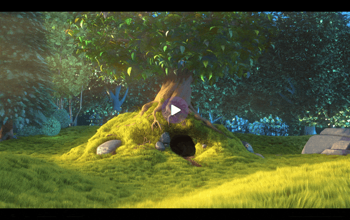

# Video Element Documentation

**Movi Streaming Video Library - Custom HTML Video Element**



---

## Table of Contents

1. [Overview](#overview)
2. [Quick Start](#quick-start)
3. [API Reference](#api-reference)
4. [Attributes](#attributes)
5. [Properties](#properties)
6. [Methods](#methods)
7. [Events](#events)
8. [UI Controls](#ui-controls)
9. [Gestures](#gestures)
10. [Theming](#theming)
11. [Advanced Features](#advanced-features)
12. [Examples](#examples)

---

## Overview

The `<movi-player>` custom HTML element provides a native `<video>`-like interface with enhanced capabilities:

- **Drop-in Replacement:** Compatible with standard HTMLVideoElement API
- **Built-in Controls:** Professional UI with play, progress, volume, settings
- **Gesture Support:** Touch-friendly with tap, swipe, pinch gestures
- **HDR Support:** Automatic HDR detection and Display-P3 rendering
- **Theme System:** Dark/Light modes with customizable styling
- **Ambient Mode:** Extracts and displays average frame colors
- **Track Selection:** Multi-audio/subtitle track selection UI
- **Object Fit Modes:** contain/cover/fill/zoom with smooth transitions
- **Audio-Only Mode:** Dedicated strip UI with embedded cover art for audio files (MP3, FLAC, AAC, Opus)
- **Muted Autoplay Fallback:** Starts muted when autoplay is blocked, shows tap-to-unmute pill
- **Pitch-Preserving Time-Stretch:** Signalsmith Stretch for clean non-1x playback
- **Custom SourceAdapter:** Plug any byte protocol (WebSocket, WebRTC, IndexedDB) directly

**Key File:** [src/render/MoviElement.ts](../src/render/MoviElement.ts)

### Browser Compatibility

| Browser | Version | Notes                              |
| ------- | ------- | ---------------------------------- |
| Chrome  | 110+    | Full support (WebCodecs)           |
| Edge    | 110+    | Full support                       |
| Safari  | 18+     | Full support                       |
| Firefox | 130+    | WebCodecs Yes, HDR Limited         |

---

## Quick Start

### Installation

```bash
npm install movi-player
```

Or from a CDN, with no build step. The module build is the one to reach for —
it is what `import` and every bundler want:

```html
<script type="module" src="https://cdn.jsdelivr.net/npm/movi-player/dist/element.js"></script>
```

…and the **`.global`** build is the same element for a page that cannot use a
module: a classic script that registers `<movi-player>` on load and puts a
`Movi` global on `window`. It is what `jsdelivr`/`unpkg` in the package point
at, so a CDN's copied "default" line works as printed.

```html
<script src="https://cdn.jsdelivr.net/npm/movi-player/dist/element.global.js"></script>
```

`dist/element.slim.global.js` is the same thing built on the slim bundle —
a third of the size, fetching `movi.wasm` from beside itself.

### Basic Usage

```html
<!DOCTYPE html>
<html>
  <head>
    <script type="module">
      import "movi-player";
    </script>
  </head>
  <body>
    <movi-player
      src="https://example.com/video.mp4"
      controls
      autoplay
      muted
      style="width: 100%; height: 500px;"
    ></movi-player>
  </body>
</html>
```

That's it! The element works just like a native `<video>` tag.

---

## API Reference

### Element Registration

The custom element is automatically registered on import:

```typescript
import "movi-player"; // Registers <movi-player>
```

**Element Name:** `movi-player` (hyphen required per Web Components spec)

---

## Attributes

### Media Source

#### `src`

Specifies the video source URL or File object.

```html
<!-- HTTP URL -->
<movi-player src="https://example.com/video.mp4"></movi-player>

<!-- Local file via JavaScript -->
<movi-player id="player"></movi-player>
<script>
  const player = document.getElementById("player");
  const fileInput = document.getElementById("file");
  fileInput.addEventListener("change", (e) => {
    player.src = e.target.files[0];
  });
</script>
```

**Supported Formats:**

- MP4 (`.mp4`, `.m4v`)
- WebM (`.webm`)
- Matroska (`.mkv`)
- QuickTime (`.mov`)
- MPEG-TS (`.ts`)
- Any FFmpeg-supported format
- Adaptive streams — HLS (`.m3u8`), MPEG-DASH (`.mpd`), Smooth Streaming (`.ism`) — auto-routed to Shaka Player (see [Adaptive Streaming](#adaptive-streaming))

---

#### `sourceAdapter` (property)

JavaScript-only property — bypasses `src` entirely and feeds bytes through a custom [`SourceAdapter`](./sources.md#creating-custom-sources). Use this when your media doesn't live behind an HTTP URL or a local `File` (WebSocket, WebRTC data channel, IndexedDB, custom encryption, etc.) — you keep the full `<movi-player>` UI without re-implementing controls.

```html
<movi-player id="player" controls></movi-player>
<script type="module">
  import { MyWebSocketSource } from "./my-source.js";

  const player = document.getElementById("player");
  player.sourceAdapter = new MyWebSocketSource("wss://media.example.com", 12_345_678);
</script>
```

**Mutual exclusion with `src`:**

| You set        | Result                                       |
| -------------- | -------------------------------------------- |
| `src`          | Clears `sourceAdapter`, loads via URL/File   |
| `sourceAdapter`| Clears `src` + `src` attribute, loads via adapter |
| Both           | Last assignment wins                         |
| `null`         | Clears that source; both null → empty state  |

Setting either re-runs the full source-switch flow: disposes the old player, fires `loadstart`, and re-initializes. There's no separate attribute — pass adapter instances through JavaScript.

```javascript
// Swap protocols on a live element
player.sourceAdapter = new MyWebRTCSource(channel);

// Later, switch back to a plain URL
player.src = "https://example.com/video.mp4"; // sourceAdapter auto-clears

// Clear everything
player.src = null;
```

::: tip Programmatic-only
There's no `sourceadapter` HTML attribute — adapter instances aren't serializable. Always assign via JS (or the `setSourceAdapter()` convenience method, identical to the property setter).
:::

---

### Playback Behavior

#### `autoplay`

Starts playback automatically when loaded.

```html
<movi-player src="video.mp4" autoplay></movi-player>
```

**Note:** Most browsers require `muted` attribute for autoplay to work.
Without it, when the browser refuses sound the player starts muted and shows a
"Tap to unmute" pill instead of not starting at all.

The same applies to a page that autoplays by **calling `play()` from script**
with no click behind it — which is how most pages do it, and what an upgraded
`<video>` receives: a refused sound falls back to muted with the pill, and a
start the page made muted shows the pill as `autoplay muted` does.

---

#### `loop`

Restarts playback when the video ends — or, with a queue, asks for the queue
instead.

```html
<movi-player src="video.mp4" loop></movi-player>
<movi-player playlist="/season-1.json" loop="all" controls></movi-player>
<movi-player playlist="/season-1.json" loop="all 5" controls></movi-player>
<movi-player playlist="/season-1.json" loop="5" controls></movi-player>
```

**Value:** bare (or `one`, `item`, `single`, `true`) repeats the **item**, which
is what `loop` has always meant and what `<video loop>` means. `all` (or
`playlist`, `queue`, `wrap`) repeats the **queue**: the next item plays, and the
last one leads back to the first. A number is the gap in seconds between items —
asking a loop to space things out can only mean the queue, so it implies `all`
on its own. Tokens combine in any order; `loop="false"` is the attribute present
and declining.

The item loop is seamless: the next pass is decoded and held while the current
one finishes, so there is no black frame or freeze at the join. Each turn
fires a `loop` event (see [Events](#events)), and `loopCount` counts them.

`loop="all"` turns [`autoadvance`](#autoadvance) on by itself — a queue that
repeats has to move to repeat. Add the attribute anyway when you want a gap
that the loop's own number shouldn't set.

---

#### `muted`

Mutes audio by default.

```html
<movi-player src="video.mp4" muted></movi-player>
```

---

#### `volume`

Sets the initial audio volume (0.0 to 1.0). User preference persists across reloads via OPFS and overrides this default on subsequent loads.

```html
<movi-player src="video.mp4" volume="0.5"></movi-player>
```

---

#### `playbackrate`

Sets the initial playback speed. Persists across reloads like `volume`.

```html
<movi-player src="video.mp4" playbackrate="1.5"></movi-player>
```

**Note:** Attribute name is all lowercase (`playbackrate`). The JS property is camelCase (`player.playbackRate`).

---

#### `playsinline`

Prevents auto-fullscreen on iOS (plays inline instead). It also — on **any touch
device** — **suppresses touch gestures (swipe-seek / volume) while the player is
inline** so they don't interfere with the page's scroll. Fullscreen gestures are
unaffected — they keep working as normal. (This replaces the deprecated
[`gesturefs`](#gesturefs-deprecated).)

```html
<movi-player src="video.mp4" playsinline></movi-player>
```

---

#### `autopictureinpicture`

Enter Picture-in-Picture automatically when the tab is hidden, and leave it on
return — the same attribute `<video>` takes, carried through for markup moved
over from one.

It applies only while the **native element** is carrying playback (a
`fallback="native"` handoff, or `engine="native"`): auto-PiP is a behaviour the
browser performs on a media element, and Movi's own path draws to a canvas,
which has none. On the WASM path the attribute is inert rather than emulated —
Picture-in-Picture itself still works there, through the control or
`requestPictureInPicture()`.

```html
<movi-player src="video.mp4" fallback="native" autopictureinpicture></movi-player>
```

---

### UI Configuration

#### `controls`

Shows/hides the built-in UI controls.

```html
<!-- With controls -->
<movi-player src="video.mp4" controls></movi-player>

<!-- Without controls (custom UI) -->
<movi-player src="video.mp4"></movi-player>
```

---

#### `poster`

Displays an image before playback starts.

```html
<movi-player src="video.mp4" poster="thumbnail.jpg"></movi-player>
```

---

#### `posterfit`

How the poster is fitted, when it should not be fitted the way the video is.
Takes any CSS `object-fit` value — `contain`, `cover`, `fill`, `none`,
`scale-down`. Omit it and the poster follows `objectfit`, which is the default
and what happens without this attribute.

They are genuinely different pictures, and a page can want different things of
them. A vertical layout may want its video letterboxed at its true shape — so a
landscape clip is not cropped or stretched — while the cover image behind it
fills the box, the way YouTube's Shorts page does.

```html
<!-- video shown whole; cover image cropped to fill the frame -->
<movi-player src="clip.mp4" poster="cover.jpg" objectfit="contain" posterfit="cover"></movi-player>
```

---

#### `postertime`

Generates a native-resolution poster frame from a timestamp instead of (or as a fallback for) `poster`. Useful when you don't have a pre-rendered thumbnail but want to show a representative frame.

**Accepted formats:**

- `"10%"` — percentage of total duration
- `"5"` or `"5s"` — seconds
- `"1:30"` — `mm:ss`
- `"0:01:30"` — `hh:mm:ss`

```html
<!-- Show frame at 10% of duration -->
<movi-player src="video.mp4" postertime="10%"></movi-player>

<!-- Show frame at 1 minute 30 seconds -->
<movi-player src="video.mp4" postertime="1:30"></movi-player>
```

**Behavior:**

- Runs on an isolated thumbnail pipeline (separate WASM + `ThumbnailBindings`); does **not** disturb the main player's clock or decoder.
- Respects the video's rotation metadata so portrait videos display correctly.
- Race-guarded — a generation counter invalidates in-flight generators on every `src` change so a late frame from the old source can't paint over the new poster.
- Skipped if an explicit `poster` URL is set, or if the source is encrypted/DRM (those pipelines have their own protected paths).
- Only `File` and plain HTTP URL sources are supported.

**Use Case:** Playlist UIs that don't want to ship pre-rendered thumbnails but still want a sharp, native-resolution preview before play.

---

#### `title`

Sets the video title shown in the in-player overlay. Unlike the global HTML `title` attribute, this does **not** trigger a native browser tooltip on hover.

```html
<movi-player src="video.mp4" title="My Vacation Video" showtitle></movi-player>
```

Use together with `showtitle` to render the title bar. Auto-filled from metadata/filename if not provided.

---

#### `showtitle`

Shows the title bar overlay at the top of the player.

```html
<movi-player src="video.mp4" title="Intro" showtitle></movi-player>
```

Auto-hides with the controls.

---

#### `titlemode`

Decides where the title bar is allowed to appear, and whether it carries a back arrow. Space- or comma-separated tokens, in any order:

| Token | Effect |
| --- | --- |
| `both` | Title bar everywhere (default — you rarely need to write it) |
| `fullscreen` | Only while fullscreen |
| `windowed` | Only while **not** fullscreen (aliases: `inline`, `normal`) |
| `back` | Add a back arrow left of the title |
| `back-mobile` | Same arrow, only on phones — touch devices, or containers under 480px wide |
| `back-fullscreen` | Arrow only while fullscreen (combine: `back-mobile-fullscreen`) |

```html
<!-- title only once the viewer goes fullscreen -->
<movi-player src="video.mp4" title="Intro" showtitle titlemode="fullscreen"></movi-player>

<!-- inline title with a back arrow, hidden in fullscreen -->
<movi-player src="video.mp4" title="Intro" showtitle titlemode="windowed back"></movi-player>
```

The back arrow fires a cancelable `back` event and does nothing else — an embedded player shouldn't navigate its host's page, so what "back" means is yours to decide:

```js
player.addEventListener('back', () => history.back());
player.addEventListener('back', () => player.exitFullscreen()); // or leave fullscreen
```

The arrow's scope is independent of where the bar shows, so `titlemode="back-mobile-fullscreen"` keeps the title everywhere and puts the arrow up only when a phone goes fullscreen.

The placement token only hides the bar. The title still resolves from metadata, `titlechange` still fires, and `resume` keys still work in the mode where the bar isn't shown.

---

#### `chapters`

Chapters that aren't in the media file. The player already reads chapter atoms out of MKV/MP4 containers; this is for the sources that keep them somewhere else — YouTube in the watch page, a CMS in its own database. Each entry is `{title, start, end?, image?}`, where `image` is artwork the timeline tile shows in place of a frame decoded at `start`.

```html
<movi-player chapters='[{"title":"Intro","start":0},{"title":"Setup","start":42}]'></movi-player>
```

```js
player.chapters = [
  { title: 'Intro', start: 0 },
  { title: 'Setup', start: 42 },
  { title: 'Wrap up', start: 610 },
];
player.chapters = null; // back to whatever the container declares
```

**Value:** JSON array (attribute) or the array itself (property). `start` is in seconds; `end` is optional — a chapter runs until the next one starts, and the last to the end of the media.

Feeds everything that reads chapters: the segmented progress bar, the chapter name in the seek preview, and the chapter timeline panel.

A chapter may also carry `image`, a URL the timeline tile shows in place of a frame decoded at `start`:

```js
player.chapters = [
  { title: 'Intro', start: 0, image: '/art/intro.jpg' },
  { title: 'Setup', start: 42 },   // no image -> a frame from the video
];
```

Only the timeline tile reads it — markers and the seek preview are unchanged. Artwork turns with the rest of the strip when the viewer rotates the video, so a rotated timeline stays of a piece. A URL that fails to load falls back to the title-only tile an undecodable frame gets. Chapters read from the container never carry one.

---

#### `playlist`

A queue. The bar grows Previous and Next, `Shift+P` / `Shift+N` walk it, and the
OS lock screen gets its skip pair — none of which exist for a player with one
thing to play.

```html
<movi-player controls
  playlist='[{"src":"ep1.mkv","title":"Pilot"},{"src":"ep2.mkv","title":"The Return"}]'>
</movi-player>

<!-- bare strings, where all you have is URLs -->
<movi-player controls playlist='["ep1.mkv","ep2.mkv","ep3.mkv"]'></movi-player>

<!-- anything that is not a JSON array is a URL the array comes from -->
<movi-player controls playlist="/season-1.json"></movi-player>
```

```js
player.playlist = [
  { src: 'ep1.mkv', title: 'Pilot', poster: '/art/1.jpg' },
  { src: 'ep2.mkv', title: 'The Return', startAt: 92 },
];
player.playlist = [];   // no queue; the buttons leave the bar
```

**Value:** JSON array (attribute), the array itself (property), or a URL. Items
are `{ src?, id?, title?, poster?, startAt? }`; a bare string means `{ src }`.
`url` and `source` are accepted as spellings of `src`. A fetched URL may return
the bare array or `{ "items": [...] }`. Anything else you put on a row is
carried through untouched and comes back on `itemchange`. A row that gives
neither a source nor an `id`/`title` is dropped — an index that lands on nothing
is worse than a shorter queue.

An item **owns** those four fields, in the strict sense: an item with no title
clears the title the last item set, so nothing leaks from one video into the
next. Anything you set for the whole player — a `poster` on the element, a
`title` you never varied — is left alone.

Setting a list opens its first item, unless the element is already playing one
of them:

```html
<!-- opens on episode 2, and knows it is the second of three -->
<movi-player src="ep2.mkv" playlist='["ep1.mkv","ep2.mkv","ep3.mkv"]' controls></movi-player>
```

A single-item list is not a queue: the buttons stay off the bar, because a Next
that can never be pressed is only taking up room.

See [`next()`](#next-boolean), [`previous()`](#previous-boolean),
[`playItem()`](#playitem-index-number-boolean), and the
`itemchange` / `playlistend` events.

##### Queues the host loads

An item's `src` is **optional**, and a queue of src-less items is one the
element never loads. It still owns the queue as a control surface — the two bar
buttons, `Shift+N` / `Shift+P`, the lock-screen skip pair, which end is dead —
and announces every move as a **cancelable** `itemchange`. Cancel it and load
the item your own way:

```js
player.playlist = videos.map((v) => ({
  id: v.id, title: v.title, poster: v.thumbnail,
}));

player.addEventListener('itemchange', (e) => {
  e.preventDefault();                      // the element writes nothing
  router.push(`/watch/${e.detail.item.id}`);
});
```

Use this shape whenever a source is more than a URL. `<source>` / `<track>`
children — a quality ladder, per-language audio, subtitle tracks — cannot be
said in an item's one `src`, and an item that *has* a `src` would hide those
children outright: the children are only read when there is no `src` on the
element. Swapping the children yourself from the handler keeps the ladder, and
keeps fullscreen and the unlocked `AudioContext` that a source swap keeps too.

Two details that make this work:

- **Opening such a queue is silent.** The first item is adopted, not announced —
  the host is already showing it, and an `itemchange` there would send it
  navigating to where it already is.
- **The move is settled before the event fires.** `preventDefault()` takes back
  the *load*, not the move: `playlistIndex`, `hasNext`, the buttons and the lock
  screen all report the new item either way. Reading `player.src` in the handler
  still gives the OUTGOING source; the incoming item is `e.detail.item`.

A src-less item that nobody cancels loads nothing, and says so in the console.

---

#### `playlistindex`

Which item to open on. Default `0`. The `playlistIndex` property reads and
writes the same position — but **writing it does not play anything**: it says
where the queue *is*. [`playItem()`](#playitem-index-number-boolean) is the one
that moves. The two have to be separable, or a host that answers `itemchange` by
navigating and then reports where it landed would send the move straight back.

```html
<movi-player playlist="/season-1.json" playlistindex="3" controls></movi-player>
```

The property reads `-1` when the current source did not come from the queue —
no queue, or a `src` you assigned yourself — and `-1` may be written to say so.
`next()` from there starts the queue at the top rather than resuming from an
index that no longer describes anything.

---

#### `autoadvance`

Let the end of one item start the next. **Off by default** — a queue a page
steps through itself and a queue that plays itself out are both ordinary, and
only one of them can be the behaviour nobody asked for.

```html
<movi-player playlist="/season-1.json" autoadvance controls></movi-player>
<movi-player playlist="/season-1.json" autoadvance="5" controls></movi-player>
<movi-player playlist="/season-1.json" autoadvance="loop" controls></movi-player>
<movi-player playlist="/season-1.json" autoadvance="5 loop" controls></movi-player>
```

**Value:** presence for "the moment it ends", a number for a gap in seconds, and
`loop` to join the ends of the list — which the buttons and the keys read too,
so Next on the last item wraps for all three of them or none. Tokens combine in
any order. An explicit `autoadvance="false"` is the attribute present and
declining, which is how a framework writes it off.

[`loop`](#loop) says the same things from the other side. `loop` bare repeats
the **item**, so nothing ever ends and nothing ever advances — it wins over this
one. `loop="all"` asks for the queue, which turns this attribute on by itself
and joins the ends of the list; a gap given here still wins over the loop's own
number, so the two can be written together in either order.

---

#### `shuffle`

Play the queue in a random order. **Off by default.**

```html
<movi-player playlist="/mixtape.json" shuffle loop="all" controls></movi-player>
```

Its own attribute rather than a `loop` token, because it is its own question: a
queue can be shuffled and played through once, and it can be looped in the order
it was given. They compose — `shuffle loop="all"` is the pair most people mean —
but neither implies the other.

The order is drawn on load and redrawn whenever the queue changes or shuffle is
switched back on, with the item playing **now** kept at the front, so turning it
on changes what comes next and nothing that is on screen. Each **pass** gets its
own order too: coming round to the top under [`loop="all"`](#loop) draws a fresh
one rather than replaying the last — and the item that just played is kept off
the front of it, so the seam never repeats a track back to back. Everything that steps
through the queue follows it: Next and Previous, the keys, auto-advance, and the
wrap at the end. `playlistIndex` still means the item's place in the **queue**,
not in the shuffled order.

`reshuffle()` draws a new order without changing what is playing. The gear menu
carries a Shuffle row of its own whenever the queue holds more than one item, so
a host mirroring the state should follow the `shufflechange` event rather than
assume it is the only one writing it.

---

#### `disablepictureinpicture`

Boolean. Refuses Picture-in-Picture, the same as `<video disablepictureinpicture>`:
`requestPictureInPicture()` rejects with an `InvalidStateError`. To hide the button
as well, use `controlslist="nopip"`.

#### `disableremoteplayback`

Boolean. Turns off remote playback targets (AirPlay, Cast) for the element, the same
as `<video disableremoteplayback>`. Mirrored onto the internal `<video>`, which is
what the browser offers the target on.

#### `controlslist`

Switches built-in controls off, as `no<name>` tokens — the same shape
`<video controlslist>` uses.

```html
<movi-player src="video.mp4" controls
             controlslist="nofullscreen nopip nospeed"></movi-player>
```

**Tokens:** `noplay`, `noplaylist`, `noprev`, `nonext`, `noseekbuttons`, `novolume`, `notime`,
`noprogress`, `noaudio`, `nocc`, `noquality`, `nospeed`, `nostableaudio`,
`nohdr`, `noloop`, `nosettings`, `noaspect`, `nopip`, `nofullscreen`, `nomore`,
`nostats`, `noshortcuts`, `noambient`, `nocrop`, `nosnapshot`, `norotate`,
`notimeline`, `nodivider`, `nosubtitledrag`, `nospinner`, `nocenterplay`
— plus the `id` of any control added with
[`addControl()`](#addcontrol-spec), which is simply not added.

A switched-off control goes everywhere it lives: the button, its context-menu
row, its row in the settings panel, its keyboard shortcut and its line in the
Keyboard Shortcuts sheet, and any gesture that does the same thing —
double-click / double-tap for `nofullscreen`, press-and-hold 2× for `nospeed`,
the fullscreen pinch for `noaspect`. `nocc` takes the caption delay keys (Z / X)
with it, `noplaylist` takes Shuffle, and `nopip` also refuses Picture-in-Picture
on the internal `<video>`, so the browser's own media controls cannot open it
either. `noplaylist` also clears the queue's skip pair from the OS lock screen,
which is the one surface a page cannot restyle its way out of. The tokens can
change at any time; the player follows.

Leaving is always allowed. A token stops a place from being **entered** —
fullscreen, Picture-in-Picture, stats, the timeline, the shortcuts sheet — but a
viewer already inside can still get out by the usual key, button or row. A
setting (speed, loop, captions, aspect, …) simply stays where it is.

Some tokens remove a piece of the bar and nothing else, because what they sit
over belongs to the viewer or to another attribute: `noplay` (Space, K and a
click on the picture still play and pause), `novolume` (M, the arrow keys and
the device's volume still work), `noseekbuttons` (seeking is
[`fastseek`](#fastseek)'s), `noprogress`, `notime`, `nosettings` and `nomore`
(the controls inside them have tokens of their own), `noprev` / `nonext`,
`nocenterplay`, `nodivider`, `nospinner` and `nounmutepill`.

`nosubtitledrag` is not a control on the bar at all — it takes away the
viewer's ability to drag the live caption somewhere else in the picture. The
caption still opens the transcript when clicked.

`nospinner` is not a control either — it takes the built-in loading ring off
the screen so a page can draw its own anywhere it likes. Only the drawing goes:
the element still puts `is-buffering` (ring earned) and `is-spinner-pending`
(ring withheld by [`spinnerdelay`](#spinnerdelay)) on the host for exactly as
long as it always did, which is what a page keys its own indicator off, and the
centre play button still stands down while either is on. To keep the ring where
the player puts it and only change how it looks, use
[`slot="spinner"`](#replace-the-spinner-slot-spinner) instead.

`nocenterplay` takes the big play button off the middle of the picture — over
the poster before the first play, at the end as replay, and on touch. The bar's
own play button stays (that one is `noplay`). A host that draws its own start
or end screen is the usual reason. For an end screen shown with
[`showOverlay()`](#custom-controls) there is nothing to do: while a `"fill"`
overlay is up the centre button stands down by itself.

`noprev` and `nonext` are a different kind of token: they take one BUTTON off
the bar and nothing else. The key, the queue and the lock screen's pair carry
on, because a host trimming a crowded bar is making room, not saying the viewer
may never go back. `noplaylist` is the one that means that. With one end gone
the other keeps play company in a single pill — which is what the bar shows for
a queue anyway, the two ends and play being one control rather than three. Ask the same question in code with
`player.isControlDisabled("pip")`.

---

#### `persist`

Which settings to remember across loads and sessions. Space-separated; nothing
is remembered unless it is listed.

```html
<movi-player src="video.mp4" controls
             persist="loop stablevolume speed aspect volume"
             persistkey="my-app"></movi-player>
```

**Settings:** `loop`, `muted`, `volume`, `speed`, `ambient`, `stablevolume`,
`hdr`, `aspect`, `cropbars`, `audiolang`, `subtitlelang`. Also available as
`MoviElement.persistableSettings`.

`audiolang` and `subtitlelang` are remembered as a **language**, not as a track
number — track 2 is Hindi in one file and a commentary in the next, so the
number is worth nothing across sources. The language is matched against each
new file's tracks once they are known: exactly first, then by two-letter stem,
so a preference stored as `eng` still finds a track tagged `en`. A file that
has no track in that language keeps its own default and the preference waits
for the next one that does. Turning subtitles off is itself a choice and is
remembered as such.

A track with no usable language tag — `und`, which is what a Matroska mux
writes when the field was never filled in — is not a preference. Choosing one
forgets the stored audio language rather than storing `und`, which would
otherwise pick whichever track was equally anonymous in the next file.

Opt-in per setting on purpose: a kiosk that starts every clip muted at 1x
should not inherit the last viewer's choices. A remembered value **wins over
the markup** — that is what opting in means, so leave a setting out of the list
if the page must fix it.

Custom controls added with [`addControl()`](#addcontrol-spec) take
`persist: true` and are remembered under the same namespace.

::: tip Replaces the built-in store
Without `persist`, the element keeps its long-standing behaviour of remembering
volume, muted, speed, stable volume, ambient, HDR, crop black bars, the fit and
the audio / subtitle languages on its own. Setting `persist` takes that
decision over completely — the old store stops saving and restoring, and this
list is exactly what is remembered.
:::

---

#### `persistkey`

Namespaces everything [`persist`](#persist) stores, so two players on a page —
or two apps on a domain — do not share one viewer's preferences.

```html
<movi-player persist="volume speed" persistkey="lesson-player"></movi-player>
```

**Default:** unset — preferences are stored per origin.

---

### Advanced Attributes

#### `renderer`

Chooses the rendering backend.

**Values:**

- `canvas` (default) — WebGL2 canvas rendering with full features (HDR, rotation, snapshots, ambient mode)

```html
<movi-player src="video.mp4" renderer="canvas"></movi-player>
```

::: info MSE / Adaptive streaming / DRM
There is no separate `mse` renderer — adaptive streams (HLS `.m3u8`, MPEG-DASH `.mpd`, Smooth Streaming `.ism`) are handled internally via Shaka Player (with hls.js / dash.js as automatic fallbacks) feeding a hidden native `<video>` element whose frames are drawn to the canvas. DRM is opt-in via the `drm` + `licenseurl` attributes. All of these paths are selected automatically from the source URL; you don't pick them via `renderer`.
:::

---

#### `objectfit`

Controls how video fills the canvas.

**Values:**

- `contain` (default) - Fit within bounds, maintain aspect ratio
- `cover` - Fill bounds, crop if necessary
- `fill` - Stretch to fill bounds (may distort)
- `zoom` - Slightly zoomed in (1.1x)
- `control` - User can pinch/zoom to adjust

```html
<movi-player src="video.mp4" objectfit="cover"></movi-player>
```

---

#### `probesize`

How far the demuxer may read before it says what the streams are.

Bytes, or a shorthand: `512kb`, `2mb`. Left off, the built-in budget applies —
deliberately generous, because a stream with **no header** to read (MPEG-TS, a
raw elementary stream) is identified by watching packets go by, and a budget cut
blind is how such a file ends up with no streams found at all.

Worth narrowing only when you know what you are serving. MP4 and WebM carry
their header at the front and are described in the first few hundred KB, so a
site serving those can open sooner:

```html
<movi-player probesize="1mb" probeduration="1000"></movi-player>
```

Measured over a network source, the open (`loadstart` → `loadedmetadata`) ran
between 0.5s and 2.2s at the default; how much of that a smaller budget returns
depends on the file and the link, so measure rather than assume.

#### `probeduration`

How much media the demuxer may analyse before it says what the streams are, in
milliseconds. The companion to [`probesize`](#probesize), and the same caution
applies: the default is generous so that headerless streams are identified
correctly.

#### `cropbars`

Crops the black bars that are part of the **picture**.

A 2.39:1 film delivered in a 16:9 frame carries its letterbox as pixels, and a
phone video padded into a 4:3 frame carries its pillarbox the same way. Without
this, `cover`, `fill` and `zoom` scale that padding along with the image and
hand back the same bars, larger — with it, the bars come off first, so those
fits mean what they say.

```html
<movi-player src="film.mkv" cropbars objectfit="cover"></movi-player>
```

```javascript
player.cropbars = true;
player.getBarCrop();  // { top: 0.128, bottom: 0.128, left: 0, right: 0 }
player.addEventListener("cropchange", (e) => console.log(e.detail));
```

Detection reads the small mirrored frame the renderer already keeps for ambient
mode, a few times a second, and the crop is applied in the shader — nothing is
decoded twice. It is deliberately slow to believe itself: the same bars have to
hold for over a second, the line just inside a bar has to be much brighter than
the bar (a fade to black has no such edge, which is what stops a night scene
from cropping the film), nothing over a quarter of the frame comes off an edge,
and a crop that lands on a known ratio — 2.39, 1.85, 4:3 and their portrait
twins — is snapped onto it exactly and centred.

Off by default, and a source with no bars is left alone. Bars on **both** axes
at once are taken as measured rather than snapped: a frame padded twice has no
single ratio to land on. The seek-bar preview and the timeline strip decode
separately and still show the bars.

The same setting is on the player itself: a **Crop black bars** switch in the
settings panel, a row in the right-click menu, and the **C** key.

---

#### `bindav`

Stalls the sound and the picture **together**. On by default.

Bound, whichever side runs out empties the other with it and they resume
together. The cost is that a shortfall you would otherwise have watched or
listened through becomes a full stop — which is the honest thing to show, since
a picture running seconds behind its own sound is not playback anyone asked
for.

```html
<!-- unbind: let each side carry on alone -->
<movi-player src="video.mkv" bindav="false"></movi-player>
```

```javascript
player.bindav = false;
```

This is an **opt-out**, and a bare boolean attribute cannot express one — an
absent attribute has to mean "on". So "off" is carried by the value:
`bindav="false"`, `"off"`, `"0"` and `"no"` all unbind, and anything else,
including the attribute being present but empty, binds. The property setter
writes `"false"` rather than removing the attribute for the same reason.

Unbound, a side running dry only counts as a stall if the other one has run dry
too: a frozen picture over continuous sound, or continuous picture over sound
being patched with silence, is taken as the lesser evil. It takes effect on the
next stall, so changing it mid-playback is enough — there is nothing to undo
about one already under way.

---

#### `backgroundplay`

Lets [`autoplay`](#autoplay) start while the tab is **hidden**.

By default a hidden tab parks the autoplay and starts it the first time the tab
is shown. That isn't politeness: a first play started behind another tab meets a
throttled `requestAnimationFrame` and a denied WakeLock, and its opening seek can
time out into a buffering state that only a manual pause → play unsticks.

```html
<movi-player src="album.m4a" autoplay backgroundplay></movi-player>
```

```javascript
player.backgroundplay = true;
```

Turn it on when the page knows that "hidden" doesn't mean "unwatched" — a
background audio player, a playlist that has to keep advancing behind another
tab, a kiosk screen the browser reports as hidden.

This is only about **starting**. Playback that has already begun continues when
the tab goes away with or without this. Document Picture-in-Picture is exempt
either way: the tab is hidden by definition there while the picture is on
screen, so autoplay is never deferred for it.

---

#### `hdr`

Enables/disables HDR rendering.

```html
<!-- HDR enabled (default) -->
<movi-player src="video.mp4" hdr></movi-player>

<!-- Force SDR -->
<movi-player src="video.mp4" hdr="false"></movi-player>
```

**Auto-Detection:**

- BT.2020 primaries + PQ/HLG transfer → Display-P3 canvas
- Otherwise → sRGB canvas

---

#### `theme`

Sets the UI theme.

**Values:**

- `dark` (default)
- `light`

```html
<movi-player src="video.mp4" theme="light"></movi-player>
```

---

#### `ambientmode`

Enables ambient background effects.

```html
<movi-player src="video.mp4" ambientmode></movi-player>
```

**Effect:** Samples average frame colors and applies to wrapper element.

---

#### `ambientwrapper`

Specifies external element for ambient effects.

```html
<div id="wrapper" style="padding: 20px; transition: background 0.5s;">
  <movi-player
    src="video.mp4"
    ambientmode
    ambientwrapper="wrapper"
  ></movi-player>
</div>
```

The wrapper is painted with a soft radial wash of the picture's colour. Set
`--movi-ambient-strength` on the wrapper to scale how strong it is (default `1`):
a wrapper that only shows a thin rim around a framed player usually wants `2`–`3`.

```css
#wrapper { --movi-ambient-strength: 2.4; }
```

---

#### `thumb`

Generates thumbnails on demand (used internally for preview).

```html
<movi-player src="video.mp4" thumb></movi-player>
```

Previews are decoded by the browser where it has a decoder for the source, and
in software where it has not. Software decoding happens on the page's own
thread, so above roughly 4K — an 8K source no browser offers a decoder for, say
— the player leaves previews off for that source rather than stalling the page
for most of a second on every hover. The seek bar itself is unaffected.

---

#### `sw`

Forces software decoding (using FFmpeg WASM) instead of hardware-accelerated WebCodecs.

```html
<movi-player src="video.mp4" sw></movi-player>
```

**Note:** Useful if hardware decoding fails or produces visual artifacts for a specific file.

---

#### `fps`

Overrides the video frame rate with a custom value.

**Values:**

- `0` (default) - Use frame rate from video metadata
- `number` - Fixed frame rate (e.g., `24`, `60`)

```html
<movi-player src="video.mp4" fps="60"></movi-player>
```

---

#### `gesturefs` (deprecated)

> **Deprecated — use [`playsinline`](#playsinline) instead.** An inline player now
> restricts touch gestures to fullscreen on its own. `gesturefs` is still honoured
> for backward compatibility.

Restricts touch gestures to fullscreen mode only. When enabled, tap/swipe/pinch gestures will only work when the player is in fullscreen.

```html
<movi-player src="video.mp4" gesturefs></movi-player>
```

**Use Case:** Prevent accidental gesture triggers when player is embedded in scrollable content or near system gesture edges on mobile devices.

---

#### `nohotkeys`

Disables all keyboard shortcuts for playback control.

```html
<movi-player src="video.mp4" nohotkeys></movi-player>
```

**Use Case:** Useful when embedding player in forms or pages where keyboard shortcuts might conflict with other page functionality.

**Disabled Shortcuts:**
- Space/K - Play/Pause
- Arrow Left/Right - Seek ±10s
- Arrow Up/Down - Volume ±10%
- F - Fullscreen
- M - Mute/Unmute

---

#### `noerrorscreen`

Suppresses the built-in error overlays (the "unsupported source", decode-failure, and network-error screens), so an embedder can render its own error UI instead. Errors are still emitted on the [`error`](#events) event.

```html
<movi-player src="video.mp4" controls noerrorscreen></movi-player>
```

**Use Case:** Custom-branded players and headless embeds that surface failures through their own host UI rather than the player's default screens.

::: tip Headless / bare player
A `<movi-player>` with **no `controls` attribute** is a pure display surface — it shows no resume dialog, no "No Video" empty state, no loading spinner, and ignores all mouse interaction (click, double-click, right-click, drag). Combine with `noerrorscreen` for a fully host-driven render canvas (background/hero video, custom chrome).
:::

---

#### `startat`

Specifies the time (in seconds) where playback should start.

```html
<movi-player src="video.mp4" startat="30"></movi-player>
```

**Use Case:** Start video at a specific timestamp, useful for sharing video links with timestamps or auto-skipping intros.

---

#### `fastseek`

Enables fast seek controls for quick ±10s navigation.

```html
<movi-player src="video.mp4" fastseek></movi-player>
```

**Enables:**
- Skip forward/backward buttons in control bar
- Double-tap on left/right sides to seek
- Arrow Left/Right keyboard shortcuts (±10s)

Those three are separable. Give the attribute a value to keep only the ones you
want — space, comma or pipe separated:

```html
<!-- gestures only: the double-tap, no extra pair of buttons on a phone bar -->
<movi-player src="video.mp4" fastseek="gestures"></movi-player>

<!-- the page draws its own skip buttons; keep the keys and the double-tap -->
<movi-player src="video.mp4" fastseek="keys gestures"></movi-player>
```

| Token | Turns on |
| --- | --- |
| `buttons` | The ⏪/⏩ pair in the bottom bar (aliases: `button`, `controls`, `bar`) |
| `keys` | Arrow Left/Right, and Ctrl+arrow frame stepping (aliases: `keyboard`, `keyonly`, `arrows`) |
| `gestures` | Double-tap either edge, and horizontal drag-to-seek (aliases: `touch`, `swipe`, `doubletap`) |
| `nontouch` | `buttons` + `keys` (aliases: `desktop`, `mouse`, `pointer`) |
| `all` | All three — the same as the bare attribute (aliases: `on`, `true`, `yes`) |
| `none` | Nothing — the same as omitting the attribute (aliases: `off`, `false`, `no`) |

The bare attribute (`fastseek` / `fastseek=""`) means all three, so existing
markup keeps working. An unrecognised token warns and is ignored; a value with
nothing recognisable in it falls back to all three rather than silently
disabling the feature.

**Use Case:** Better navigation experience for longer videos (podcasts, lectures, movies).

---

#### `doubletap`

Enables/disables double-tap to seek gesture.

```html
<!-- Enable (default) -->
<movi-player src="video.mp4" doubletap="true"></movi-player>

<!-- Disable -->
<movi-player src="video.mp4" doubletap="false"></movi-player>
```

**Behavior:** Double-tap left side seeks -10s, double-tap right side seeks +10s.

---

#### `themecolor`

Sets the player's accent colors — one or two, separated by a space.

```html
<!-- primary only: progress bar, buttons, accents -->
<movi-player src="video.mp4" themecolor="#ff5722"></movi-player>

<!-- primary + secondary: secondary tints the centre play/pause flash -->
<movi-player src="video.mp4" themecolor="#ff5722 #000000"></movi-player>
```

**Value:** One or two valid CSS colors (hex, rgb, color name, `color-mix(...)`). Splitting is paren-aware, so `rgb(255 87 34) #000` is two colors, not four.

The secondary is the player's accent: it sets `--movi-accent`, which the centre
play/pause button wears. Set that variable directly and you get the same thing
without a `themecolor` at all. Without a secondary the button keeps whatever
`--movi-accent` holds (the player's own `#4f86ff` unless the page says
otherwise); everything else uses the primary.

**Gradients.** The primary may be a gradient instead of a colour:

```html
<movi-player src="video.mp4" themecolor="linear-gradient(110deg, #674cff, #3c6df5)"></movi-player>
```

A gradient is a background, and text, borders, focus rings and the shades
derived from the accent cannot take one. So a gradient paints the surfaces that
fill an area — the scrubber's fill, a switch that is on, the resume button —
and everything else uses the gradient's first colour. The player ships with its
own brand gradient in that slot; a plain colour replaces it everywhere.

**Use Case:** Match player theme to your brand colors.

---

#### `buffersize`

Target prefetch window in **megabytes** — how far ahead of playback the source should try to keep buffered.

```html
<movi-player src="video.mp4" buffersize="200"></movi-player>
```

**Value:** Target buffer depth in MB.

**Default:** `250` for plain HTTP (sliding window at 8% of file size, capped at 250 MB); `~192` for encrypted mode (prefetch high-water × 2 MB block size).

**Behavior:**
- **HTTP source** — overrides the sliding-window cap. Files smaller than this value are cached entirely; larger files use a sliding window.
- **Encrypted source** — scales the prefetch depth (`PREFETCH_HIGH_WATER`), refill threshold (`LOW_WATER` ≈ half), and block cache cap (≈ 1.5× target).
- **File source** — no-op (entire file already in memory).

**Use Case:** Raise for deep-scrub UX on large files; lower for memory-constrained embeds.

---

#### `spinnerdelay`

How long an interruption has to last, in **seconds**, before the viewer is shown a loading spinner.

```html
<!-- anything under 400ms passes without a spinner -->
<movi-player src="video.mp4" spinnerdelay="0.4"></movi-player>

<!-- a stall is reported after 250ms; an opening is given a full second -->
<movi-player src="video.mp4" spinnerdelay="0.25 1"></movi-player>
```

**Value:** Seconds. The default is **`"1 2"`** — a mid-play stall is reported after a second, an opening after two — so an interruption the player sorts out inside that is one the viewer never hears about. `0` shows the spinner the moment the player says it is loading, which is how this behaved before the default existed.

A second number, separated by a space or a comma, is the wait the **opening** gets — the stretch before this source has put a frame up. One number keeps its old meaning and holds every interruption, opening included, to the same wait.

#### `posterdelay`

How long to wait, in **milliseconds**, before putting the opening poster up — the cover shown while a source loads its first frame.

```html
<!-- only cover it if the picture is going to take more than 600ms -->
<movi-player src="video.mp4" poster="cover.jpg" posterdelay="600"></movi-player>
```

**Value:** Milliseconds. The default is **`0`** — the poster paints at once, which is what a player without this attribute has always done.

It is for a host that prefetches. When the first frame is already on its way, a poster that appears and is replaced a moment later is a flash the viewer reads as something going wrong, not as a cover. Set this and a load that finishes inside the wait never shows a poster at all: the picture is simply there. A load that takes longer still gets covered, at the point where the wait is worth explaining.

The wait applies only to the **opening** poster — the one that comes up before a source has painted anything. A poster replacing a picture that is already on screen is unaffected.

The two are different waits and one number is often wrong for both. A video that has not started has its poster up and is doing exactly what a starting video does; a video that stops mid-picture has frozen, and the viewer is looking at a still that was moving a moment ago. Measured on a page that hit this: an ordinary cold open put the ring up for 925ms of a 1205ms startup — a second of "something is wrong" over a video that was merely beginning — while a real mid-play stall on the same page wanted reporting inside a quarter of a second. Raising the single number far enough to cover the first would have bought that silence by going quiet on the second.

Playback interrupts itself constantly and briefly: an opening seek, a scrub landing, a rendition switch, a queue refilling after a flush. Most of those are over in a tenth of a second, and a ring that appears and vanishes faster than it can be read is not information — it reads as a player in trouble. `spinnerdelay` is the wait before the player admits to one.

The delay is a floor under **every** reason the spinner goes up, because they all pass through one decision: the opening load, seeking, buffering, a rendition switch, a juddering picture, the software-decode retry. A hide cancels a wait still in flight, so an interruption shorter than the delay is one the viewer never hears about. Once the spinner IS up it stays up for as long as the load lasts — the wait is paid once per interruption, not once per tick — and the next interruption pays it again from the top.

It reaches the other two surfaces that say the same thing: strip mode's pulsing progress bar, and the spinner in the document Picture-in-Picture window.

**Behavior:** The wait is in addition to the per-reason grace the player already applies (seeks and picture catch-up are held back briefly on their own, and a picture that is still moving never earns a spinner at all). Both have to pass, so a value of `0` does not switch those off.

**Use Case:** Lower it where stalls are real and long — on a thin mobile link, holding the ring back for a second reads as a player that has died, and `spinnerdelay="0.25"` or `0` reports them as they happen. Raise it where the source is local or a well-provisioned CDN and the honest answer to most interruptions is that nothing worth reporting happened.

---

#### `smoothwarning`

Shows a notice when what is loaded is not expected to play smoothly on this
device at the current speed. Off by default.

```html
<movi-player src="film.mkv" controls smoothwarning></movi-player>
```

The notice is written for the viewer, not a developer — no codec names or
pixel counts — and worded for the media and the cause:

| Situation | Title | Line under it |
|---|---|---|
| Fine at normal speed, not at this one | This video may not play smoothly at 2× speed | It plays fine at normal speed — switch back to 1× if it stutters. |
| Too demanding for the device | This video may not play smoothly on this device | It's very demanding for this device, so it may stutter or lag. |
| Sound-only source | This audio may not play smoothly on this device | Your device may have trouble keeping up, so you might hear gaps or skips. |
| Cannot be decoded at all | This video can't be played on this device | Your device or browser doesn't support this file's format. |
| Measured stutter while playing | This video may not play smoothly on this device | Your device can't decode it fast enough, so the picture may stutter or fall behind the sound. |
| Measured stutter, on the software decoder | This video switched to software decoding | Hardware decoding didn't work for this video, so a slower software decoder took over. The picture may stutter or fall behind the sound. |
| The link, not the device, is short | This media needs about N Mbps to play | It's only arriving at about M Mbps — this connection or the server can't deliver it fast enough. |

It sits at the bottom left, opposite the resume prompt, has a dismiss button, and
goes by itself after 12 seconds.

It asks [`canPlaySmoothly()`](#element-canplaysmoothly-options-promise-playbackassessment)
when a source finishes loading and again whenever the speed changes — a 4K file
can be fine at 1x and not at 2x — once per source and speed, and a speed that
fixes it takes the notice down. It judges only sources this player demuxes
itself; an adaptive stream or the native fallback is not second-guessed.

**Event:** a cancelable `smoothwarning` fires first. Its `detail` is the
assessment plus `media: "video" | "audio"` and `message: { title, body }` — the
same plain-language text the notice would show. The technical `reasons` are
there too, for logging. Call `preventDefault()` to keep the built-in notice down
and show your own:

```typescript
player.addEventListener("smoothwarning", (e) => {
  e.preventDefault();
  showMyBanner(e.detail.message.title, e.detail.message.body);
  console.debug(e.detail.reasons);
});
```

That is the **prediction**. Two more notices come from **measurement**, while
the file is actually playing:

- **Stutter.** At any speed, if five of the last eight seconds show fewer than
  75% of the frames they should, the notice appears once per source ("Your
  device can't decode it fast enough…"). If the picture is on the software
  decoder at that point — most notably when hardware decoding refused the
  stream mid-playback and the player fell back — the notice says that instead
  ("This video switched to software decoding"), and the event's `detail`
  carries `software: true` plus a `softwareReason`. Above 1x the "Play at 1x
  for smoother playback" hint counts the same way. A second in which the host
  page kept the main thread busy is not counted — that is the page, not the
  device. The event's `detail` carries `measured: true`.
- **Link speed.** A source that stalls because its bytes are not arriving fast
  enough — rather than because the device cannot decode it — is probed a few
  times, and if the best reading still falls short the notice says how fast a
  connection the media needs and what it is actually arriving at, rounded to
  speeds people recognise. The `detail` carries `link: true`, `neededBps` and
  `measuredBps`.

The software-decode budget behind the prediction scales with the machine's
core count, so a fast desktop is not warned about a file it plays perfectly.

---

#### `nolinkwarning`

Keeps `smoothwarning` on but never raises the link-speed notice ("This media
needs about N Mbps to play"). The decode notices stay.

```html
<movi-player src="http://127.0.0.1:9000/file.mkv" controls smoothwarning nolinkwarning></movi-player>
```

**Use Case:** a host that serves local files over HTTP — a desktop shell or a
LAN media server streaming the user's own disk from `127.0.0.1`. The player
sees an ordinary HTTP source with a known size, so when a heavy file stalls it
probes the "link" and reports loopback's throughput as a shortfall — blaming a
connection that doesn't exist. Set it per source: on for files served off the
machine's own disk, off for URLs the host proxies, where the network is real.

Toggleable at runtime via the attribute or the `noLinkWarning` property; turning
it on also cancels a probe already in flight.

---

#### `resume`

Saves playback position to localStorage and shows a resume dialog on reload.

```html
<movi-player src="video.mp4" resume></movi-player>
```

Position is saved every 5 seconds and on pause. Cleared when video ends.

The position is filed under the **title** — the one thing about a source that
survives the URL changing underneath it, which a signed link, a proxy or a CDN
that rewrites the path all do. A source with no title resolved yet has nowhere
to file it, so nothing is saved.

---

#### `resumekey`

Files the resume position under a name you choose instead of the title.

```html
<movi-player src="/signed/abc123.mp4" resume resumekey="episode-42"></movi-player>
```

The title is the player's guess; a host with a catalogue has the fact. Two
episodes that share a title are not the same video, a title the host later
corrects is still the same video, and a source whose title never resolves gets
no resume at all without this. The key is also known before the file opens, so
the position is offered on the first check rather than after metadata arrives.

Also a property: `el.resumeKey = "episode-42"`. Empty or absent means the title
decides, as before. For a saved position it needs `resume`.

**It also says two sets of links are the same media.** A host whose URLs expire
— YouTube's, a signed CDN link, Google Drive's — renews them by swapping the
`<source>` children, and to the player that looks exactly like the next video in
a queue. With `resumekey` set and unchanged across the swap, the player treats it
as the same media under new links: it picks up at the same position, paused if it
was paused, playing if it was, at the same speed — no `resume` needed. Change the
key along with the children for a new video, and it starts fresh as before.

```jsx
// React: the video's own id, not the URL — the URL is what changes.
<MoviPlayer resumekey={videoId} autoplay>
  {qualities.map((q) => <MoviSource key={q.url} src={q.url} />)}
</MoviPlayer>
```

A wrapper that sets the key a frame after the children change is fine: the
decision is made once the new source has loaded, not at the swap.

**Not needed for a discarded tab.** When the browser takes a background tab's
memory back (Chrome's Memory Saver) and the viewer returns, the page reloads —
and the player puts them back where they were on its own, the way a native
`<video>` or YouTube does, with no prompt and no attribute. That is a different
thing from `resume`: a discard interrupts the *same* visit and nobody asked for
it, so the position just comes back — paused if it was paused, playing if it
was (where the browser allows playback without a fresh gesture), at the speed
it was at. It is kept in `sessionStorage`, so it lives exactly as long as the
tab, and it applies only to URL sources: a local file cannot be handed back to a
page after a reload. It needs `document.wasDiscarded`, which today is Chromium.

---

#### `stablevolume`

Enables loudness normalization (DynamicsCompressorNode). Reduces loud scenes and boosts quiet ones.

```html
<movi-player src="video.mp4" stablevolume></movi-player>
```

Toggle at runtime via the UI button or context menu.

---

#### `subtitledelay`

Shifts subtitle timing relative to video, in seconds. Sign matches VLC and mpv: **positive** values shift subtitles **later**, negative shifts them earlier.

```html
<!-- Subtitles are 200ms ahead of dialogue — push them later -->
<movi-player src="video.mkv" subtitledelay="0.2" controls></movi-player>
```

**Hotkeys:** `Z` shifts earlier, `X` shifts later, by 100ms per press. The OSD shows the current offset.

**Notes:**
- Applies live without re-decoding — shift is computed at the active-cue check, so the same offset works for text and image (PGS/DVB) subtitles.
- **Not** persisted to `SettingsStorage` — sync drift is per-source, so a global value would mis-shift unrelated videos.
- File-source only. Streamed sources (HLS) don't expose the timing surface this control depends on, so the UI hides it.

---

#### `subtitlesize` / `subtitlecolor` / `subtitlebg` / `subtitleedge`

Customize subtitle rendering. All four are also exposed in the in-player customize panel under the subtitle menu and persist to localStorage when changed there.

```html
<movi-player
  src="video.mkv"
  subtitlesize="1.2"      <!-- size multiplier; default 1 -->
  subtitlecolor="#FFFF00"  <!-- text color -->
  subtitlebg="0.5"         <!-- background opacity 0..1 -->
  subtitleedge="outline"   <!-- none | shadow | outline | raised -->
  controls
></movi-player>
```

The size multiplier drives both text (SRT/ASS/VTT) and image (PGS/VOBSUB) subtitles. Edge style applies to text subs only.

**Where the caption sits** is the viewer's, not the page's: they drag the caption itself to anywhere in the picture, and a double click (or double tap) puts it back. The position is kept as a share of the picture rather than a pixel offset, so it holds through a resize, fullscreen and the next video, and it persists to localStorage alongside the four attributes above — as does "Reset to default" in the customize panel, which clears it with everything else. Hosts that want the caption to stay where the player puts it write `controlslist="nosubtitledrag"`.

---

#### `encrypted`

Enables encrypted video playback. Requires `tokenurl` and `videourl` attributes.

```html
<movi-player
  encrypted
  tokenurl="/api/token"
  videourl="/api/video"
  videoid="movie.mp4"
  controls autoplay muted
></movi-player>
```

See [Encrypted Server Example](https://github.com/mrujjwalg/movi-player/tree/develop/encrypted-server) for the complete server implementation.

---

#### `tokenurl`

Token endpoint URL for encrypted playback. Server returns HMAC signing secret and file metadata.

---

#### `videourl`

Video endpoint URL for encrypted playback. Chunks are served with token + HMAC validation.

---

#### `videoid`

Video identifier sent to the token server. Maps to a specific encrypted file on the server.

---

#### `drm`

Enables DRM playback mode for HLS streams. When set, the player switches to a native `<video>` element + EME API instead of the canvas pipeline. Canvas-only features (rotation, snapshots) are disabled in this mode.

```html
<movi-player
  src="https://example.com/stream.m3u8"
  drm
  licenseurl="https://license.pallycon.com/ri/licenseManager.do"
  controls autoplay
></movi-player>
```

Works with Widevine (Chrome/Edge/Firefox) and FairPlay (Safari).

---

#### `licenseurl`

Widevine/FairPlay license server URL for DRM playback. Required when `drm` is set.

```html
<movi-player
  src="stream.m3u8"
  drm
  licenseurl="https://license.example.com/wv"
></movi-player>
```

Supported providers: PallyCon, EZDRM, BuyDRM, AWS Media Services, custom.

---

#### `licenseheaders`

Extra HTTP headers sent with the **DRM license request only** — the auth token, customer ID or provider-specific header your license server expects. A JSON object string; invalid JSON is ignored with a console warning.

```html
<movi-player
  src="stream.mpd"
  drm
  licenseurl="https://license.example.com/wv"
  licenseheaders='{"Authorization":"Bearer eyJ...","X-Customer-Id":"acme"}'
></movi-player>
```

Distinct from [`headers`](#headers), which applies to media requests (manifests, segments, thumbnails) rather than to the license exchange. Set both if your license server and your CDN each need auth.

---

#### `headers`

Custom HTTP headers applied to **every** media network request — adaptive-stream manifests *and* their segments (Shaka request filter, hls.js `xhrSetup`, dash.js request interceptor), progressive HTTP, thumbnails, and the encrypted source (stream GET + token refresh). Use it to carry auth tokens, signed-URL headers, or API keys.

```html
<!-- Declarative: a JSON object string -->
<movi-player
  src="https://example.com/master.m3u8"
  headers='{"Authorization":"Bearer eyJ..."}'
  controls
></movi-player>
```

```typescript
// Property form (preferred for non-trivial maps) — takes an object, not a string
player.headers = { Authorization: `Bearer ${token}`, "X-Api-Key": key };
```

**Notes:**
- The attribute must be valid JSON; an invalid string is ignored with a console warning.
- A native `<audio>` element can't carry custom headers, so when `headers` is set a split-audio track is fetched (with the headers) and played from an in-memory blob URL.
- Changing `headers` on a connected element with a source reloads it.

---

#### `audioonly`

Data-saver mode — play only the audio and skip the video decode to save CPU and bandwidth. Toggleable live (no reload for muxed/file sources).

```html
<movi-player src="podcast.mkv" audioonly controls></movi-player>
```

---

#### `wasmurl`

URL of the external `movi.wasm`, used only by the **slim build**
(`movi-player/element/slim`, i.e. `dist/element.slim.js`).
The slim build ships the WASM as a separate file instead of embedding it; by
default it loads `movi.wasm` from next to the JS bundle. Set `wasmurl` when you
host it somewhere else — a CDN, or a versioned path.

```html
<movi-player
  src="video.mkv"
  wasmurl="https://cdn.example.com/movi-player/movi.wasm"
  controls
></movi-player>
```

Has no effect on the default build (`element.js`), whose WASM is embedded. Must
be set before the engine first loads (the attribute is read on connect).

Setting `wasmurl` also **turns off the slim build's automatic native fallback.**
The slim build defaults to `fallback="native"` for the consumer who never hosts
`movi.wasm` — a source it can't open then degrades to the browser's `<video>`.
Pointing `wasmurl` at the file says you *are* hosting it, so the WASM engine
becomes authoritative (same as the embedded build) and an unplayable source
surfaces an error instead of silently degrading. Opt back in with an explicit
[`fallback="native"`](#fallback) if you still want the safety net.

---

#### `fallback`

What to do with a source Movi itself can't play.

**Values:**

- *(unset, default)* — surface the error screen
- `native` — hand the source to the browser's own `<video>` and keep the Movi UI on top of it

```html
<movi-player src="video.mp4" fallback="native" controls></movi-player>
```

Tried once per source. If the native element also fails, playback falls through to the software-decode path (for decoder errors) or to the normal error screen — so this only ever adds a recovery attempt, it never hides a genuine failure.

Native playback has no WASM canvas, so canvas-dependent controls (rotate, snapshot, aspect, ambient mode, the timeline strip, HDR) hide themselves for the duration. What survives: the quality menu (including Auto) when the source declared a `<source>` ladder, subtitles declared as `<track>` children (rendered in Movi's own overlay, so the subtitle styling controls still apply), and split/multi-language audio via a synced companion `<audio>`. A [`nativefallback`](./events.md#movielement-dom-events) event fires with the source that was handed over.

---

#### `engine`

Which playback engine leads, and what follows it. Movi has four ways to play a source and, by default, a fixed order: its own WASM demuxer + WebCodecs pipeline first; Shaka (then dash.js / hls.js) for adaptive manifests; the WASM demuxer again as the manifest fallback; the browser's `<video>` last. `engine` re-orders that — the first name listed is attempted first, and any others define what's tried when it fails, replacing the built-in escalation.

**Values:** *(space-separated; unset keeps the built-in order)*

- `wasm` — Movi's own demuxer + WebCodecs pipeline. For a manifest this is Movi's own DASH/HLS handling, which the default order only reaches as a last resort. Aliases: `demuxer`, `movi`
- `shaka` — Shaka Player (the default engine for adaptive manifests)
- `dashjs` — dash.js
- `hlsjs` — hls.js
- `native` — the browser's own `<video>`, under Movi's UI

```html
<!-- native <video> first, nothing after it -->
<movi-player src="video.mp4" engine="native" controls></movi-player>

<!-- native first, Movi's pipeline if it can't play it -->
<movi-player src="video.mkv" engine="native wasm" controls></movi-player>

<!-- dash.js instead of Shaka, Shaka as the backup -->
<movi-player src="stream.mpd" engine="dashjs shaka" controls></movi-player>

<!-- force Movi's own demuxer for a manifest, skipping every MSE engine -->
<movi-player src="stream.m3u8" engine="wasm" controls></movi-player>
```

Read at load time; changing it applies to the next source. A single name means exactly that engine and no fallback — list the ones you want tried, in order. Independent of [`fallback`](#fallback), which only appends native as a last-resort recovery; `engine` decides the whole order.

```typescript
player.audioOnly = true;   // switch to audio-only at runtime
player.audioOnly = false;  // restore video
```

**Behavior by source type:**
- **Muxed file** — the process loop skips the video decode (saves CPU).
- **Adaptive stream** — switches to an audio-only variant (or the smallest video rendition) with ABR off (saves bandwidth), done live via track selection.
- **Split source** — stops the demux loop entirely so the video file body never downloads; the native `<audio>` drives playback.

The UI forces the album-art / strip surface and disables previews. The attribute maps to the `audioOnly` property and `PlayerConfig.audioOnly`.

**Fullscreen works for audio** — any audio presentation, by every route (the button, `F`, the context menu, double-click / double-tap, swipe-up, `movi-fullscreen-request` + [`setHostFullscreen`](#sethostfullscreen)). With cover art (embedded, or the `poster` painted as art) the artwork view fills the screen, the sleeve beside its title when the screen is wide and above it when it is tall. With no art, the 56px strip gives way to the same full-screen view with a drawn sleeve in the art's place — coloured from the title — and comes back unchanged on exit; `audiostripchange` keeps reporting the windowed layout, so a page that collapses its wrapper for the strip is not reflowed by the trip. Audio never locks the phone's orientation, and a video that switches to audio while fullscreen stays fullscreen. `controlslist="nofullscreen"` still switches it all off.

---

#### `lcevc` / `lcevcurl`

Enables MPEG-5 Part 2 **LCEVC** enhancement-layer decoding for adaptive streams. Requires the external `lcevc_dec.js` library — point `lcevcurl` at it to lazy-load, or expose a global `LCEVCdec`.

```html
<movi-player
  src="https://example.com/manifest.mpd"
  lcevc
  lcevcurl="https://cdn.example.com/lcevc_dec.min.js"
  controls
></movi-player>
```

Maps to `PlayerConfig.lcevc` / `lcevcUrl`. Ignored when `drm` is set.

---

### Standard HTML Attributes

#### `width` / `height`

Sets element dimensions (CSS preferred).

```html
<movi-player src="video.mp4" width="800" height="450"></movi-player>
```

---

#### `preload`

Hints how much data to buffer initially.

**Values:**

- `none` - Don't preload
- `metadata` (default) - Load metadata only
- `auto` - Buffer as much as possible

```html
<movi-player src="video.mp4" preload="auto"></movi-player>
```

---

#### `crossorigin`

CORS mode for cross-origin videos.

**Values:**

- `anonymous` - No credentials
- `use-credentials` - Include credentials

```html
<movi-player
  src="https://cdn.example.com/video.mp4"
  crossorigin="anonymous"
></movi-player>
```

---

#### `vr`

Render immersive / spherical video. The player auto-enters the right projection from the source's spherical metadata, so for ordinary 360 clips you don't need this at all — `vr` is for forcing a projection or marking a source whose metadata is missing.

**Tokens** (space-separated, combinable):

- _(bare)_ / `360` — 360° equirectangular
- `180` — 180° (VR180) hemisphere
- `fisheye` — equidistant fisheye un-projection
- `sbs` / `3d` — side-by-side **stereo** (uses the left eye)
- `littleplanet` / `planet` / `tinyplanet` — stereographic "little planet"

```html
<movi-player src="360.mp4" vr></movi-player>
<movi-player src="vr180-3d.mp4" vr="180 fisheye sbs"></movi-player>
<movi-player src="planet.mp4" vr="littleplanet"></movi-player>
```

Drag (or arrow keys) to look around; scroll / pinch to zoom.

#### `vrpad`

Opt-in on-screen joystick for looking around in `vr` mode (handy on touch / without a mouse).

```html
<movi-player src="360.mp4" vr vrpad></movi-player>
```

#### `audiooutput`

Route audio to a specific output device (speakers, Bluetooth, a virtual device) via `AudioContext.setSinkId`. Accepts a concrete `deviceId` **or** a **label substring** (case-insensitive) — handy because device ids are session-salted, so a substring like `"Headphones"` reliably targets the same physical device across reloads. `""` / `"default"` routes to the system default.

```html
<movi-player src="video.mkv" audiooutput="Headphones"></movi-player>
```

Also settable at runtime — see [`setAudioOutput()`](#setaudiooutput-deviceid-string-promise-boolean). A right-click **Audio Output** submenu lets the viewer pick a device too.

---

## Properties

### Build Info

#### `version: string` (read-only)

The player version, baked in at build time. Readable off the class, off any instance, or as an import — all three are the same string.

```typescript
MoviElement.version;                              // "0.4.1"
document.querySelector("movi-player").version;    // "0.4.1"

import { VERSION } from "movi-player/element";
```

---

#### `build: "slim" | "full"` (read-only)

Which bundle is running: `"full"` embeds the FFmpeg WASM in the JS, `"slim"` streams it from a separate `movi.wasm` (see [`wasmurl`](#wasmurl)).

```typescript
MoviElement.build;                              // "full"
document.querySelector("movi-player").build;    // "full"

import { BUILD } from "movi-player/element";
```

Deliberately separate from `version` — both bundles ship the same release, so folding it in (`0.4.1+slim`) would break any consumer comparing versions for equality. It's the axis worth capturing in a bug report: the two differ in how the engine loads, and in what happens when it can't (the slim build degrades to native `<video>` on its own). The stats panel shows both as `Player: 0.4.1 (slim)`.

---

### The core player

#### `player: MoviPlayer | null` (read it, don't assign it)

The [`MoviPlayer`](./player.md) the element drives — the engine that loads, decodes and plays the current source. It is there for what the element does not forward itself: [`getPreviewFrame()`](./player.md), `getMediaInfo()`, `getCacheStats()`, the track and rendition APIs.

```typescript
const el = document.querySelector("movi-player");  // with thumb="precise"

el.addEventListener("loadeddata", async () => {
  const blob = await el.player?.getPreviewFrame(30, null, true);
  if (blob) img.src = URL.createObjectURL(blob);
});
```

- **Take it when you need it.** The element builds a new player for every source (and on some recoveries) and destroys the old one, so a reference kept across a `loadstart` points at one that is gone. Read `el.player` after `loadeddata`.
- **`null`** before the first load and after `src` is cleared.
- **Previews need the `thumb` attribute** — without it `getPreviewFrame()` returns `null`. Pass `true` as its third argument to wait for a frame already being made instead of getting `null`.

---

### Media Properties

#### `src: string | File | null`

Gets/sets the media source.

```typescript
const player = document.querySelector("movi-player");

// Set URL
player.src = "https://example.com/video.mp4";

// Set File
player.src = fileObject;

// Get current source
console.log(player.src);
```

---

#### `currentTime: number`

Gets/sets current playback position (in seconds).

```typescript
// Get position
console.log(player.currentTime); // 45.2

// Seek to position
player.currentTime = 120.5;
```

---

#### `duration: number` (read-only)

Total media duration in seconds.

```typescript
console.log(`Duration: ${player.duration}s`);
```

---

#### `paused: boolean` (read-only)

True if playback is paused.

```typescript
if (player.paused) {
  console.log("Video is paused");
}
```

---

#### `ended: boolean` (read-only)

True if playback has reached the end.

```typescript
if (player.ended) {
  console.log("Video finished");
}
```

---

#### `playing: boolean` (read-only)

True only while the player is actively playing — distinguishes `playing` from intermediate states like `ready`, `loading`, `seeking`, and `buffering`. Useful when deciding whether to carry play state across a source switch (e.g., a playlist).

```typescript
if (player.playing) {
  console.log("Frame loop is running");
}

// Forward play state to the next playlist item
const wasPlaying = player.playing;
player.src = nextItem.url;
if (wasPlaying) await player.play();
```

**Note:** `!paused` is true even during `ready`/`buffering`. Use `playing` when you want to mean "actively rendering frames right now."

---

### Audio Properties

#### `volume: number`

Gets/sets audio volume (0.0 to 1.0).

```typescript
player.volume = 0.5; // 50% volume
```

---

#### `muted: boolean`

Gets/sets mute state.

```typescript
player.muted = true; // Mute
```

---

### Playback Control

#### `playbackRate: number`

Gets/sets playback speed multiplier.

```typescript
player.playbackRate = 1.5; // 1.5x speed
player.playbackRate = 0.5; // Half speed
```

---

#### `loop: boolean`

Gets/sets whether the **item** repeats — the `<video loop>` meaning, kept
because that is what a page writing `player.loop = true` has always meant.

```typescript
player.loop = true; // this video, over and over
```

---

#### `loopMode: "off" | "one" | "all"`

What [`loop`](#loop) is set to, by name. `"one"` is the item; `"all"` is the
queue, which turns auto-advance on and joins the ends of the list. `loop` the
boolean is the `"one"` half of this.

```typescript
player.loopMode = 'all'; // play the queue round and round
```

---

#### `loopCount: number` (read-only)

How many times the current source has looped, from `0`. Resets with the source;
the `loop` event carries the same number as each turn happens.

---

#### `shuffle: boolean`

Gets/sets whether the queue plays in a random order (see
[`shuffle`](#shuffle)). Writing it reflects the attribute and fires
`shufflechange`.

```typescript
player.shuffle = true;
player.reshuffle();  // a new order, same item still playing
```

---

#### `sw: boolean`

Gets/sets whether software decoding is forced.

```typescript
player.sw = true; // Force software decoding
```

---

#### `fps: number`

Gets/sets custom frame rate override.

```typescript
player.fps = 24; // Override to 24 FPS
player.fps = 0; // Auto (from metadata)
```

---

#### `gesturefs: boolean` (deprecated)

> **Deprecated — use `playsInline` instead**, which now restricts gestures to
> fullscreen on its own. Kept for backward compatibility.

Gets/sets whether touch gestures are restricted to fullscreen mode only.

```typescript
player.gesturefs = true; // Gestures only work in fullscreen
player.gesturefs = false; // Gestures always enabled
```

---

#### `nohotkeys: boolean`

Gets/sets whether keyboard shortcuts are disabled.

```typescript
player.nohotkeys = true; // Disable keyboard shortcuts
player.nohotkeys = false; // Enable keyboard shortcuts
```

---

#### `startat: number`

Gets/sets the starting playback time in seconds.

```typescript
player.startat = 30; // Start at 30 seconds
```

---

#### `fastseek: boolean`

Gets whether ANY fast-seek affordance is on. Assign a boolean as before, or the
attribute's token list to pick channels.

```typescript
player.fastseek = true; // Enable ±10s skip buttons
player.fastseek = false; // Disable fast seek
player.fastseek = "keys gestures"; // No buttons in the bar
```

---

#### `fastseekModes: string`

The channels currently on, as the canonical token list (`"buttons keys
gestures"`, `""` when none). Assigning is the same as assigning to `fastseek`.

```typescript
player.fastseekModes; // "keys gestures"
player.fastseekModes = "touch"; // gestures only
```

---

#### `doubletap: boolean`

Gets/sets whether double-tap to seek is enabled.

```typescript
player.doubletap = true; // Enable double-tap seek
player.doubletap = false; // Disable double-tap seek
```

---

#### `themecolor: string | null`

Gets/sets custom theme color for the player UI.

```typescript
player.themecolor = "#ff5722"; // Primary only
player.themecolor = "#ff5722 #000000"; // Primary + secondary
player.themecolor = null; // Reset to default

// `themeColor` additionally accepts the pair as an object
player.themeColor = { primary: "#ff5722", secondary: "#000000" };
```

---

#### `buffersize: number`

Gets/sets the target prefetch window in **megabytes**. Applies to both HTTP and encrypted sources; file sources ignore it.

```typescript
player.buffersize = 400; // Keep ~400 MB buffered ahead
player.buffersize = 0;   // Restore library default
```

---

#### `spinnerDelay: number`

Gets/sets the loading-spinner delay in **seconds**. See the [`spinnerdelay` attribute](#spinnerdelay).

```typescript
player.spinnerDelay = 0.4; // Interruptions under 400ms pass in silence
player.spinnerDelay = 0;   // Show the spinner as soon as loading starts
```

One number, which is what this property is: setting it holds the opening to the same wait as everything else, replacing the split the default carries. To give the opening its own, set the attribute — `player.setAttribute("spinnerdelay", "0.25 1")`.

---

#### `headers: Record<string, string> | null`

Gets/sets custom HTTP headers applied to all media requests. See the [`headers` attribute](#headers) for scope and caveats. Unlike the attribute (a JSON string), the property takes an object.

```typescript
player.headers = { Authorization: `Bearer ${token}` };
player.headers = null; // Clear
```

---

#### `audioOnly: boolean`

Gets/sets data-saver audio-only mode. See the [`audioonly` attribute](#audioonly).

```typescript
player.audioOnly = true;  // Skip video decode / fetch audio-only rendition
player.audioOnly = false; // Restore video
```

---

### UI Properties

#### `controls: boolean`

Gets/sets whether controls are visible.

```typescript
player.controls = true; // Show controls
```

---

#### `poster: string`

Gets/sets poster image URL.

```typescript
player.poster = "thumbnail.jpg";
```

---

#### `postertime: string | null`

Gets/sets the timestamp used to generate the poster frame. Setting to `null` removes the attribute. See the [`postertime` attribute](#postertime) for accepted formats.

```typescript
player.postertime = "10%";   // Generate poster at 10% of duration
player.postertime = "1:30";  // Generate poster at 1m 30s
player.postertime = null;    // Disable
```

---

#### `subtitleDelay: number`

Gets/sets the subtitle offset in seconds. Setter fires a `subtitledelaychange` CustomEvent on the element. See the [`subtitledelay` attribute](#subtitledelay) for sign convention.

```typescript
player.subtitleDelay = 0.5;   // Subtitles 500ms later
player.subtitleDelay = -0.3;  // Subtitles 300ms earlier
player.subtitleDelay = 0;     // Reset
```

VLC-compatible aliases are also exposed:

```typescript
player.setSubtitleDelay(0.5);
const offset = player.getSubtitleDelay();
```

---

## Methods

### Playback Control

#### `play(): Promise<void>`

Starts playback.

```typescript
await player.play();
console.log("Playing");
```

**Returns:** Promise that resolves when playback starts

---

#### `pause(): void`

Pauses playback.

```typescript
player.pause();
```

---

#### `load(): Promise<void>`

Loads the media source (called automatically when `src` changes).

```typescript
player.src = "video.mp4";
await player.load();
```

**Note:** Calling `play()` while a source is still loading is now safe — the play intent is queued and flushed once the load completes (matches `HTMLMediaElement` semantics).

---

#### `dispose(): void`

Tears down the internal player and resets transient UI (subtitles, timeline, time, title, generated poster) back to the no-source state. Called automatically on every `src` change so playlist-style flows never leak state between sources. Safe to call when nothing is loaded.

```typescript
// Manual cleanup before swapping content
player.dispose();
player.src = nextVideo;
```

**Notes:**
- Does **not** touch the canvas or the native `<video>` element — the canvas keeps its WebGL2 context for the next renderer to reuse, and resetting `<video>` would interfere with the DRM/HLS path.
- Releases any per-source software-decoder fallback so the next source gets a fresh hardware-decode attempt.
- Revokes any `postertime`-generated poster URL.

---

#### `loadEncrypted(config): Promise<void>`

Loads an encrypted video source programmatically.

```typescript
await player.loadEncrypted({
  videoUrl: "/api/video",
  tokenUrl: "/api/token",
  videoId: "movie.mp4",
  fingerprint: await generateFingerprint(),
  sessionToken: "jwt-token",
});
```

**Config:**
- `videoUrl` — Encrypted video endpoint
- `tokenUrl` — Token/HMAC endpoint
- `videoId` — Video identifier
- `fingerprint` — Browser fingerprint string
- `sessionToken` — Auth session token
- `tokenRefreshInterval` — Token refresh ms (default: 1500)
- `onAuthFailed` — Callback on auth failure

---

### Playlist

All of these are no-ops without a [`playlist`](#playlist), and the ones that
move the queue return `false` rather than throwing, so a UI can call them
without asking first. They return `true` for a move a host cancelled — the queue
moved; only the load was taken back.

#### `next(): boolean`

Plays the next item — the next in the **play order**, so it follows
[`shuffle`](#shuffle) when that is on. `false` when there isn't one — the last
item with neither [`loop="all"`](#loop) nor `loop` on
[`autoadvance`](#autoadvance), or no queue at all — and nothing changes in that
case.

```typescript
if (!player.next()) showRecommendations();
```

---

#### `previous(): boolean`

Plays the previous item. `false` when there isn't one.

---

#### `playItem(index: number): boolean`

Plays the item at that index. Out of range is `false` and no change; the index
already playing **restarts** it, which is what clicking the row you are on means
everywhere else.

```typescript
list.addEventListener('click', (e) => player.playItem(rowIndex(e.target)));
```

---

#### `hasNext` / `hasPrevious` (properties)

Whether there is anything that way — the same question the buttons ask, so your
own controls grey out with theirs.

```typescript
nextBtn.disabled = !player.hasNext;
player.addEventListener('itemchange', () => {
  nextBtn.disabled = !player.hasNext;
});
```

---

#### `playlistItem` (property)

The item playing right now, or `null` when the current source did not come from
the queue.

---

#### `reshuffle(): void`

Draws a fresh random order. A no-op unless [`shuffle`](#shuffle) is on. The item
playing keeps its place at the front, so this changes what comes next and
nothing that is on screen.

---

### Track Selection

::: info
The element does **not** expose numeric `selectVideoTrack` / `selectAudioTrack` / `selectSubtitleTrack` directly — use the language-keyed helpers below ([`selectAudioLang`](#getaudiolangs-lang-label-active), [`selectSubtitleLang`](#getsubtitlelangs-lang-label-active)). For raw `Track[]` lists and numeric IDs, drop down to the underlying `MoviPlayer` instance via [`getCanvas()`](#getcanvas-htmlcanvaselement)'s sibling APIs or the programmatic `MoviPlayer` directly.
:::

---

### Source Helpers

#### `setFile(file: File | null): void`

Convenience setter for a `File` source — equivalent to `player.src = file`.

```typescript
fileInput.addEventListener("change", (e) => {
  player.setFile(e.target.files[0]);
});
```

---

#### `source(value?): { src, type, audioSrc } | void`

Video.js-style source API. With no arg, returns the current source descriptor; with an arg, sets a new one.

```typescript
// Single string
player.source("video.mp4");

// Object with type hint
player.source({ src: "video.mp4", type: "video/mp4" });

// Multiple sources — first playable wins (uses canPlayType)
player.source([
  { src: "video.mp4", type: "video/mp4" },
  { src: "video.webm", type: "video/webm" },
]);

// Separate video + audio (DASH-style split)
player.source({
  video: { src: "video-only.mp4", type: "video/mp4" },
  audio: { src: "audio.m4a", type: "audio/mp4" },
});

// Multi-language audio + external subtitles
player.source({
  video: { src: "video.mp4", type: "video/mp4" },
  audio: [
    { src: "en.m4a", type: "audio/mp4", lang: "en", label: "English" },
    { src: "hi.m4a", type: "audio/mp4", lang: "hi", label: "Hindi" },
  ],
  subtitles: [
    { src: "en.vtt", lang: "en", label: "English", format: "vtt" },
  ],
});

// Read current source
const current = player.source();
console.log(current.src, current.type, current.audioSrc);
```

---

#### `audioSrc: string | null`

Gets/sets a separate audio source URL for split video+audio playback. Can also be set via the child `<source kind="audio">` pattern in HTML.

```typescript
player.audioSrc = "audio-only.m4a";
```

---

### Declarative Children (`<source>` and `<track>`)

The element parses `<source>` and `<track>` children at connect time so integrators can ship full track configurations as plain HTML — no JS source setter required.

**Split video + single audio file** — pair a video `<source>` with one `<source kind="audio">`:

```html
<movi-player controls>
  <source src="video-only.mp4" type="video/mp4">
  <source src="audio-only.m4a" type="audio/mp4" kind="audio">
</movi-player>
```

**Premuxed quality menu** — multiple video `<source>` tags with `data-height` (and optional `data-label`, `data-fps`, `data-badge`, `data-default`) populate a YouTube-style quality picker. Without `data-height` the player just falls back to the first playable source via `canPlayType`.

```html
<movi-player controls>
  <source src="video-1080p.mp4" type="video/mp4" data-height="1080" data-label="1080p" data-default>
  <source src="video-720p.mp4"  type="video/mp4" data-height="720"  data-label="720p">
  <source src="video-480p.mp4"  type="video/mp4" data-height="480"  data-label="480p">
</movi-player>
```

**Multi-language audio** — two or more `<source kind="audio">` tags with `srclang` (or `label`) become parallel language tracks and the player exposes an audio-language menu. Initial pick: explicit `default` / `data-default` → first locale match (`navigator.language` two-letter prefix) → first track.

```html
<movi-player controls>
  <source src="video.mp4" type="video/mp4">
  <source src="audio-en.m4a" type="audio/mp4" kind="audio" srclang="en" label="English" default>
  <source src="audio-hi.m4a" type="audio/mp4" kind="audio" srclang="hi" label="Hindi">
  <source src="audio-ja.m4a" type="audio/mp4" kind="audio" srclang="ja" label="Japanese">
</movi-player>
```

**External subtitles via `<track>`** — standard `<video>`-style markup. Recognized when `kind` is `subtitles`, `captions`, or omitted. Defaults to VTT; set `data-format="srt"` for SRT files.

```html
<movi-player controls>
  <source src="video.mp4" type="video/mp4">
  <track src="subs-en.vtt" srclang="en" label="English" kind="subtitles" default>
  <track src="subs-hi.vtt" srclang="hi" label="Hindi"   kind="subtitles">
  <track src="subs-jp.srt" srclang="ja" label="Japanese" kind="subtitles" data-format="srt">
</movi-player>
```

**Attribute reference**

| Element              | Attribute       | Purpose                                                              |
|----------------------|-----------------|----------------------------------------------------------------------|
| `<source>`           | `src`           | URL of the video/audio file                                          |
| `<source>`           | `type`          | MIME type — used by `canPlayType` to pick the first playable source  |
| `<source>`           | `kind="audio"`  | Marks the file as an audio-only track (split source / multi-language) |
| `<source>`           | `srclang`       | BCP-47 language code (alias: `lang`) — required for the language menu |
| `<source>`           | `label`         | Human-readable label shown in the menu                                |
| `<source>`           | `data-height`   | Resolution height in pixels — populates the quality picker            |
| `<source>`           | `data-label`    | Override label for the quality picker                                 |
| `<source>`           | `data-fps`      | Frame-rate hint shown in the quality picker                          |
| `<source>`           | `data-badge`    | Free-form chip (e.g. `"HDR"`) shown next to the label                |
| `<source>` / `<track>`| `default`      | Marks this entry as the initial pick (alias: `data-default`)         |
| `<track>`            | `kind`          | `subtitles`, `captions`, or omit                                      |
| `<track>`            | `srclang`       | BCP-47 language code (alias: `lang`)                                  |
| `<track>`            | `label`         | Human-readable label                                                  |
| `<track>`            | `data-format`   | `vtt` (default) or `srt`                                              |

---

### Track Helpers (language-keyed)

When you prefer language codes over numeric track IDs, the element exposes a parallel set of helpers.

#### `getAudioLangs(): { lang, label, active }[]`

Returns the currently available audio languages. Works for muxed multi-audio files **and** for the multi-language `source({ audio: [...] })` form.

```typescript
const langs = player.getAudioLangs();
// [{ lang: "en", label: "English", active: true }, { lang: "hi", label: "Hindi", active: false }]
```

---

#### `selectAudioLang(lang: string): boolean`

Switches the active audio track by language code. Returns `true` if a matching track was found.

```typescript
player.selectAudioLang("hi");
```

---

#### `getSubtitleLangs(): { lang, label, active }[]`

Returns external subtitle tracks (those declared via `source({ subtitles: [...] })` or sideloaded).

---

#### `selectSubtitleLang(lang: string | null): Promise<boolean>`

Activates an external subtitle track by language, or pass `null` to disable subtitles. Returns a promise that resolves to `true` on success.

```typescript
await player.selectSubtitleLang("en");   // Turn on English
await player.selectSubtitleLang(null);    // Turn off
```

---

#### `appendSubtitleCues(cues, { lang, label, select?, pending? }): boolean`

Adds cues to a subtitle track that is being **written as it plays** rather than
loaded — captions from speech recognition, a live transcript, a translation
arriving line by line. The first call for a `lang` puts the track in the
subtitle menu under `label`; later calls extend it, and cues may arrive in any
order (they are kept sorted, and a cue repeating the text of one starting within
0.1s of it is dropped). `select: true` switches the track on without recording
it as the viewer's own subtitle choice. Returns `false` when nothing is loaded.

```typescript
player.appendSubtitleCues(
  [{ start: 12.4, end: 15.1, text: "Nothing is uploaded to any server." }],
  { lang: "en-auto", label: "English (auto)", select: true },
);
```

A cue showing now appears as soon as it is appended. A new source starts with no
generated tracks.

`pending: true` (with no cues) lists the track **before** there is anything in
it — recognition warming up — with a small turning ring in place of its
language badge, in the bar's subtitle list and the context menu. The first cue
clears it; so does `pending: false`, for when none are coming.
`getSubtitleLangs()` reports it as `pending: true` meanwhile.

```typescript
player.appendSubtitleCues([], { lang: "en-auto", label: "English (auto)", select: true, pending: true });
```

#### `removeSubtitleCues(lang): boolean`

Takes a generated track out of the menus, cues and all — captions switched off
before any were made, or a file with no speech in it. Subtitles go off if it was
showing. `false` if there is no such track.

---

#### `decodeAudio(options?): AsyncGenerator<DecodedAudioChunk>` / `MoviElement.decodeAudio(input, options?)`

The soundtrack as plain samples — mono, resampled (16 kHz by default, what
speech models expect) — from any point in the file, **without playing it** and
without disturbing a player that is. The file is read on its own WASM instance.
The instance method reads what the element has loaded; the static one takes a
URL, `File` or `Blob`.

```typescript
for await (const chunk of player.decodeAudio({ from: player.currentTime, chunkSeconds: 30 })) {
  // chunk: { start, end, sampleRate, samples: Float32Array }
  const text = await recognise(chunk.samples);
}
```

| Option | Default | |
|---|---|---|
| `from` | `0` | Media time to start at, in seconds; the first chunk starts exactly there |
| `chunkSeconds` | `30` | Length of each chunk handed back (the last may be shorter) |
| `sampleRate` | `16000` | Output rate |
| `signal` | — | An `AbortSignal`; aborting stops decoding and releases the file |

Breaking out of the loop releases the file too. Uses the first audio track;
decoding runs well ahead of real time (a 20s clip in under 0.1s on a laptop) and
yields between chunks, so playback alongside it is not disturbed. Encrypted
playback is not readable this way.

**Auto captions.** The web app at moviplayer.com pairs the two: Whisper (via
transformers.js) runs in a worker on 30s windows from `decodeAudio`, and its
lines go into an "English (auto)" track with `appendSubtitleCues` — work starts
at the playhead, follows a seek, rests once far enough ahead, and fills in what
was skipped. Silero VAD picks out the stretches with someone speaking, so music
and noise never reach Whisper, and finished captions are kept per video in
IndexedDB — a second visit shows them at once. Nothing leaves the browser but
the one-time model download.

---

#### `getAudioOutputs(): Promise<{ deviceId, label }[]>`

Lists the available audio **output** devices. Labels are populated once the page holds audio-device permission (granted hosts list them directly; a bare web embed may need the viewer to allow access first).

```typescript
const devices = await player.getAudioOutputs();
// → [{ deviceId: "…", label: "MacBook Air Speakers" }, …]
```

---

#### `setAudioOutput(deviceId: string): Promise<boolean>`

Routes playback to an output device via `AudioContext.setSinkId`. Accepts a concrete `deviceId` or a **label substring** (case-insensitive); `""` / `"default"` → the system default. Resolves to `false` when unsupported or the device is gone.

```typescript
await player.setAudioOutput("Headphones");      // by label substring
await player.setAudioOutput(devices[1].deviceId); // by exact id
await player.setAudioOutput("");                  // back to system default
```

---

#### `getAudioOutput(): string`

Returns the current output device id (`""` = system default).

---

### Other Helpers

#### `getCanvas(): HTMLCanvasElement`

Returns the underlying `<canvas>` the player draws into. Useful for snapshotting, applying CSS filters/transforms, or chaining further GPU work — note that the canvas is owned by the element and you should not detach or resize it manually.

```typescript
const canvas = player.getCanvas();
const dataUrl = canvas.toDataURL("image/png");
```

---

#### `requestFullscreen(): Promise<void>`

Native `HTMLElement.requestFullscreen()` — the element inherits it. Pressing `F` or using the fullscreen button calls this internally.

```typescript
await player.requestFullscreen();
```

::: tip Picture-in-Picture
The element does **not** expose a `requestPictureInPicture()` method (it extends `HTMLElement`, not `HTMLVideoElement`). PiP is handled internally via the Document Picture-in-Picture API and is triggered by the `P` keyboard shortcut, the PiP button, or the context menu. Listen for the [`pipchange`](#events) event to react to state changes.
:::

---

#### `setHostFullscreen(active: boolean): void`

Tells the element that the **host** has taken over fullscreen instead of `requestFullscreen()`. The player's UI (toolbar icon, context-menu label, OSD) keeps its fullscreen state in sync without triggering the browser's native fullscreen API.

```typescript
player.addEventListener("movi-fullscreen-request", (e) => {
  e.preventDefault();           // Block the player's requestFullscreen
  myHostShellEnterFullscreen(); // VS Code webview, custom app shell, etc.
  player.setHostFullscreen(true);
});

// And on exit:
myHostShellOnExit(() => player.setHostFullscreen(false));
```

**Use Case:** VS Code webviews (where `requestFullscreen` is blocked by Permissions-Policy), embedded app shells, or any host that wants to drive fullscreen with its own chrome instead of the browser's.

---

#### `exitFullscreen(): void`

Leaves fullscreen by whichever route the player entered it — native, host-driven (`setHostFullscreen`), or the iOS pseudo-fullscreen fallback. `document.exitFullscreen()` only covers the first of those. No-op when the player isn't fullscreen.

```typescript
player.addEventListener("back", () => player.exitFullscreen());
```

---

### Custom Controls

#### `addControl(spec)`

Puts a control of your own in the player's own chrome — the bottom bar, the
right-click menu, or both — so it sits with the built-ins instead of beside
them.

```typescript
player.addControl({
  id: "autoplay-next",
  label: "Autoplay",
  icon: '<svg viewBox="0 0 24 24">…</svg>',
  before: "cc",
  placement: "both",
  toggle: true,
  hotkey: "shift+a",
  onSelect: (on) => setAutoplay(on),
});
```

| Field | Meaning |
| --- | --- |
| `id` | Unique; the handle for `updateControl` / `removeControl`, and the token `controlslist` uses to switch it off |
| `label` | Accessible name, tooltip, and the text on the menu row |
| `icon` | Inline SVG markup or an element to clone. Without one the label is drawn as text |
| `title` | Tooltip override; `null` for none. Drawn by the player over the bar, like every built-in's, with the `hotkey` beside it — not the browser's native tooltip |
| `side` | `"left"` / `"right"` (default) end of the bar |
| `before` / `after` | Position against a built-in — `"play"`, `"cc"`, `"settings"`, `"divider"`, `"pip"`, `"fullscreen"`, `"dots"` (the corner's three-dots), … — or against another of your controls by its id |
| `placement` | `"bar"` (default), `"center"`, `"top"`, `"menu"`, `"both"` — or a list, e.g. `["top", "menu"]`. See below |
| `media` | `"video"`, `"audio"`, or `"both"` (default) — see below |
| `screen` | `"fullscreen"`, `"windowed"`, or `"both"` (default) — see below |
| `toggle` / `active` | Carries state: pressed styling, On/Off on the menu row, and the boolean handed to `onSelect` |
| `hotkey` | e.g. `"shift+a"`. Checked after the player's own shortcuts, so it can't take over Space or the arrows; appears on the menu row and in the shortcuts panel |
| `shortcutHint` | Right-hand text on the menu row for a non-toggle |
| `items` / `onPick` / `value` | Turn the menu row into a submenu of choices (nests) |
| `persist` | Remember a toggle's state under the element's `persistkey` |
| `osd` | Set `false` to stay silent when used by its hotkey |
| `onSelect` | Called with the state AFTER the toggle flipped; also emitted as a `movi-control` event |
| `divider` | `true` makes it a divider instead of a button — see below |

**Dividers.** The bar draws a thin line between the track controls (audio,
subtitles) and the viewing controls. You can put the same line between your
own controls: pass `divider: true` and an `id`, and place it the way you place
a control — `before` / `after`, `side`, `placement`, `media`, `screen`, and
`group`, so it can sit **inside a capsule**:

```js
player.addControl({ id: "a", label: "A", icon: aSvg, side: "left", group: "extras" });
player.addControl({ id: "sep", divider: true, side: "left", group: "extras", after: "a" });
player.addControl({ id: "b", label: "B", icon: bSvg, side: "left", group: "extras", after: "sep" });

player.addControl({ id: "menu-sep", divider: true, placement: "menu", after: "loop-toggle" });
```

On the bar, the centre and the corner it is a vertical line; in the context
menu it is the menu's own horizontal rule. A divider with nothing visible on one
side of it inside its capsule — its neighbour unavailable for this source, or
removed — hides itself, so no line is left at the end of a pill. It is removed
with `removeControl(id)` and switched off with `controlslist="no<id>"`, like any
control. `controlslist="nodivider"` removes the player's own divider;
`after: "divider"` places a control next to it.

Style every divider on the bar, the built-in one included, from the page:

```css
movi-player {
  --movi-divider-color: rgba(255, 255, 255, 0.14); /* default */
  --movi-divider-width: 1px;
  --movi-divider-height: 20px;
  --movi-divider-gap: 4px;                         /* margin either side */
}
movi-player::part(controls-divider) { border-radius: 0; }
```

**`placement` — which surface.** `"bar"` is the control bar along the bottom,
`"menu"` a row in the right-click menu, and `"both"` means those two, as it
always has. `"top"` is the top-right corner — beside the three-dots button that
opens the context menu on touch — which is where a player puts what is about
the *session* rather than about playback: cast, share, close. It is shown on
every device, not only touch: the three-dots is a touch affordance (a mouse has
right-click), the corner is not.

`"center"` is the **middle of the bar** — the free width between the left run
and the settings run, which the player itself never puts anything in. It is its
own surface rather than a side of `"bar"`, because it is not one: `side`,
`group` and every built-in anchor describe the two runs. A control there is
ordered only against your *own* other centre controls, by id:

```js
player.addControl({ id: "a", label: "A", placement: "center" });
player.addControl({ id: "b", label: "B", placement: "center", after: "a" });
```

The middle is also the first thing to go when the bar runs out of room: the two
clusters grow towards each other as the player narrows, and a control drawn
across the clock is worse than one that stepped aside. So it suits a control
that is an *offer* rather than a duty — which is what it is usually paired with
`screen: "fullscreen"` for:

```js
player.addControl({
  id: "suggestions",
  label: "Suggestions",
  icon: '<svg viewBox="0 0 24 24">…</svg>',
  placement: "center",       // the middle of the bar
  screen: "fullscreen",      // …and only once there is a screen to fill
  toggle: true,
  onSelect: (on) =>
    on
      ? player.showOverlay({
          id: "suggestions",
          content: suggestionsPanel,   // your own markup or Element
          placement: "center",
          dismissOn: ["play", "escape"],
        })
      : player.hideOverlay("suggestions"),
});
```

That is the whole "up next / suggestions" affordance: a button the viewer only
meets in fullscreen, and an overlay of your own over the picture behind it.

A `"fill"` overlay — the default placement, an end screen — also stands the
centre play button and the captions down while it is up, so neither shows
through behind your panel. `controlslist="nocenterplay"` removes the button for
good.

A list puts one control on several surfaces at once:

```js
player.addControl({
  id: "cast",
  label: "Cast to TV",
  icon: '<svg viewBox="0 0 24 24">…</svg>',
  placement: ["top", "menu"],   // in the corner while watching, and named in the menu
  onSelect: () => startCast(),
});
```

The corner is a row like the bar is, and it is ordered the same way — with
`before` / `after`. The three-dots is one member of that row, named `"dots"`,
so it can be placed against like anything else:

```js
player.addControl({ id: "share", label: "Share", placement: "top", before: "cast" });
player.addControl({ id: "cast",  label: "Cast",  placement: "top" });
player.addControl({ id: "close", label: "Close", placement: "top", after: "dots" });
// → share  cast  ⋮  close
```

An anchor can name a built-in, **another of your own controls by its id**, or
`"dots"`. A control with no anchor goes in front of the three-dots, so the
corner still ends with it unless you ask for otherwise — `after: "dots"` is
that asking. `anchors: { top: { … } }` sets the corner's anchors separately
from the bar's and the menu's.

The order holds on touch and on desktop alike: the three-dots is hidden where
there is a right-click to open the menu with, and the row closes up around it.

`side` and `group` describe the bar and are ignored in the corner. Its tooltip
is the browser's — the player's own tooltip is drawn inside the bar and
positioned against it, so a corner button borrowing it would be named at the
other end of the player. The title bar keeps clear of whatever the corner
holds, so a long title still truncates before it.

**`media` — video-only or audio-only.** The player collapses to an audio
presentation when the media has no picture (cover art, or the compact strip),
and the built-ins that mean nothing there — captions, quality, aspect, PiP —
take themselves out of the bar and the menu. (Fullscreen stays: audio has a
full-screen view of its own — see [`audioonly`](#audioonly).) Say which kind of
media your control belongs to and it does the same:

```typescript
player.addControl({ id: "cast", label: "Cast to TV", media: "video", … });
player.addControl({ id: "sleep", label: "Sleep timer", media: "audio", … });
```

A scoped-out control leaves the bar, the context menu **and** the shortcuts
panel, and its hotkey stops firing — an invisible control with a live key is
worse than no control. Enforced against the player's own audio class, so it
follows a source swap from video to audio with no work from the host.

**`screen` — fullscreen-only or windowed-only.** The same words
[`titlemode`](#titlemode) uses, and for the same reason: fullscreen is a
different amount of room and a different amount of attention. A control that
would crowd a 360px embed has a whole screen to sit in once the viewer has
committed to watching, and a control that only makes sense beside the page it
came from should not follow them out of it.

```typescript
player.addControl({ id: "suggestions", label: "Suggestions", screen: "fullscreen", … });
player.addControl({ id: "open-page",   label: "Open page",  screen: "windowed",   … });
```

Every fullscreen route counts — native, a host-driven one (see
[`setHostFullscreen`](#sethostfullscreen)) and the iOS pseudo-fullscreen
fallback — so the control appears and disappears on its own with no work from
you. It scopes like `media` does, on every surface: the bar, the middle, the
corner, the context menu and the shortcuts panel, and the hotkey with them.

#### `updateControl(id, patch)` · `removeControl(id)`

`updateControl` merges a partial spec and re-renders — `{ active: true }` to
reflect state the host owns, `{ value: "720p" }` to move a submenu's tick.
`removeControl` takes it back down; unknown ids are ignored.

#### `isControlActive(id): boolean` · `isControlDisabled(id): boolean`

The current state of a custom toggle, and whether a control (custom or
built-in) has been switched off by [`controlslist`](#controlslist).

#### `getInitialEnabledControls(): string[]` · `setInitialEnabledControls(names)`

Which controls stay usable before there is anything to play.

They are the settings a viewer can decide up front and the player remembers —
speed, aspect, loop, stable volume, ambient mode, crop — so they read as live
in the settings panel and the context menu even on an empty player. Everything
else needs a source to act on and stays dimmed until there is one.

```typescript
player.getInitialEnabledControls();
// ["speed", "aspect", "loop", "stableaudio", "ambient", "crop", "shortcuts"]

player.setInitialEnabledControls(["speed", "loop"]); // the rest dim until loaded
player.setInitialEnabledControls(null);              // back to the built-in list
```

Names are the ones [`controlslist`](#controlslist) and
[`isControlDisabled()`](#iscontrolactiveid-boolean--iscontroldisabledid-boolean)
use, so there is one vocabulary to know.

This governs whether a control is OFFERED, not whether the action is possible:
each one still checks for itself when used, so listing `fullscreen` here gets a
lit row with nothing to go fullscreen with. A control switched off by
`controlslist` stays off either way — that is the host's decision, not a
missing source.

---

### Keyboard Shortcuts

Every built-in shortcut can be moved, given extra keys, or taken off the
keyboard entirely — and so can the hotkey of a control you added yourself.

#### `setShortcut(action, keys)`

```typescript
player.setShortcut("fullscreen", "j");            // move it
player.setShortcut("mute", ["m", "shift+m"]);     // more than one key
player.setShortcut("loop", null);                 // off the keyboard
player.setShortcut("cast", "shift+c");            // a control you added, by id
```

`keys` takes one key, an array of them, or `null`. Returns `false` for an
unknown action.

Rebinding **moves** a shortcut: the old key stops doing anything rather than
continuing to work beside the new one. Everything that PRINTS the key follows
along — the button tooltips, the settings panel rows, the context menu, and the
keyboard shortcuts sheet, which drops a row whose action you unbound.

#### `getShortcut(action): string[]` · `shortcuts` · `resetShortcuts()`

```typescript
player.getShortcut("mute");     // ["m", "shift+m"]
player.shortcuts;               // every action → its keys, built-ins and yours
player.resetShortcuts();        // back to the defaults
```

**Actions.** `playpause`, `seekback`, `seekforward`, `volumeup`, `volumedown`,
`mute`, `fullscreen`, `pip`, `aspect`, `rotate`, `loop`, `stableaudio`, `hdr`,
`snapshot`, `stats`, `timeline`, `subtitles`, `subtitledelayback`,
`subtitledelayforward`, `audiotrack`, `ambient`, `speedup`, `speeddown`,
`shortcuts` — plus the `id` of any control you added.

Keys are written the way `hotkey` is: a single key, optionally with
`ctrl` / `meta` / `alt` / `shift` in front — `"j"`, `"shift+m"`, `"ctrl+alt+p"`.

Two groups are deliberately not remappable. The digits seek to a percentage of
the duration (`0` to the start, `1`–`9` to 10%–90%), which is one behaviour
spread over ten keys rather than a shortcut anyone moves; `Home` and `End`
belong to the platform.

[`nohotkeys`](#nohotkeys) still switches the whole keyboard off; while it is set
the tooltips and the settings rows stop naming keys.

---

### Static Utilities

#### `MoviElement.canPlaySmoothly(input, options?): Promise<PlaybackAssessment>`

Will this play smoothly **here** — on this device, in this browser, at this
speed — asked before committing to playing it. Offer a lower quality, warn
before a 2x on a heavy file, or pick between two encodes, instead of finding
out from a stutter.

```typescript
const a = await MoviElement.canPlaySmoothly("https://cdn.example/film.mkv");
if (!a.smooth) showLowerQualityOption(a.reasons);

await MoviElement.canPlaySmoothly(file, { rate: 2 });   // a File or Blob, at 2x
await MoviElement.canPlaySmoothly({ codec: "av1", width: 3840, height: 2160, fps: 60 });
```

**`input`** — a URL or `File`/`Blob`, opened just long enough to read its tracks
(on its own WASM instance, so a player already playing is not disturbed); or a
query `{ codec, width, height, fps?, bitrate? }` when there is nothing to open.
`codec` is a WebCodecs string (`"av01.0.13M.10"`) or a family (`"av1"`, `"hevc"`,
`"h264"`, `"vp9"`).

**`options.rate`** — the speed to judge at. Decode work scales with it: 2x is
twice the frames per wall-clock second. Default `1`.

**Resolves — never rejects — with:**

| Field | Meaning |
|---|---|
| `playable` | Something here can decode it at all |
| `smooth` | Expected to play without dropping frames, at `rate` |
| `powerEfficient` | Decoded on dedicated hardware (cool laptop, battery-friendly phone). `false` does not mean it stutters |
| `rate` | The speed it was judged at |
| `video` | `{ codec, width, height, fps, decoder, smooth, powerEfficient, load }` — `decoder` is `"hardware"`, `"software"` (the browser's) or `"wasm"` (the player's built-in FFmpeg); `load` is software decode work relative to what this class of device sustains (1 = at the limit) |
| `audio` | `{ codec, channels, sampleRate, decoder }` — reported, never decisive |
| `reasons` | Plain-language reasons for anything short of smooth; empty when smooth |

**How it decides.** The same judgement the player acts on when it picks a
rendition, so the answer and the behaviour cannot disagree:

1. **Hardware decoder?** Asked of WebCodecs with `prefer-hardware` — the API that
   actually decides; MediaCapabilities is advisory. A hardware path is smooth up
   to **8K at 60fps**, which is the top of what hardware decoders are built for
   (AV1/HEVC level 6.1) — past it, typically only reached with a speed setting,
   it is not.
2. **Otherwise software** — the browser's own decoder, or the player's WASM
   FFmpeg when the browser has none (which is why nearly anything with a video
   track is `playable`). Then it comes down to cost: width × height × fps × the
   codec's work factor × rate, against this class of device's budget (desktop and
   mobile differ).
3. **The browser's own estimate** (MediaCapabilities) can veto `smooth`.

A source that cannot be read — a bad URL, an adaptive manifest — comes back
`playable: false` with the error in `reasons`. For HLS/DASH, load it into the
element and ask the instance instead.

#### `element.canPlaySmoothly(options?): Promise<PlaybackAssessment>`

The same question about what this element is playing or about to play: the
tracks already open when there are any, `src` otherwise. Judged at the
element's current `playbackRate` unless `options.rate` says otherwise — the
speed the viewer will actually get.

```typescript
const now = await player.canPlaySmoothly();
const faster = await player.canPlaySmoothly({ rate: 2 });
speed2xButton.disabled = !faster.smooth;
```


#### `MoviElement.cleanVideoTitle(filename: string): string`

Turns a raw filename or metadata string into a human-readable title by stripping separators, release-group tags, and quality/codec suffixes — the same logic the player uses internally for tab titles, the in-player overlay, and the resume localStorage key.

```typescript
import { MoviElement } from "movi-player/element";

MoviElement.cleanVideoTitle("My.Series.S01E02.Episode.Title.1080p.WEB-DL.DDP5.1.x265-RELEASEGRP.mkv");
// → "My Series S01E02 Episode Title"
```

**Use Case:** A playlist UI that wants to show identical titles to the player, or compute the resume key (`movi-resume:<cleanVideoTitle(name)>`) so the right resume position is shown next to each item.

---

## Events

The element re-exposes player activity as DOM events so you can wire `addEventListener(...)` like a native `<video>`. Standard media events use HTML-style lowercase; player-specific extras carry richer `detail` payloads.

| Event                  | Detail payload                       | When it fires                                      |
| ---------------------- | ------------------------------------ | -------------------------------------------------- |
| `loadstart`            | `{ src: string \| null }`            | A new source is being loaded                       |
| `emptied`              | —                                    | Previous media torn down; a new load is starting   |
| `loadedmetadata`       | —                                    | Duration and track list are known                  |
| `loadeddata`           | —                                    | First frame is decoded and ready to render         |
| `canplay`              | —                                    | Enough data buffered to begin playback             |
| `canplaythrough`       | —                                    | Buffer reached the end of the media. Unlike `<video>` this is **not** an estimate — it fires only when the rest is genuinely buffered, at most once per source |
| `durationchange`       | `number` (seconds)                   | Duration became known, or was corrected mid-playback |
| `play`                 | —                                    | Playback started                                   |
| `playing`              | —                                    | Playback actually resumed (after a stall or start) |
| `waiting`              | —                                    | Playback stalled waiting for data                  |
| `pause`                | —                                    | Playback paused                                    |
| `seeking`              | `number` (target time)               | A seek started                                     |
| `seeked`               | `number` (landed time)               | The seek completed                                 |
| `progress`             | `number` (buffered end, seconds)     | Fetching advanced the buffered end                 |
| `stalled`              | —                                    | No data arrived for ~3s while fetching             |
| `ended`                | —                                    | Playback reached the end                           |
| `timeupdate`           | `number` (current time)              | Current time advanced (fires repeatedly)           |
| `resize`               | `{ width: number, height: number }`  | Intrinsic video size changed (i.e. a quality switch) |
| `error`                | `Error`                              | Internal player error surfaced to the DOM          |
| `statechange`          | `PlayerState`                        | Underlying `MoviPlayer` state transitioned         |
| `volumechange`         | `{ volume: number, muted: boolean }` | Volume or mute toggled (UI, hotkey, or property)   |
| `ratechange`           | `{ playbackRate: number }`           | Playback speed changed                             |
| `titlechange`          | `{ title: string \| null }`          | Resolved/cleaned video title changed               |
| `audiotrackchange`     | —                                    | Active audio track switched                        |
| `subtitletrackchange`  | —                                    | Active subtitle track switched                     |
| `trackschange`         | `Track[]`                            | Available tracks list updated                      |
| `fullscreenchange`     | `{ fullscreen: boolean }`            | Player entered/exited fullscreen                   |
| `movi-fullscreen-request` | —                                 | **Cancelable** — fired before `requestFullscreen()` so a host can take over (call `setHostFullscreen()`) |
| `pipchange`            | `{ pip: boolean }`                   | Picture-in-Picture window opened/closed            |
| `enterpictureinpicture` | —                                   | `HTMLVideoElement` alias, fired alongside `pipchange` |
| `leavepictureinpicture` | —                                   | `HTMLVideoElement` alias, fired alongside `pipchange` |
| `qualitychange`        | `{ trackId, height, auto }` or `{ src, height, … }` or `{ height, auto }` | Active video quality / track switched. A hand-picked rung reports `auto: false` — including the rung Auto was already on, which switches nothing — and an Auto/ABR move reports `auto: true`; see [events](./events.md) |
| `subtitledelaychange`  | `{ subtitleDelay: number }`          | Subtitle offset changed via property/attr          |
| `aspectchange`         | `{ fit, mode }`                      | Viewer picked an aspect — gear panel, context menu, the bar's aspect button, the A key or a pinch (`fit` is `contain`/`cover`/`fill`/`zoom`; `mode` says whether it landed on `objectfit` or the `control` fit). Not fired for the host's own `objectfit` |
| `cropbarschange`       | `{ enabled: boolean }`               | Viewer switched [`cropbars`](#cropbars) on or off (C, the gear switch, the context menu, or the property). Not fired for the host's own attribute |
| `cropchange`           | `{ top, bottom, left, right }`       | The bars cropped from the picture changed (see [`cropbars`](#cropbars)); fractions of the coded frame taken off each edge |
| `controlschange`       | `{ visible: boolean }`               | The control bar appeared or auto-hid. Fires on the change only, so a host drawing its own chrome over the player can follow it |
| `loopchange`           | `{ enabled: boolean, mode: "off" \| "one" \| "all" }` | Loop toggled or changed kind (see [`loop`](#loop)). `enabled` is `mode !== "off"` |
| `loop`                 | `{ count: number }`                  | The item started over, from the seamless [`loop`](#loop). `count` is which turn this is, from 1; it resets with the source and `loopCount` reads it back |
| `smoothwarning`        | `PlaybackAssessment & { media, message: { title, body } }` | **Cancelable** — what is loaded is not expected to play smoothly at the current speed (see [`smoothwarning`](#smoothwarning)). `preventDefault()` keeps the built-in notice down. Measured stutter adds `measured: true`; a link too slow adds `link: true`, `neededBps`, `measuredBps` |
| `shufflechange`        | `{ enabled: boolean }`               | Shuffle toggled (see [`shuffle`](#shuffle)). A fresh order is already drawn when it fires |
| `stablevolumechange`   | `{ enabled: boolean }`               | Stable volume toggled                              |
| `hdrchange`            | `{ enabled: boolean }`               | HDR toggled                                        |
| `ambientchange`        | `{ enabled: boolean }`               | Ambient glow toggled                               |
| `rotatechange`         | `{ degrees: number }`                | Picture rotated (menu, hotkey or property)         |
| `audioonlychange`      | `{ enabled: boolean }`               | Audio-only (data saver) toggled                    |
| `playlistchange`       | `{ items: MoviPlaylistItem[] }`      | The queue was replaced (see [`playlist`](#playlist))               |
| `itemchange`           | `{ index, previousIndex, item }`     | **Cancelable** — the queue moved to another item (a button, a key, `playItem()`, an auto-advance), and is about to load it. `preventDefault()` takes back the load, not the move; see [Queues the host loads](#queues-the-host-loads). `previousIndex` is `-1` when nothing in the queue was playing |
| `playlistend`          | `{ index: number }`                  | The last item ended with nothing after it. Fires whether or not [`autoadvance`](#autoadvance) is on, so a page driving the queue itself still hears it run out |
| `coverart`             | `ImageBitmap \| null`                | Embedded cover art extracted at load (close the bitmap when done) |
| `preloadcomplete`      | —                                    | Initial preload buffer filled, ready to play       |
| `linearmode`           | —                                    | Source server ignores `Range` (`200`, not `206`) — playback is forward-only via a sliding RAM window; hide seek-dependent UI like the thumbnail strip |
| `filerevoked`          | `{ offset, length, reason }`         | Underlying `File` handle was revoked by the browser (mobile background / memory pressure) |

::: tip Casing note
`subtitletrackchange` is the canonical name, matching every other DOM event here. A camelCase `subtitleTrackChange` is dispatched alongside it as a compatibility alias — earlier versions of this page documented only that spelling. Prefer the lowercase one.
:::

Every `HTMLMediaElement` event above behaves as it does on a `<video>`, except that `canplaythrough` is stricter (see the table). `abort`, `suspend`, `encrypted` and `waitingforkey` are not emitted — see [Events → Parity with `<video>`](./events.md#parity-with-video) for the reasoning and for the player-level (`player.on(...)`) event list.

### Lifecycle

```typescript
const player = document.querySelector("movi-player")!;

player.addEventListener("loadstart", (e: CustomEvent) => {
  console.log("Loading:", e.detail.src);
});

player.addEventListener("loadeddata", () => {
  console.log(`First frame ready, duration: ${player.duration}s`);
});

player.addEventListener("play", () => console.log("Playing"));
player.addEventListener("pause", () => console.log("Paused"));
player.addEventListener("ended", () => console.log("Playback finished"));
```

---

### Progress

```typescript
player.addEventListener("timeupdate", (e: CustomEvent<number>) => {
  console.log(`Time: ${e.detail}s`);
});
```

`statechange` (below) covers seeking/buffering — the element does not fire separate `seeking`/`seeked` DOM events.

---

### State

```typescript
player.addEventListener("statechange", (e: CustomEvent) => {
  switch (e.detail) {
    case "buffering": showSpinner(); break;
    case "seeking":   showSeekIndicator(); break;
    case "playing":   hideSpinner(); break;
    case "paused":    hideSpinner(); break;
    case "error":     showError(); break;
  }
});
```

---

### Volume / Speed

```typescript
player.addEventListener("volumechange", (e: CustomEvent) => {
  volumeIcon.dataset.muted = String(e.detail.muted);
  volumeSlider.value = String(e.detail.volume);
});

player.addEventListener("ratechange", (e: CustomEvent) => {
  speedLabel.textContent = `${e.detail.playbackRate}x`;
});
```

---

### Audio output

```typescript
// Fires whenever the output device changes — via setAudioOutput(),
// the `audiooutput` attribute, or the right-click "Audio Output" menu.
player.addEventListener("audiooutputchange", (e: CustomEvent) => {
  console.log("routing audio to:", e.detail.deviceId || "(system default)");
});
```

---

### Tracks

```typescript
player.addEventListener("trackschange", (e: CustomEvent) => {
  rebuildTrackMenus(e.detail);
});

player.addEventListener("audiotrackchange", () => {
  highlightActiveAudio(player.getAudioLangs().find((t) => t.active));
});

player.addEventListener("subtitleTrackChange", () => {
  // camelCase — see note above
  highlightActiveSubtitle(player.getSubtitleLangs().find((t) => t.active));
});

player.addEventListener("qualitychange", (e: CustomEvent) => {
  console.log("Quality switched to track:", e.detail.trackId);
});
```

---

### Playlist

```typescript
player.addEventListener("itemchange", (e: CustomEvent) => {
  highlightRow(e.detail.index);
  nextBtn.disabled = !player.hasNext;
  console.log("Now playing:", e.detail.item.title ?? e.detail.item.src);
});

player.addEventListener("playlistend", () => showRecommendations());
```

`itemchange` and `playlistchange` both fire during element upgrade for a queue
declared in markup, before a listener added in a script has had a chance to
attach. Read `player.playlistIndex` once on start-up rather than waiting for the
first event.

---

### Title

```typescript
player.addEventListener("titlechange", (e: CustomEvent) => {
  document.title = e.detail.title ?? "Movi";
});
```

---

### Fullscreen / PiP

```typescript
player.addEventListener("fullscreenchange", (e: CustomEvent) => {
  console.log("Fullscreen:", e.detail.fullscreen);
});

player.addEventListener("pipchange", (e: CustomEvent) => {
  pipButton.dataset.active = String(e.detail.pip);
});
```

---

### Error

```typescript
player.addEventListener("error", (e: CustomEvent<Error>) => {
  console.error("Playback error:", e.detail);
});
```

`e.detail` is the raw `Error` — `"HTTP 403 (Fatal)"`, an FFmpeg abort, and so
on. For the sentence the viewer is actually being shown, listen for
`errordisplay` instead.

---

### Error Screen

Fires whenever an error screen goes up, carrying the wording on it. Unlike
`error`, it also covers the format and codec failures that never produce a
runtime error.

```typescript
player.addEventListener("errordisplay", (e: CustomEvent) => {
  const { title, message, canRetry, canTrySoftware } = e.detail;
  // e.g. "Not Found" / "It isn't at that address any more."
  showMyOwnBanner(title, message);
});
```

It can fire more than once for one failure, because the player narrows the
cause as it goes: a first pass may report the generic `"Playback Error"`
before a later one identifies it as, say, a 404. Render the latest — the
built-in screen updates the same way. It does **not** re-fire for a repaint
of a screen already showing the same words.

| Field | Type | Meaning |
|---|---|---|
| `title` | `string \| null` | Heading, e.g. `"Can't Play This"` |
| `message` | `string \| null` | Body text |
| `canRetry` | `boolean` | Whether `load()` is worth offering |
| `canTrySoftware` | `boolean` | Whether `enableSoftwareDecoding()` is worth offering |

The same wording is readable at any time from `player.errorTitle` and
`player.errorMessage` (both `null` when no error screen is up).

---

## Customizing the Error Screen

### Restyle it — `::part()`

The pieces of the built-in screen are exposed as parts, so they can be styled
from the page without replacing the markup:

```css
movi-player::part(error-screen)  { background: #101014; }
movi-player::part(error-icon)    { display: none; }
movi-player::part(error-title)   { font-family: "Söhne", sans-serif; }
movi-player::part(error-message) { color: #8a8a94; }
movi-player::part(error-button)  { border-radius: 2px; }
```

| Part | Piece |
|---|---|
| `error-screen` | The full-bleed backdrop |
| `error-container` | The centred column |
| `error-icon` | Icon tile (its `<svg>` inherits `currentColor`) |
| `error-text` | Title + message + buttons wrapper |
| `error-title` | Heading |
| `error-message` | Body text |
| `error-button` | Both buttons |
| `error-retry-button` | Retry only |
| `error-software-button` | "Try Software Decoding" only |
| `error-exit-fullscreen-button` | "Exit full screen" — shown only while the player is fullscreen |

### Replace it — `slot="error"`

A light-DOM child with `slot="error"` replaces the built-in screen entirely.
The backdrop stays (it is what covers the last painted frame); override
`::part(error-screen)` to drop it.

```html
<movi-player src="video.mkv">
  <div slot="error" class="my-error">
    
    <h2 id="err-title"></h2>
    <p id="err-message"></p>
    <button id="err-retry">Try again</button>
  </div>
</movi-player>
```

```javascript
const player = document.querySelector("movi-player");

player.addEventListener("errordisplay", (e) => {
  document.getElementById("err-title").textContent = e.detail.title;
  document.getElementById("err-message").textContent = e.detail.message;
  document.getElementById("err-retry").hidden = !e.detail.canRetry;
});

// The two recoveries the built-in buttons offer:
document.getElementById("err-retry").onclick = () => player.load();
// player.enableSoftwareDecoding();  // when canTrySoftware is true
```

To suppress the error screen with no replacement, use the `noerrorscreen`
attribute.

### From a framework wrapper

`::part()` is plain page CSS and needs nothing from the wrappers. Children
pass straight through, so `slot="error"` works as written in all three. The
event is bridged: `onErrorDisplay` in React, `@errordisplay` in Vue,
`on:errordisplay` in Svelte.

```jsx
// React — el.load() / el.enableSoftwareDecoding() come off the ref
<MoviPlayer
  src="video.mkv"
  controls
  onErrorDisplay={({ title, message, canRetry }) => setErr({ title, message, canRetry })}
>
  {err && (
    <div slot="error">
      <h2>{err.title}</h2>
      <p>{err.message}</p>
      {err.canRetry && <button onClick={() => ref.current.load()}>Try again</button>}
    </div>
  )}
</MoviPlayer>
```

```vue
<MoviPlayer src="video.mkv" controls @errordisplay="onErr">
  <div slot="error">
    <h2>{{ err.title }}</h2>
    <p>{{ err.message }}</p>
  </div>
</MoviPlayer>
```

```svelte
<MoviPlayer src="video.mkv" controls on:errordisplay={(e) => (err = e.detail)}>
  <div slot="error">
    <h2>{err.title}</h2>
    <p>{err.message}</p>
  </div>
</MoviPlayer>
```

---

## Keyboard Shortcuts

Press `?` during playback to view the shortcuts panel.

| Key | Action | Key | Action |
|---|---|---|---|
| `Space` / `K` | Play / Pause | `0` / `Home` | Seek to start |
| `F` | Fullscreen | `End` | Seek to end |
| `M` | Mute / Unmute | `Left` | Seek -10s |
| `R` | Rotate video 90 | `Right` | Seek +10s |
| `I` | Stats for nerds | `Ctrl+Left` | Previous frame (when paused) |
| `T` | Timeline thumbnails | `Ctrl+Right` | Next frame (when paused) |
| `S` | Snapshot | `Up` | Volume up |
| `?` | Shortcuts panel | `Down` | Volume down |
| `V` | Cycle subtitle track | `B` | Cycle audio track |
| `A` | Cycle aspect ratio | `L` | Toggle loop |
| `U` | Toggle stable volume | `G` | Toggle ambient mode |
| `H` | Toggle HDR | `P` | Picture-in-Picture |
| `+` / `-` | Speed up / down | `Z` / `X` | Subtitle delay -/+ 100ms |
| `C` | Crop black bars | `1` – `9` | Seek to 10%–90% |
| `Shift+N` | Next in queue | `Shift+P` | Previous in queue |

---

## UI Controls

The built-in controls provide:

### Bottom Control Bar

```
┌─────────────────────────────────────────────────────────┐
│ [▶]  ●──────────────────────────○  [⚙] [CC] [FS]  1:23 │
└─────────────────────────────────────────────────────────┘
  ↑         ↑                      ↑    ↑   ↑   ↑     ↑
  │         │                      │    │   │   │     └─ Time display
  │         │                      │    │   │   └─────── Fullscreen
  │         │                      │    │   └─────────── Subtitles
  │         │                      │    └─────────────── Settings
  │         │                      └──────────────────── Volume
  │         └─────────────────────────────────────────── Progress bar
  └───────────────────────────────────────────────────── Play/Pause
```

### Settings Menu

Accessed via ⚙ icon:

- **Quality:** Video track selection
- **Speed:** Playback rate (0.25x to 2x)
- **Audio:** Audio track selection
- **Subtitles:** Subtitle track selection
- **Object Fit:** contain/cover/fill/zoom
- **Theme:** Dark/Light mode
- **HDR:** Enable/Disable

---

### Center Play Button

Large play/pause button in center:

- Shown when paused
- Hidden during playback
- Responds to tap/click

---

### Context Menu (Right-Click)

Custom right-click menu with quick access to:

- **Aspect Ratio:** Switch between contain, cover, fill, zoom
- **Playback Speed:** 0.25x to 2.0x
- **Audio/Subtitle Tracks:** Quick selection
- **HDR Mode:** Toggle HDR rendering
- **Snapshot:** Capture current frame
- **Fullscreen:** Toggle fullscreen mode

## Gestures

### Touch Gestures

#### Tap to Play/Pause

```
Single tap → Toggle play/pause
Double tap → (reserved, no action)
```

**Behavior:**

- 200ms delay for double-tap detection
- Works anywhere on video surface

---

#### Swipe to Seek

```
Swipe left  → Seek backward (-10s)
Swipe right → Seek forward  (+10s)
```

**Cumulative Seeking:**

- Multiple swipes accumulate
- Visual indicator shows total seek amount
- Example: Right swipe × 3 = +30s seek

**Threshold:** 50px minimum swipe distance

---

#### Pinch to Zoom

```
Pinch out → Zoom in  (object-fit: zoom)
Pinch in  → Zoom out (object-fit: contain)
```

**Modes:**

- `objectfit="control"` - User can freely adjust zoom
- Other modes - Pinch gesture disabled

---

### Mouse Gestures

#### Click to Play/Pause

Single click toggles playback (same as tap).

---

#### Hover Controls

Controls auto-hide after 3 seconds of inactivity.

**Behavior:**

- Mouse move → Show controls
- 3s idle → Hide controls
- Hover over controls → Stay visible

---

## Theming

### Dark Theme (Default)

```html
<movi-player src="video.mp4" theme="dark"></movi-player>
```

**Colors:**

- Background: `rgba(0, 0, 0, 0.7)`
- Text: `#ffffff`
- Accent: `#4CAF50` (green)
- Progress: `#2196F3` (blue)

---

### Light Theme

```html
<movi-player src="video.mp4" theme="light"></movi-player>
```

**Colors:**

- Background: `rgba(255, 255, 255, 0.9)`
- Text: `#333333`
- Accent: `#4CAF50` (green)
- Progress: `#2196F3` (blue)

---

### Custom Styling

Every colour, radius, size and timing in the chrome is a `--movi-*` custom
property set on `:host`, so a page can retheme the player by overriding them —
no `::part()`, no shadow-piercing:

```css
movi-player {
  --movi-primary: #ff5722;
  --movi-accent: #ffc107;
  --movi-controls-height: 64px;
  --movi-progress-height: 6px;
  --movi-radius-control: 2px;
}
```

`--movi-accent` falls back to `--movi-primary` wherever it is not set, so
setting one colour is usually enough. The complete list is generated from the
stylesheet into `vscode-extension/css-custom-data.json`, which is what gives
the VS Code extension its completions.

---

### Restyle the chrome — `::part()`

The pieces a page is most likely to want to change carry a `part=`, so they can
be styled from outside without reaching into the shadow root:

```css
movi-player::part(button)          { border-radius: 2px; }
movi-player::part(progress-played) { background: #ff5722; }
movi-player::part(center-button)   { backdrop-filter: blur(8px); }
movi-player::part(title-bar)       { font-family: "Söhne", sans-serif; }
```

| Part | Piece |
|---|---|
| `controls` | The whole bottom chrome — bar, progress, tooltip |
| `controls-bar` | The bar itself, inside that container |
| `button` | Every button on the bar, all at once |
| `play-button` | Play / pause |
| `prev-button` / `next-button` | The queue's two ends |
| `seek-backward-button` / `seek-forward-button` | The ±10s pair |
| `volume-button` | Mute / unmute |
| `audio-button` | Audio track |
| `subtitles-button` | Subtitles / captions |
| `hdr-button` | HDR toggle |
| `quality-button` | Quality |
| `speed-button` | Playback speed |
| `stableaudio-button` | Stable volume |
| `loop-button` | Loop |
| `settings-button` | The gear |
| `aspect-button` | Aspect ratio |
| `pip-button` | Picture-in-picture |
| `more-button` | The mobile "more" tray |
| `fullscreen-button` | Fullscreen |
| `controls-divider` | The quiet rule in the right-hand capsule |
| `progress` | The seek bar's track |
| `progress-buffer` | The buffered stretch |
| `progress-played` | The played stretch |
| `progress-handle` | The knob |
| `time` | Current time / duration |
| `center-button` | The big centre play / pause |
| `icon` | Every glyph in the player, all at once — size, colour, transform |
| `spinner` | The loading ring's box — where it sits, not what it draws |
| `title-bar` | The title strip along the top |
| `poster` | The poster image |
| `osd` | The volume / speed / seek flash in the middle |
| `subtitle` | Each caption line |
| `subtitle-area` | The region the captions are laid out in |

The error screen has its own set — see
[Customizing the Error Screen](#customizing-the-error-screen).

::: warning What `::part()` cannot reach
The element sets `outline: none !important` on its own controls, and an
`!important` declaration inside a shadow tree beats one in the page. Focus
rings are therefore not overridable from outside; nothing else in the table is
declared `!important`.
:::

---

### Replace an icon — `setIcon()`

`::part()` can style a glyph but cannot swap it — a part is the END of a
selector, so `::part(play-button) svg` matches nothing. Every mark the player
draws has a name instead:

```js
const player = document.querySelector("movi-player");

player.setIcon("play", '<svg viewBox="0 0 24 24"><path d="…"/></svg>');
player.setIcon("emptyCards", myPlaceholderElement);
player.setIcon("play", null);   // back to the built-in
```

Every drawing of that symbol changes together — the bar button, the big centre
button, the context-menu row, the settings panel, the OSD flash — because they
are the same symbol, and a menu that disagrees with its bar is worse than a
player that cannot be themed at all.

The replacement keeps the class list, the inline `display` and the marks the
player finds and toggles the glyph by, so a swapped play mark still hides itself
when pause comes up. Markup is parsed the way
[`addControl()`](#addcontrol-spec)'s `icon` is: inert document, `<script>` and
`on*` handlers stripped, host trust. An `Element` is cloned instead.

Glyphs the player draws later — a settings page built on first open, a track
list rebuilt for a new source, the OSD — are swapped as they appear; there is
nothing to re-call.

**Names** (`MoviElement.iconNames`, 72):

`play`, `pause`, `previous`, `next`, `volume`, `volumeLow`, `volumeHigh`,
`mute`, `volumeFull`, `volumeOne`, `volumeMuted`, `volumeOff`, `volumeWave`,
`volumeWaves`, `unmute`, `audio`, `audioOutput`, `subtitles`,
`subtitlesFilled`, `subtitlesOff`, `transcript`, `speed`, `stopwatch`,
`stable`, `loop`, `shuffle`, `settings`, `quality`, `qualityUp`, `aspect`,
`aspectCover`, `aspectFill`, `zoom`, `crop`, `rotate`, `pip`, `pipPlaceholder`,
`backToTab`, `fullscreen`, `fullscreenExit`, `collapse`, `more`, `dots`,
`close`, `closeThin`, `check`, `plus`, `search`, `info`, `warning`, `retry`,
`replay`, `ambient`, `snapshot`, `timeline`, `stats`, `keyboard`, `holdSpeed`,
`seekBackward`, `seekForward`, `chevronLeft`, `chevronRight`, `chevronBack`,
`chevronForward`, `chevronLeftBold`, `chevronRightBold`, `chevronsLeft`,
`chevronsRight`, `trackItem`, `hdr`, `emptyCards`, `errorCards`

`emptyCards` and `errorCards` are the two card-stack illustrations — "Nothing to
Play" and the error screen — not 24-square glyphs; they are drawn in a 140×100
box and their pieces are coloured by the stylesheet.

The loading ring is not in this list. It has
[`slot="spinner"`](#replace-the-spinner-slot-spinner) instead, because replacing
it is a matter of handing over an element, not a path.

::: tip Size and colour are CSS
`::part(icon)` reaches every glyph at once, and `--movi-controls-color` sets the
colour of the chrome's marks. Reach for `setIcon()` when a different SHAPE is
wanted.
:::

**From a framework wrapper.** `setIcon()` is a method, so it needs the element:
a `ref` or `onReady(el)` in React, `@ready` or the exposed `element` in Vue,
`bind:element` in Svelte. Calling it again with the same icon is a no-op, so an
effect that re-runs on unrelated renders costs nothing. `controlslist` and
`::part()` need nothing from the wrappers, and a `slot="spinner"` child works
whether it is rendered with the player or on a later tick.

---

### Replace the spinner — `slot="spinner"`

A light-DOM child with `slot="spinner"` is drawn instead of the built-in
ribbon:

```html
<movi-player src="video.mkv" controls>
  <div slot="spinner" class="my-spinner"></div>
</movi-player>
```

The player keeps everything around it — when the ring comes up, how long
[`spinnerdelay`](#spinnerdelay) holds it back, where it sits, and that it never
shares the middle with the play button. Only the drawing is yours. The box is
centred and `pointer-events: none`, so size it yourself and do not expect it to
take clicks.

To take the ring away entirely and draw your own somewhere else on the page,
use [`controlslist="nospinner"`](#controlslist) and watch the `statechange`
event, or the `is-buffering` / `is-spinner-pending` classes the element puts on
itself.

The Document Picture-in-Picture window keeps the built-in ribbon either way —
it is a separate document, and a slot cannot reach into it.

---

## Advanced Features

### Ambient Mode

Extracts average frame colors and applies to wrapper element.

**Setup:**

```html
<div id="ambient-wrapper" style="padding: 50px; transition: background 0.5s;">
  <movi-player
    src="video.mp4"
    ambientmode
    ambientwrapper="ambient-wrapper"
  ></movi-player>
</div>
```

**Effect:**

- Samples 8×8 center region of frame
- Calculates average RGB color
- Updates wrapper background every 100ms
- Smooth transitions via CSS

**Performance:** Uses downsampled canvas (~64KB sample)

---

### HDR Rendering

Automatic HDR detection and rendering:

**Detection:**

```typescript
if (
  videoTrack.colorPrimaries === "bt2020" &&
  videoTrack.colorTransfer === "smpte2084"
) {
  // HDR10 content → Use Display-P3 canvas
}
```

**Rendering:**

- Creates WebGL2 context with `colorSpace: 'display-p3'`
- Preserves wide color gamut
- Tone-mapping handled by browser/OS

**Requirements:**

- HDR-capable display
- Browser support (Chrome 94+, Safari 16.4+)
- macOS, Windows 10+ with HDR enabled

---

### Adaptive Streaming

HLS (`.m3u8`), MPEG-DASH (`.mpd`), and Smooth Streaming (`.ism`) are all played through **Shaka Player** (with `hls.js` / `dash.js` as automatic fallbacks). The engine and format are picked automatically from the source URL — you just set `src`. Frames are drawn to the same canvas pipeline as progressive files, so the quality menu, nerd stats, audio/subtitle track switching, and gestures behave identically.

```html
<!-- HLS / DASH / Smooth — same element, no extra config -->
<movi-player src="https://example.com/master.m3u8"   controls autoplay muted></movi-player>
<movi-player src="https://example.com/manifest.mpd"  controls autoplay muted></movi-player>
<movi-player src="https://example.com/manifest.ism/manifest" controls autoplay muted></movi-player>
```

**Live streams** show a `LIVE` badge that jumps back to the live edge, support DVR-window seeking, and display an Auto-mode quality badge with the currently-served rendition.

**Auth** — pass signed/token headers to the manifest and every segment via the [`headers`](#headers) attribute/property.

**Data saver** — set [`audioonly`](#audioonly) to fetch an audio-only (or smallest) rendition with ABR disabled.

**LCEVC** — opt into MPEG-5 enhancement-layer decoding with [`lcevc` / `lcevcurl`](#lcevc-lcevcurl).

**DRM** — opt in with `drm` + `licenseurl`; key systems are tried Widevine → PlayReady → FairPlay (see [`drm`](#drm)).

::: tip Manifests load directly
Adaptive players fetch the manifest *and* its (often relative) segment URLs themselves, so manifests are never routed through a same-origin proxy. Make sure your manifest/segment hosts send the right CORS headers.
:::

---

### Multi-Quality Streaming

Switch the active audio language at runtime (the element doesn't expose direct video-track switching — see the note in [Track Selection](#track-selection)):

```html
<movi-player id="player" src="video.mkv" controls></movi-player>
<select id="audio"></select>

<script>
  const player = document.getElementById("player");
  const audio = document.getElementById("audio");

  player.addEventListener("loadeddata", () => {
    audio.innerHTML = "";
    for (const t of player.getAudioLangs()) {
      const opt = new Option(`${t.label} (${t.lang})`, t.lang, t.active, t.active);
      audio.add(opt);
    }
  });

  audio.addEventListener("change", () => {
    player.selectAudioLang(audio.value);
  });
</script>
```

---

### Custom Context Menu

Right-click opens custom menu (not browser default):

**Items:**

- Copy video URL
- Open in new tab
- Download video
- About Movi Player

**Disable:**

```css
movi-player {
  pointer-events: none; /* Disables context menu */
}
```

---

## Examples

### Responsive Video

```html
<style>
  .video-container {
    position: relative;
    width: 100%;
    padding-top: 56.25%; /* 16:9 aspect ratio */
  }

  movi-player {
    position: absolute;
    top: 0;
    left: 0;
    width: 100%;
    height: 100%;
  }
</style>

<div class="video-container">
  <movi-player src="video.mp4" controls></movi-player>
</div>
```

---

### Playlist

```html
<movi-player id="player" controls></movi-player>

<ul id="playlist">
  <li data-src="video1.mp4">Video 1</li>
  <li data-src="video2.mp4">Video 2</li>
  <li data-src="video3.mp4">Video 3</li>
</ul>

<script>
  const player = document.getElementById("player");
  const items = document.querySelectorAll("#playlist li");

  items.forEach((item) => {
    item.addEventListener("click", () => {
      player.src = item.dataset.src;
      player.play();
    });
  });

  // Auto-advance to next video
  player.addEventListener("ended", () => {
    const current = Array.from(items).findIndex(
      (i) => i.dataset.src === player.src,
    );
    const next = items[current + 1];
    if (next) {
      player.src = next.dataset.src;
      player.play();
    }
  });
</script>
```

---

### Custom Controls

```html
<movi-player id="player" src="video.mp4"></movi-player>

<div class="custom-controls">
  <button id="play">Play</button>
  <button id="pause">Pause</button>
  <input type="range" id="seek" min="0" max="100" value="0" />
  <span id="time">0:00 / 0:00</span>
</div>

<script>
  const player = document.getElementById("player");

  document.getElementById("play").onclick = () => player.play();
  document.getElementById("pause").onclick = () => player.pause();

  player.addEventListener("timeupdate", () => {
    const percent = (player.currentTime / player.duration) * 100;
    document.getElementById("seek").value = percent;
    document.getElementById("time").textContent =
      `${formatTime(player.currentTime)} / ${formatTime(player.duration)}`;
  });

  document.getElementById("seek").oninput = (e) => {
    const time = (e.target.value / 100) * player.duration;
    player.currentTime = time;
  };

  function formatTime(s) {
    const m = Math.floor(s / 60);
    const sec = Math.floor(s % 60);
    return `${m}:${sec.toString().padStart(2, "0")}`;
  }
</script>
```

---

### File Upload

```html
<input type="file" id="file" accept="video/*" />
<movi-player
  id="player"
  controls
  style="width: 100%; height: 500px;"
></movi-player>

<script>
  const fileInput = document.getElementById("file");
  const player = document.getElementById("player");

  fileInput.addEventListener("change", (e) => {
    const file = e.target.files[0];
    if (file) {
      player.src = file;
      player.play();
    }
  });
</script>
```

---

### Subtitle Customization

```html
<style>
  movi-player::part(subtitle) {
    font-size: 24px;
    font-family: Arial, sans-serif;
    color: yellow;
    text-shadow: 2px 2px 4px black;
  }
</style>

<movi-player src="video.mp4" controls></movi-player>
```

`::part(subtitle)` is each caption line; `::part(subtitle-area)` is the region
they are laid out in. See [Restyle the chrome](#restyle-the-chrome-part) for
the rest of the parts.

---

## Browser Support

### Feature Support Matrix

| Feature            | Chrome 110+ | Safari 18+ | Edge 110+ | Firefox 130+ |
| ------------------ | ---------- | ---------- | --------- | ------------ |
| Basic Playback     | ✅         | ✅         | ✅        | ✅           |
| Hardware Decode    | ✅         | ✅         | ✅        | ✅           |
| HDR (Display-P3)   | ✅         | ✅         | ✅        | Limited      |
| SharedArrayBuffer  | ✅         | ✅         | ✅        | ✅           |
| Picture-in-Picture | ✅         | ✅         | ✅        | ✅           |

---

## Performance Tips

### 1. Preload WASM Binary

The default build already carries the engine inside `element.js`, so
`wasmBinary` is optional there — set it only to hand several players one copy
instead of letting each decode its own.

The separate file comes from the package: **`movi-player/dist/movi.wasm`**.
Copy it somewhere your server serves and point the fetch at that path. It is
what `movi-player/element/slim` streams instead of embedding (see
[`wasmurl`](#wasmurl)),
and that build resolves it next to its own bundle without any of this — so
preloading is a way to share or warm the engine, never a requirement.

```typescript
// Fetch WASM once, reuse for all players
const wasmBinary = await fetch("/movi.wasm").then((r) => r.arrayBuffer());

const player1 = document.querySelector("#player1");
player1.wasmBinary = new Uint8Array(wasmBinary);

const player2 = document.querySelector("#player2");
player2.wasmBinary = new Uint8Array(wasmBinary);
```

---

### 2. Lazy Load

```html
<!-- Don't load until user clicks play -->
<movi-player
  id="player"
  data-src="video.mp4"
  controls
  poster="thumb.jpg"
></movi-player>

<script>
  const player = document.getElementById("player");
  player.addEventListener(
    "play",
    () => {
      if (!player.src) {
        player.src = player.dataset.src;
      }
    },
    { once: true },
  );
</script>
```

---

### 3. Destroy When Hidden

```typescript
const observer = new IntersectionObserver((entries) => {
  entries.forEach((entry) => {
    if (!entry.isIntersecting) {
      entry.target.pause();
      // Optional: destroy player to free memory
      // entry.target.destroy();
    }
  });
});

observer.observe(player);
```

---

## See Also

- [Player API Documentation](./player.md)
- [Demuxer Documentation](./demuxer.md)
- [ISO Standards Compliance](../guide/standards.md)

---

**Last Updated:** June 10, 2026
